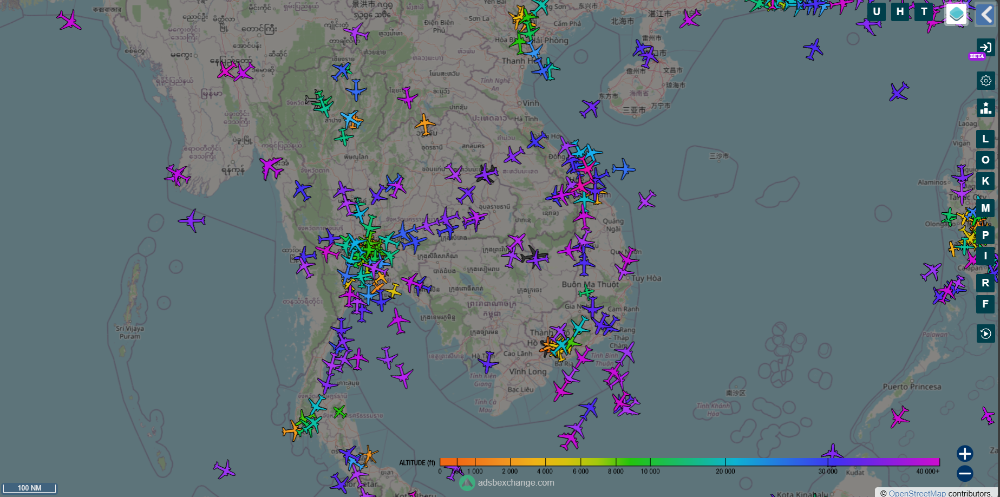
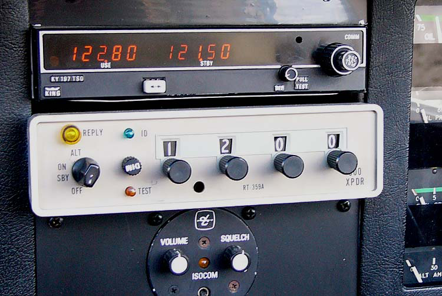
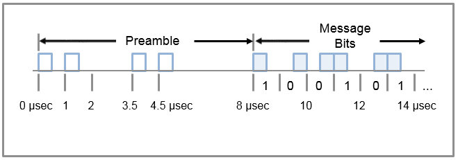
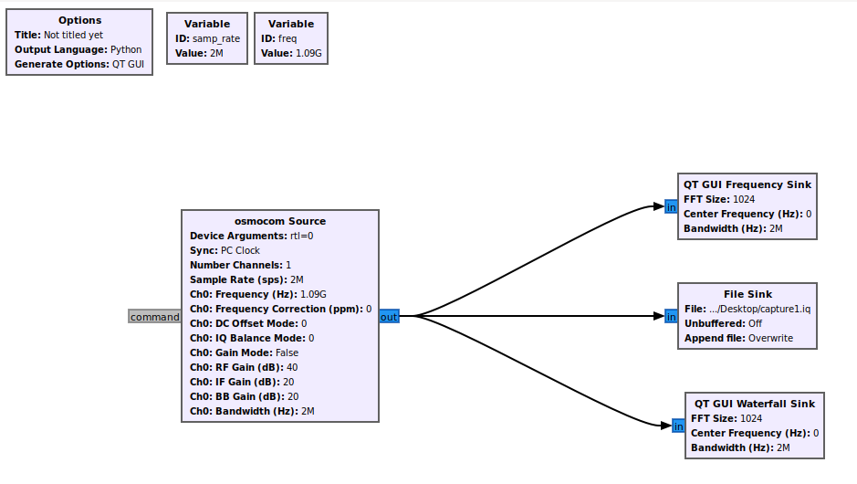
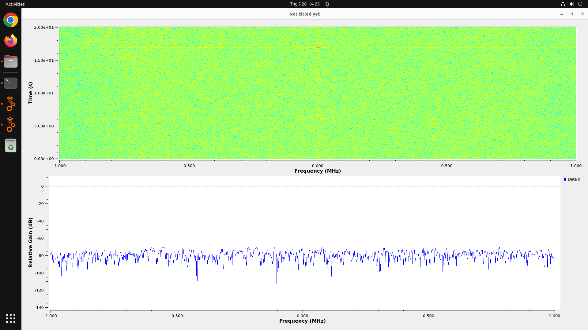
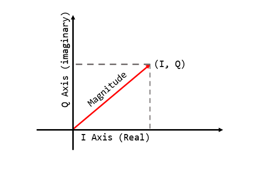
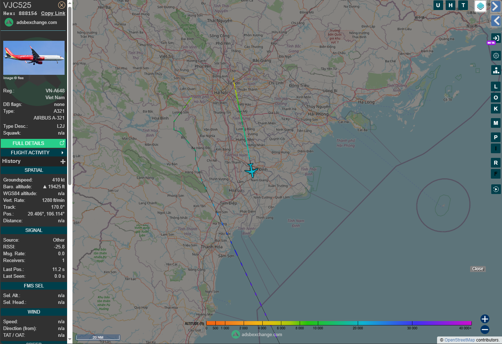

>I’m always curious about how flight tracking services (like Flightradar24 or ADS-B Exchange) provide precise real-time information about these flights. By learning about the ADS-B protocol, I will explain how to receive and decode the data from it... Then we will become a radar XD.



## Sit here, my brothers. I have a story to tell.

The first documented human free flight occurred on November 21, 1783, in France, in A hot-air balloon built by the Montgolfier brothers. Then, on December 17, 1903, in the USA, the Wright brothers introduced their aircraft. This flight lasted 12 seconds and covered 36m5. From this landmark, the era of aviation began.


Aircraft were commonly used in World War I for bombing, aerial combat, reconnaissance,... By the end of the war, they were used to transport mail and carry passengers. Since then, many airlines have been created. Today, Airbus and Boeing are the two largest commercial aircraft manufacturers in the world.<br>
To avoid accidents, we need a way to know important information about aircraft, such as their altitude, registration number,... so radio communication jump in.

## Aviation Transponder

An aviation transponder is an electronic device onboard an aircraft that transmits information to air traffic control (ATC) and other aircraft, helping with identification and collision avoidance. In simple, it does two things:
+ Responds to requests from ground stations: When someone asks for data, the transponder replies with information such as the aircraft’s identity, altitude, and sometimes speed.
+ Radio beacon: Transponder sends information about itself in period time.



There are several generations and modes of transponders. Each has different purposes and has its own specific structure. Modes A, B, C, D, and S are civilian transponder modes. Mode B and mode D are not in use (only modes A, C, and S are operational):
+ Mode A: Only transmits a four-digit squawk code. Useful for identifying an aircraft and its position, but not much else.
+ Mode C: Provides information on the aircraft’s pressure altitude. Combined with mode A, ATC and other aircraft can receive an aircraft’s unique squawk code, position, and altitude.
+ Mode S: Short for “Mode Select,” offers more advanced communication capabilities than mode A or mode C transponders. (*This is the main mode we’ll focus on.*)

Mode 1 to Mode 5 are military transponder modes. We will not discuss about it here, but you can find more about it [here](https://pilotinstitute.com/transponder-modes-explained).

## ADS-B
### Basic information

A Mode S transponder transmits a variety of valuable information to ATC and other aircraft. Some critical data transmitted by a Mode S transponder include:
+ ICAO address: Every aircraft has a unique ICAO address, which helps ATC and other aircraft identify the specific aircraft.
+ Squawk Code: Pilots are normally required to apply the code, allocated by ATC, to that specific flight.
+ Altitude: Your aircraft’s altitude.
+ Position, Speed, and Heading: Your aircraft’s GPS-based position, speed, and heading, which helps ATC and nearby aircraft know your location and direction of travel.
+ Additional Flight-Related Data: It can transmit other flight-related information, such as intent data, which provides ATC with a better understanding of your planned flight maneuvers.

There are two more systems that make mode S transponders. Traffic Collision Avoidance Systems (TCAS) and Automatic Dependent Surveillance-Broadcast (ADS-B). These systems improve situational awareness and help prevent mid-air collisions by allowing aircraft to share their positions and other relevant information with each other.

### The Preamble

The preamble is the initial part of every ADS-B message sent over 1090 MHz. It serves to:
+ Signal the start of a message.
+ Allow the receiver to synchronize with the incoming signal.
+ Help in detecting and identifying valid ADS-B messages amid radio noise.

Each bit in ADS-B takes 0.5 microseconds. The preamble length is 8 microseconds, and the bits look like this:



You can see there are pulses at 0 μs, 1 μs, 3.5 μs and 4.5 μs. The rest is the message.

### The Message

Pulse-Position Modulation (PPM) is used for encoding. So, after identifying the preamble, we use PPM to extract the message bits. The rule is simple: we examine each 1-microsecond interval, and:
+ If a pulse occurs at the beginning of the interval (0.0 – 0.5 μs), it represents a binary 1.
+ If a pulse occurs in the second half of the interval (0.5 – 1.0 μs), it represents a binary 0.

After extracting 56 or 112 bits, we have a complete message. In this post, I will focus only on 112-bit messages (*I will update on 56-bites msg later*). The structure is as follows:
```
+----------+----------+-------------+------------------------+-----------+
|  DF (5)  |  CA (3)  |  ICAO (24)  |         ME (56)        |  PI (24)  |
+----------+----------+-------------+------------------------+-----------+
```

Five main block:
+ DF: Civil aircraft msg always starts with the Downlink Format `17 - 10001`.
+ CA: Transponder capability, which helps the ground stations and other aircraft understand what kind of data and services the transponder can provide.
+ ICAO: A unique ICAO address is assigned to each Mode S transponder of an aircraft and serves as the unique identifier for each aircraft.
+ ME: This is actual payload with data about altitude, speed,...
+ PI: Parity bit and Interrogator ID use for checksum.

### ME field

This is the most interesting part. It contains speed, altitude, and more. Let’s dive into it, to identify what information is contained in an ADS-B message, we need to take a look at the Type Code of the message, The Type Code is located at bits `33–37` (first 5-bits of the `ME`).

| Type Code      | Data frame content |
| :---        |    :----:   |
| 1 - 4       | Aircraft identification       |
| 5 - 8       | Surface position       |
| 9 - 18       | Airborne position (w/Baro Altitude)       |
| 19       | Airborne velocities       |
| 20 - 22       | Airborne position (w/GNSS Height)       |
| 23 – 27       | Reserved       |
| 28       | Aircraft status       |
| 29       | Target state and status information       |
| 31       | Aircraft operation status       |

#### Type 1-4
This type only has aircraft identification. nothing else:
```
DF 17: ADS-B message.
  Capability     : 5 (Level 2+3+4 (DF0,4,5,11,20,21,24,code7 - is on airborne))
  ICAO Address   : 88814f
  Extended Squitter  Type: 4
  Extended Squitter  Sub : 3
  Extended Squitter  Name: Aircraft Identification and Category
    Aircraft Type  : Aircraft Type A
    Identification : VJC1215 
```

#### Type 5-8
This type are usually used to find out the aircraft location and what runway it will use.
```
ME : ADSB Msg Type  : (6) Airborne Position  
  Super Sonic?      : No  
  Altitude          : 34000 ft  
  Surveillance Stat : 0  
  NIC Supplement A  : 0  
  CPR Format        : Even  
  CPR latitude      : 10456  
  CPR longitude     : 27589  
```

#### Type 9-18
This type contain the position in the air position. In this type of message, the aircraft use barometric to calculate the altitude.
```
DF 17: ADS-B message.
  Capability     : 5 (Level 2+3+4 (DF0,4,5,11,20,21,24,code7 - is on airborne))
  ICAO Address   : 88814f
  Extended Squitter  Type: 11
  Extended Squitter  Sub : 0
  Extended Squitter  Name: Airborne Position (Baro Altitude)
    F flag   : odd
    T flag   : non-UTC
    Altitude : 1650 feet
    Latitude : 102050 (not decoded)
    Longitude: 117952 (not decoded)
```

#### Type 19
This type will tell what is the speed of the aircraft.
```
DF 17: ADS-B message.
  Capability     : 5 (Level 2+3+4 (DF0,4,5,11,20,21,24,code7 - is on airborne))
  ICAO Address   : 88814f
  Extended Squitter  Type: 19
  Extended Squitter  Sub : 1
  Extended Squitter  Name: Airborne Velocity
    EW direction      : 1
    EW velocity       : 137
    NS direction      : 1
    NS velocity       : 53
    Vertical rate src : 1
    Vertical rate sign: 1
    Vertical rate     : 15
```

#### Type 20-22
Same with type 9-18 but this time, the aircraft use geometric altitude from GPS or other satellite navigation system.
```
ME : ADSB Msg Type  : (21) Air Position (with GNSS altitude)  
  Super Sonic?      : No  
  Altitude (GNSS)   : 39,950 ft  
  Surveillance Stat : 0  
  NIC Supplement A  : 0  
  CPR Format        : Even  
  CPR latitude      : 16240  
  CPR longitude     : 33721  
```

#### Type 28
This type will give us information about the aircraft status. It is usually use for emergency/priority status.
```
ME : ADSB Msg Type  : (28) Aircraft Operational Status (Legacy)	  
  ADS-B Version     : 2  
  NIC Supplement A  : 0  
  Operational Mode  : (TCAS enabled, IDENT off)  
  Surveillance Capability: (TCAS RA broadcast: Yes)  
  NIC               : 8  
  NACp              : 9  
  SIL               : 3  
  SDA               : 2  
  Transponder Status: OK  
```

#### Type 29
This message is typically known as the Airborne Operational Status Message, introduced with ADS-B Version 2 (DO-260B).
```
ME : ADSB Msg Type  : (29) Officially Airborne Operational Status  
  ADS-B Version     : 2  
  Emitter Category  : Medium Aircraft (e.g., small jet)  
  NACp              : 9 (high position accuracy)  
  NACv              : 1 (typical velocity accuracy)  
  SIL               : 3 (very low risk of incorrect data)  
  SIL Type          : Per Sample  
  SDA               : 2 (Medium confidence in system design)  
  NIC               : 8  
  Position Offset   : False  
  GNSS Antenna Offset: Not Significant  
```

#### Type 31
Type Code 31 is used to broadcast an aircraft's operational status, providing information about its capabilities and performance.
```
ME : ADSB Msg Type  : (31) Aircraft Operational Status
  ADS-B Version     : 2
  NIC Supplement A  : 0
  NACp              : 9       (high position accuracy)
  GVA               : 2       (≤ 45 m vertical accuracy)
  SIL               : 3       (high integrity confidence)
  SIL Type          : per sample
  SDA               : 2       (medium system design assurance)
  Baro Alt Integrity: OK
  Track/Heading Ref : Track angle
```

## Capture it !!

All Mode S messages are transmitted to the aircraft at 1030 MHz and to the ground at 1090 MHz. Let setup to capture it, I use RTL-SDR (with stock antenna) for this.


For the software, I use a pretty cool Docker image called ["RF Swift"](https://github.com/PentHertz/RF-Swift). Just start the container and use GNU Radio.





Or you can just install `rtl_sdr` with this command:
+ -f: freq you want to capture (1.09 Ghz)
+ -s: sample rate (2M)
+ -n: how many sample you want to capture. ex: you want to capture in 1s -> sample_rate * 1s = 2M

```
rtl_sdr -f 1090000000 -s 2000000 -n 2000000 captured.iq 
```

`rtl_sdr` will return a `uint8` I/Q file (1 bytes for I and 1 bytes for Q, IQIQIQ...). In GNU Radio file sink, complex type is chosen so the binary file will be full of `float32s` (4 bytes for I, 4 bytes for Q). I gonna use the file that `rtl_sdr` return.

## Process the I/Q data
I/Q stand for `In-phase and quadrature` components. It's used to represent the modulations of some carrier, independent of that carrier's frequency. The file is `uint8` I/Q data, so the first bytes will be your I0, and next bytes will be your Q0, then I1, Q1,...<br>
Combine I and Q, we have a complex number `I + Qj` represent for signal. So we can write a script to create data from I/Q file, then turn it into complex number. 

```python
def read_iq_data(path, num_samples):
    with open(path, 'rb') as f:
        raw = np.frombuffer(f.read(num_samples * 2), dtype=np.uint8)
    raw = raw.astype(np.float16) - 127.5
    iq = raw[::2] + 1j * raw[1::2]
    return iq
```

Hmm, why we need to subtract `127.5` ?? Because uint8 is 0 - 255. We will need to center it by subtracting with `127.5` (midpoint is 255/2).<br>
After that, we need to calculate the magnitude by this formula $Magnitude = \sqrt{I^2 + Q^2}$. Why ?? `Pythagorean theorem` my friend.
+ I: In-phase, thehorizontal axis.
+ Q: Quadrature, the Vertical axis.
+ Hypotenuse: Magnitude of the vector - signal strength.



We will use `numpy.abs()` to make our life easier.

```python
iq_data = read_iq_data(file_path, num_samples)
magnitude = np.abs(iq_data)
```

Ok now we need to find the preamble, if we found it, we can extract message bits. We normalize the input with mean and standard deviation to improve correlation. After that we find the correlation between normalized signal and known preamble. 
The threshold for detecting preambles can be calculated as:

$$
\text{threshold} = \text{mean}(\text{corr}) + k \times \text{std}(\text{corr})
$$

Where:

- $\text{corr}$ is the correlation result with the ADS-B preamble
- $\text{mean}(\text{corr})$ is the average correlation value
- $\text{std}(\text{corr})$ is the standard deviation of the correlation
- $k$ is a multiplier (typically between 2 and 4.5)

Then return index where correlation is bigger than the threshold.

```python
def detect_preambles(mag_signal):
    preamble = np.array([1,0,1,0,0,0,0,1,0,1,0,0,0,0,0,0])
    norm_signal = (mag_signal - np.mean(mag_signal)) / np.std(mag_signal)
    corr = np.correlate(norm_signal, preamble, mode='valid')
    threshold = np.mean(corr) + 2 * np.std(corr)
    print("[+] Use threshold: %f" % threshold)
    return np.where(corr > threshold)[0]
```

Now get all the bits of message. Use PPM to get it boiz.

```python
def extract_bits(signal, start_index, msg_length=112):
    preamble_len = 16
    bit_len = 2
    total_samples = preamble_len + msg_length * bit_len
    slice = signal[start_index : start_index + total_samples]
    if len(slice) < total_samples:
        return None
    message_part = slice[preamble_len:]
    bits = []
    for i in range(0, len(message_part), 2):
        if message_part[i] > message_part[i+1]:
            bits.append(1)
        elif message_part[i] < message_part[i+1]:
            bits.append(0)
    return bits
```

So far so good, now lets check the header with `10001 = 17` and `101 = 3` or `10001101 = 0x8D`. One more thing, we need to verify the message. Remember there is a CRC and parity bit ?? We can use that.

```python
def compute_crc(message):
    poly = 0xFFF409
    crc = 0
    for byte in message:
        crc ^= byte << 16
        for _ in range(8):
            if crc & 0x800000:
                crc = ((crc << 1) ^ poly) & 0xFFFFFF
            else:
                crc = (crc << 1) & 0xFFFFFF
    return crc
```

if `compute_crc(message[:-3]) == message[-3:]` we good to go... Or just `pip install pyModeS`, then `pyModeS.crc(message) == 0`. After got valid message, we can parse `ICAO`, `ME`,... In this post, I just take out the `ICAO` for some fun.

```
[+] Use threshold: 5.840205
[+] Detected 16905 potential preambles.

[+] Got valid msg: 8d888156ea34d7fc2b3c084d11bc
  [-] ICAO: 888156

[+] Got valid msg: 8d8881ed581353342c5903bfd889
  [-] ICAO: 8881ed

[+] Got valid msg: 8d8881ed990cdb85309085833224
  [-] ICAO: 8881ed

[+] Got valid msg: 8d888156582ff3489a5514d9b7a7
  [-] ICAO: 888156

[+] Got valid msg: 8d7800439994a988180c851e1542
  [-] ICAO: 780043

[+] Got valid msg: 8d8881edea2727fee53c08b397dd
  [-] ICAO: 8881ed

[+] Got valid msg: 8d8881ed581367156dc15e5bca41
```

Wallah



You can do everything simply with `dump1090`, but I dont want to be a script kiddle :)

~~**We can spoofing, but I dont want to go to jail :(**~~

***Gonna update more in future ... if I can XD***