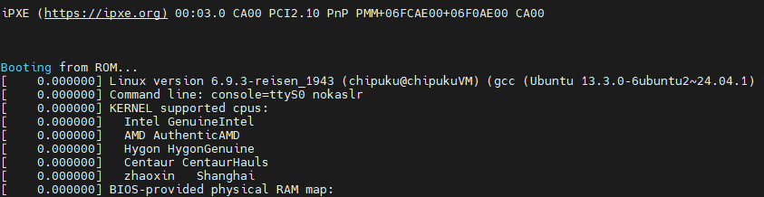
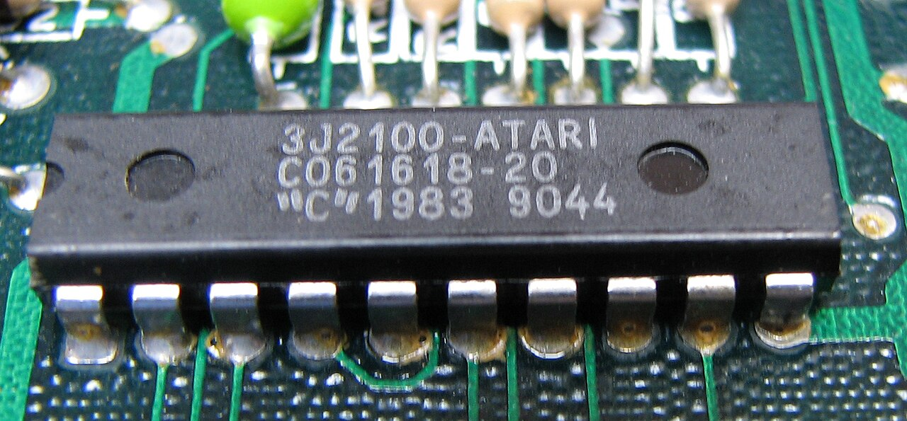
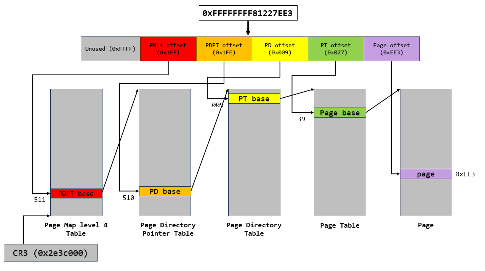
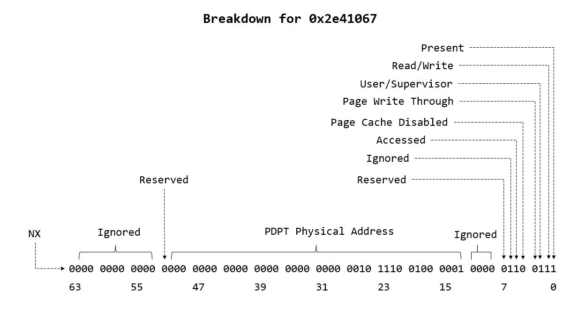
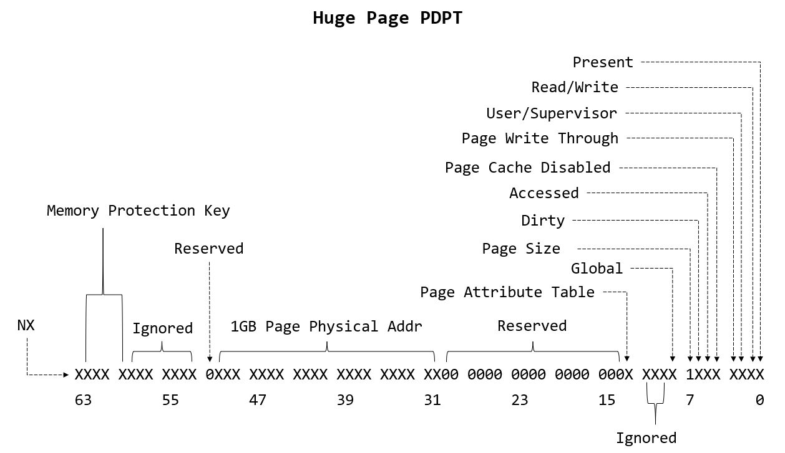
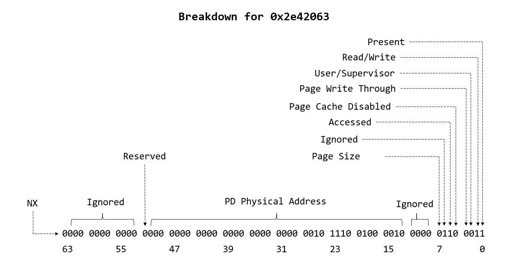
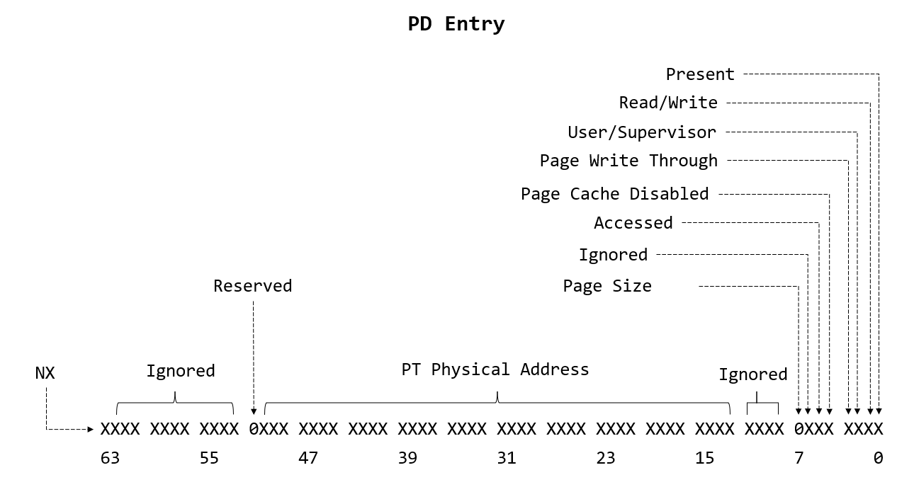
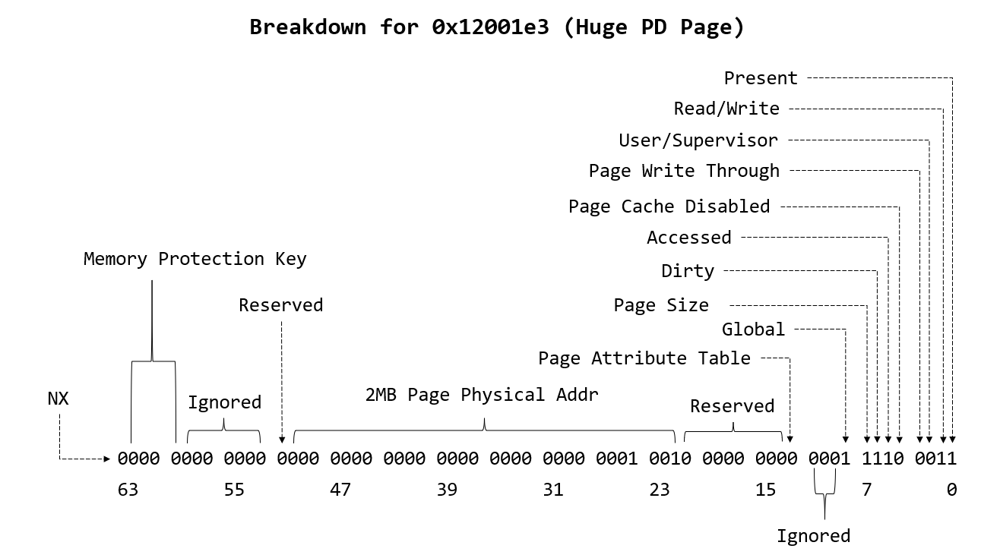
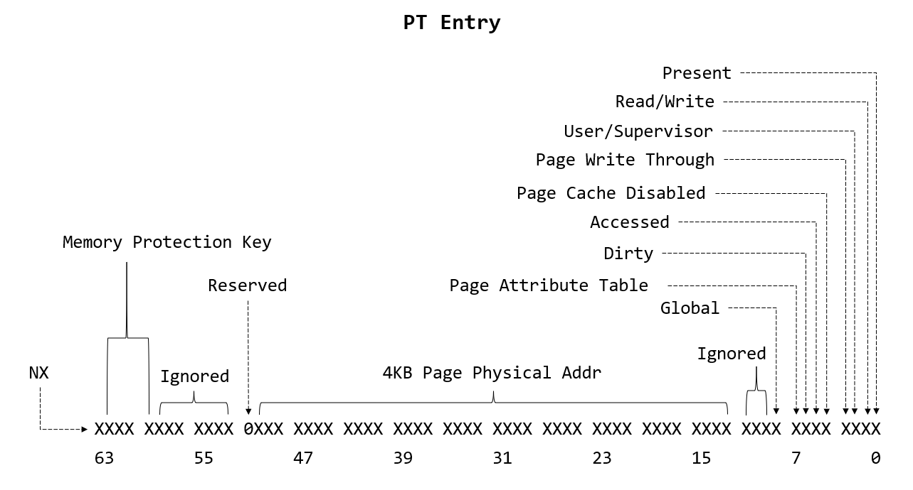

> A long time ago, I spent a lot of time studying CPU exploitation. During that process, I really loved how virtual addresses are mapped to physical addresses. It's complex but it's fun, so today I'm going to share what I learned and break down the translation process step-by-step.

# But first, let's build a Linux kernel from source...

So yeah, we need a Linux kernel image to emulate and debug. I went with version `6.9.3`, but you do you. First, install tools required:

```bash
sudo apt update
sudo apt install build-essential libncurses-dev bison flex libssl-dev libelf-dev bc wget
```

After that, download the version you want on [`kernel.org`](https://kernel.org):

```bash
wget https://cdn.kernel.org/pub/linux/kernel/v6.x/linux-6.9.3.tar.xz
tar -xf linux-6.9.3.tar.xz
cd linux-6.9.3
```

You can use your current system's config:

```bash
cp /boot/config-$(uname -r) .config
```

Or you can enable/disable some features like KASLR, Debug info, etc.

```bash
make menuconfig
```

For debugging the kernel, I will tweak a few settings:
- Enable Debug Symbols: `Kernel hacking` -> `Compile-time checks and compiler options` -> check `Compile the kernel with debug info` and `Provide GDB scripts for kernel debugging`.
- Disable KASLR: `Processor type and features` -> Uncheck `Randomize the address of the kernel image (KASLR)`.

Grab a cup of coffee and build the kernel using:

```bash
make -j$(nproc)
```

We still need to create a file contains some folders and binary like `bin/`, `sbin/`, etc.

```bash
mkdir my_initramfs
cd my_initramfs
mkdir -p bin sbin etc proc sys usr/bin usr/sbin

cp /bin/busybox bin/ # this will copy the busybox to bin/

cat << 'EOF' > init
#!/bin/busybox sh
mount -t proc none /proc
mount -t sysfs none /sys
echo "==================================="
echo "  Welcome to reisen_1943's Kernel!   "
echo "==================================="
exec /bin/sh
EOF

chmod +x init
find . -print0 | cpio --null -ov --format=newc | gzip -9 > initramfs.cpio.gz # pack it

```

Then use `QEMU` to emulate it:

```bash
qemu-system-x86_64 \
  -kernel arch/x86/boot/bzImage \
  -initrd my_initramfs/initramfs.cpio.gz \
  -append "console=ttyS0 nokaslr" \
  -nographic
```

And there you go mate !!

<div align="center">



*Our kernel just run !!*

</div>

To connect and debug the kernel. We simple run `QEMU` with 2 more options:
- `-s` - This will open GDB port `1234`.
- `-S` - This will freeze the `QEMU` and wait for a debugger to attach.

Then we open another Terminal, open GDB and open the `vmlinux` file (this is the statically linked and uncompressed Linux kernel executable file, we will have this file after we built our kernel):

```bash
pwndbg> file vmlinux
pwndbg> target remote :1234
```

# What is Address Translation

Address Translation in an OS is the process of mapping a program's `virtual addresses` to the actual `physical addresses` in RAM. Handled by the `Memory Management Unit (MMU)`, it enables virtual memory, allowing programs to run in large, contiguous spaces regardless of physical memory limits.

A long time ago, the `MMU` was a separate chip located on the motherboard. Nowadays, it's built directly into the CPU die to minimize latency.

<div align="center">



*MMU on 8-bit Atari Computer*

</div>

# Under the Hood
## Page, Virtual Address, PML4,... WTF is that ??

In the x86 arch, a `page` is a fixed-length (0x1000 B - 4 KB), contiguous block of memory. It's the smallest unit of data that the operating system's memory manager and the CPU's Memory Management Unit (MMU) operate on for allocating memory and tracking permissions. `Paging` is the foundation of Virtual Memory.

A `Virtual Address` is a memory address used by a running program that does not directly correspond to an actual, physical location on your RAM hardware. Virtual Address will be translate to Physical Address through data structure named `PML (Page Map Level)`. Currently, X86_64 use `PML4`, it has 4 level: `PML4` -> `PDPT` -> `PD` -> `PT`. Each level contains 512 entries, why ? Because 64-bits system use 8-bytes for each address.

$$
\frac{\text{0x1000}}{8} = 512
$$

So the maximum addressable space is 256 TB. While newer architectures support `PML5` (adding a 5th level), `PML4` remains the standard today. The CPU's MMU uses the base physical address stored in the `CR3` register as the starting point to walk through the Page Map Levels. Each thread of your CPU has a `CR3` register.

## A Deep Dive into PML

I have those command:

```bash
pwndbg> p/x $rip
$1 = 0xffffffff81227ee3
pwndbg> p/x $cr3
$2 = 0x2e3c000
```

We have a virtual address `RIP = 0xffffffff81227ee3` and the CPU currently has the physical address `0x2e3c000` loaded into `CR3`.

```
63           48 47       39 38       30 29       21 20       12 11            0
+--------------+-----------+-----------+-----------+-----------+--------------+
|    Unused    |   PML4    |   PDPT    |    PD     |    PT     |    Offset    |
+--------------+-----------+-----------+-----------+-----------+--------------+
|   16 bits    |  9 bits   |  9 bits   |  9 bits   |  9 bits   |   12 bits    |
+--------------+-----------+-----------+-----------+-----------+--------------+
|    0xFFFF    |   0x1FF   |   0x1FE   |   0x009   |   0x027   |    0xEE3     |
+--------------+-----------+-----------+-----------+-----------+--------------+
|   (Unused)   |  Idx: 511 |  Idx: 510 |  Idx: 9   |  Idx: 39  |  Off: 3811   |
+--------------+-----------+-----------+-----------+-----------+--------------+
```

<div align="center">



*Breakdown for 0xffffffff81227ee3*

</div>

Python script:

```python

def breakdown_virtual_address(vaddr_input):
    if isinstance(vaddr_input, str):
        try:
            address = int(vaddr_input, 16)
        except ValueError:
            print("Invalid hexadecimal string.")
            return
    else:
        address = int(vaddr_input)

    pml4_index = (address >> 39) & 0x1FF
    pdpt_index = (address >> 30) & 0x1FF
    pd_index   = (address >> 21) & 0x1FF
    pt_index   = (address >> 12) & 0x1FF
    offset     = address & 0xFFF

    bit_47 = (address >> 47) & 1
    expected_top_16 = 0xFFFF if bit_47 else 0x0000
    actual_top_16 = (address >> 48) & 0xFFFF
    is_canonical = (expected_top_16 == actual_top_16)

    print(f"[*] Analyzing Virtual Address: {hex(address)}")
    print(f"[*] Canonical Form:          {'Valid' if is_canonical else 'INVALID (Bits 48-63 malformed)'}")
    print("-" * 45)
    print(f"[+] PML4 Index (Bits 47:39): {pml4_index:<5} (0x{pml4_index:03X})")
    print(f"[+] PDPT Index (Bits 38:30): {pdpt_index:<5} (0x{pdpt_index:03X})")
    print(f"[+] PD Index   (Bits 29:21): {pd_index:<5} (0x{pd_index:03X})")
    print(f"[+] PT Index   (Bits 20:12): {pt_index:<5} (0x{pt_index:03X})")
    print(f"[+] Offset     (Bits 11:0):  {offset:<5} (0x{offset:03X})")
    print("-" * 45)

if __name__ == "__main__":
    target = "0xffffffff81227ee3"
    breakdown_virtual_address(target)
```

## Go for a walk, shall we ?
### First step (decode PML4 info)

`CR3 = 0x2e3c000`, but this value isn't just an address. The lower 12 bits of `CR3` hold control flags like `Page-level Cache Disable` (PCD) and `Page-level Write-Through` (PWT). Because we only need to extract the base address (bits `63:12`), we use the GDB command `p/x $cr3 & 0xFFFFFFFFFFFFF000`. This successfully gives us the physical pointer to the `PML4 base`.

Since our `PML4 Index = 511`, our next step is to find out what is in the `511th` entry of the PML4 Table (at offset `511 * 8`). 

However when we use GDB's `x` command, GDB assumes the address provided is a *Virtual Address*. The MMU will attempt to translate that address, but the value we pulled from `CR3` is already a *Physical Address*. Because GDB tries to translate an address that shouldn't be translated, the lookup fails, and it cannot access that memory.

So, we have 2 ways to read the value:
- Use the `monitor xp/10gx (0x2e3c000 + 511 * 8)` command - `xp` stands for *Examine Physical*; `10gx` shows 10 values in 64-bits hexadecimal format.
- Use the `x/10gx 0xffff888000000000 + (0x2e3c000 + 511 * 8)` command - We add `PAGE_OFFSET = 0xffff888000000000` because, on modern x86-64 systems, `PAGE_OFFSET` is often [0xffff888000000000](https://elixir.bootlin.com/linux/v6.14.5/source/arch/x86/include/asm/page_64_types.h#L42).

```bash
pwndbg> x/10gx 0xffff888000000000 + (0x2e3c000 + 511 * 8)
0xffff888002e3cff8:     0x0000000002e41067      0x0000000000000000
0xffff888002e3d008:     0x0000000000000000      0x0000000000000000
0xffff888002e3d018:     0x0000000000000000      0x0000000000000000
0xffff888002e3d028:     0x0000000000000000      0x0000000000000000
0xffff888002e3d038:     0x0000000000000000      0x0000000000000000

pwndbg> monitor xp/10gx (0x2e3c000 + 511 * 8)
0000000002e3cff8:       0x0000000002e41067      0x0000000000000000
0000000002e3d008:       0x0000000000000000      0x0000000000000000
0000000002e3d018:       0x0000000000000000      0x0000000000000000
0000000002e3d028:       0x0000000000000000      0x0000000000000000
0000000002e3d038:       0x0000000000000000      0x0000000000000000
pwndbg>
```

Okay, we got the value `0x0000000002e41067`, lets break it down:

<div align="center">



*Breakdown for 0x0000000002e41067*

</div>

Let me explain the members/fields:
- `NX (No Execute)` - If this is `1`, code can't be executed on this page.
- `PDPT Physical Address` - This is the physical address of the PDPT Table (PDPT base). Remember, this is `PFN (Page Frame Number)`, it just like an index. The first 4 KB chunk of RAM is `PFN 0`, next is `PFN 1`, so on. To get the actual PDPT Physical Address, you must multiply this PFN by 4096 (0x1000).
- `Accessed` - The CPU's Memory Management Unit (MMU) has recently used this specific entry for an address translation.
- `Page Cache Disabled (PCD)` - The CPU is allowed to cache this memory in its L1/L2/L3 caches if this bit is set to `0`.
- `Page Write Through (PWT)` - Write-through caching is enabled. If this is `1`, CPU will writes to this memory every single time, updates the cache and immediately push the data into physical RAM through memory bus.
- `User/Supervisor` - User-mode app are allowed to access this memory space. If it were `0`.
- `Read/Write` - This memory only is writable if this bit is set to `1`.
- `Present` - If this bit is `1`, the page is loaded in physical RAM and the CPU will process the rest of the flags. If it is `0`, the processor will not use this entry for address translation and triggers a Page Fault.

Okay we can extract to get the `PDPT Physical Address` by using the command `p/x 0x0000000002e41067 & ~((1ull<<12)-1) & ((1ull<<51)-1)`.

```bash
pwndbg> p/x 0x0000000002e41067 & ~((1ull<<12)-1) & ((1ull<<51)-1)
$5 = 0x2e41000
```

### Second step (decode PDPT info)

We examine the data at entry `510th` of the PDPT Table. Use this command `monitor xp/10gx (0x2e41000 + 510 * 8)`. 

```bash
pwndbg> monitor xp/10gx (0x2e41000 + 510 * 8)
0000000002e41ff0:       0x0000000002e42063      0x0000000002e43067
0000000002e42000:       0x0000000000000000      0x0000000000000000
0000000002e42010:       0x0000000000000000      0x0000000000000000
0000000002e42020:       0x0000000000000000      0x0000000000000000
0000000002e42030:       0x0000000000000000      0x0000000000000000
pwndbg>
```

Everything looks the same, but there is a new challenger: `Page Size`. If this bit is set to `1`, we call it `Huge Page` and we need to decode the PDPT info in a different way. The structure of the `Huge Page` should look like this:

<div align="center">



*PDPT Huge Page*

</div>

I will explain some new fields:
- `Memory Protection Key` or `Protection Keys for Userspace` - allow userspace app to group their memory pages and change the access permission (Read/Write/Disable) for the grouped-memories, without OS's help.
- `Page Attribute Table (PAT)` - helps the MMU determine the specific caching type for the memory page (combined with the `PCD` and `PWT` bits to index the `PAT MSR`), such as `WB (Write-Back)`, `UC (Uncacheable)`, `WC (Write-Combining)`, or `WT (Write-Through)`.
- `Global` - The MMU's cache for the translation is called the TLB (Translation Lookaside Buffer). If this bit is set to `1`, the CPU won't flush this translation from it when the `CR3` register changes.
- `Dirty` - If this flag is `1`, the memory has been modified since it was first loaded into physical RAM.

To get the *Physical Address* we need to extract the bits from `51:30` and multi it with `0x40000000 (1 GB)` not `4096 (4 KB)` like normal page. You might ask, why a `1 GB` page? Let me explain. *Virtual Address* is:

$$
	{Unused}_{\text{ 16-bits}} + \text{PML4}_{\text{ 9-bits}} + \text{PDPT}_{\text{ 9-bits}} + \text{PD}_{\text{ 9-bits}} + \text{PT}_{\text{ 9-bits}} + \text{Offset}_{\text{ 12-bits}} = 64\ \text{bits}
$$

If we found a `Huge Page`, we will stop the translation right there, and the *Virtual Address* looks like this:

$$
    {Unused}_{\text{ 16-bits}} + \text{PML4}_{\text{ 9-bits}} + \text{PDPT}_{\text{ 9-bits}} + \text{skipped}_{\text{ 30-bits}}
$$

30-bits is skipped. so the page size: $2^{30} = 1{,}073{,}741{,}824\ \text{Bytes} = 1\ \text{GB}$

In this case, we don't have to deal with the `Huge Page` so just like normal.

<div align="center">



*Breakdown for 0x0000000002e42063*

</div>

Get the `PD base` out using this command `p/x 0x0000000002e42063 & ~((1ull<<12)-1) & ((1ull<<51)-1)`

```bash
pwndbg> p/x 0x0000000002e42063 & ~((1ull<<12)-1) & ((1ull<<51)-1)
$5 = 0x2e42000
```

### Third step (decode PD info)

We continue to examine the `009th`. Use this command `monitor xp/10gx (0x2e42000 + 9 * 8)`.

```bash
pwndbg> monitor xp/10gx (0x2e42000 + 9 * 8)
0000000002e42048:       0x00000000012001e3      0x00000000014001e3
0000000002e42058:       0x00000000016001e3      0x00000000018001e3
0000000002e42068:       0x0000000001a001e3      0x0000000001c001e3
0000000002e42078:       0x0000000001e001e3      0x00000000020001e3
0000000002e42088:       0x00000000022001e3      0x00000000024001e3
pwndbg>
```

The normal PD info will look like this, very similar to previous (normal PDPT Entry):

<div align="center">



*Breakdown for normal PD entry*

</div>

But for the `0x00000000012001e3`, the `Page Size` flag is set to `1` (Use `p/x 0x00000000012001e3 & (1<<7)` to check). So we are facing a `Huge PD Page`. Let's break it down:

<div align="center">



*Breakdown for 0x00000000012001e3*

</div>

Since we are facing the `Huge PD Page`, we stop processing. To get the *Physical Address*, we extract bits and multi it with `2,097,152`, so `value[51:21] * 2,097,152 = 0x1200000`. Then we add the offset of `Page = 0x27ee3`.

So the translation complete, we have `0xffffffff81227ee3 (Virtual Address)` = `0x1227ee3 (Physical Address)`. Let's compare it:

```bash
pwndbg> monitor xp/10gx 0x1227EE3
0000000001227ee3:                           0xa38b150348d2f748      0x420f48d73948018a
0000000001227ef3:                           0xf08948c8430f48f0      0x7701f88348c82948
0000000001227f03:                           0x8d485074c98548ca      0x046348c66348ff71
0000000001227f13:                           0x79c08582a1654085      0x52050348d0f7480a
0000000001227f23:                           0x634801568d018aa3      0xa1654095146348d2

pwndbg> x/10gx 0xffffffff81227ee3
0xffffffff81227ee3 <get_symbol_pos+67>:     0xa38b150348d2f748      0x420f48d73948018a
0xffffffff81227ef3 <get_symbol_pos+83>:     0xf08948c8430f48f0      0x7701f88348c82948
0xffffffff81227f03 <get_symbol_pos+99>:     0x8d485074c98548ca      0x046348c66348ff71
0xffffffff81227f13 <get_symbol_pos+115>:    0x79c08582a1654085      0x52050348d0f7480a
0xffffffff81227f23 <get_symbol_pos+131>:    0x634801568d018aa3      0xa1654095146348d2
pwndbg>
```

Congrats, we just do the MMU's job. But what if we facing normal PD entry ? The answer is we keep walking...

### Fourth Step (decode the PT info)

Here is the detail of `PT` value:

<div align="center">



*Breakdown for PT Entry*

</div>

To get the final *Physical Address*, we just need to extract the bits from `51:12` and multi it with `0x1000`, then add the `Page offset` and we got the final *Physical Address*.

To better understand, I wrote a python script to help. Give it a try:

```python
import sys

def analyze_addr(addr):
    pageshift = 12
    addr = addr >> pageshift
    pt, pd, pdpt, pml4 = (((addr >> (i * 9)) & 0x1ff) for i in range(4))
    return pml4, pdpt, pd, pt

def is_huge_page(value):
    return bool(value & (1 << 7))

def decode_data(value, low_bit, high_bit):
    return value & ~((1 << low_bit) - 1) & ((1 << (high_bit + 1)) - 1)

def print_end(virtual_addr, phys_base, offset, kernel_direct):
    phys = phys_base + offset
    print("\n[+] Virtual Address:  0x%x" % virtual_addr)
    print("    -> Physical Address: 0x%x" % phys)
    print("    -> Read in GDB (direct-map): 0x%x" % (kernel_direct + phys))

if __name__ == "__main__":
    if len(sys.argv) != 2:
        print("[!] Give me address bro !!")
        exit(0)

    print("\n***************** PAGE WALKING *****************")
    address = int(sys.argv[1], 16)
    pml4, pdpt, pd, pt = analyze_addr(address)
    print("[+] Address: 0x%x" % address)
    print("[+] Address analyze: ")
    print("  [-] Level 1 - PT:   0x%x" % pt)
    print("  [-] Level 2 - PD:   0x%x" % pd)
    print("  [-] Level 3 - PDPT: 0x%x" % pdpt)
    print("  [-] Level 4 - PML4: 0x%x" % pml4)

    print("\n[+] Start walking...")
    kernel_direct = (0xffff << 48) | (0x88 << 40) | (0x8 << 36)
    print("[+] Kernel Direct Mapping: 0x%x" % kernel_direct)

    # PML4 -> PDPT
    cr3_reg = int(input("[+] PML4 base (CR3 register): "), 16) & ~0xfff
    pml4_data_addr = cr3_reg + pml4 * 8
    data_at_pml4 = int(input("  [-] Data at PML4 (x/gx 0x%x): " % (pml4_data_addr | kernel_direct)), 16)
    physical_pdpt = decode_data(data_at_pml4, 12, 51)
    print("  [-] Physical PDPT: 0x%x\n" % physical_pdpt)

    # PDPT -> PD (may be a 1GB huge page)
    pdpt_data_addr = physical_pdpt + pdpt * 8
    data_at_pdpt = int(input("  [-] Data at PDPT (x/gx 0x%x): " % (kernel_direct + pdpt_data_addr)), 16)
    if is_huge_page(data_at_pdpt):
        phys_base = decode_data(data_at_pdpt, 30, 51)
        offset = address & ((1 << 30) - 1)
        print("[+] Encounter 1GB huge PDPT page -> STOP walking !!")
        print_end(address, phys_base, offset, kernel_direct)
        exit(0)
    physical_pd = decode_data(data_at_pdpt, 12, 51)
    print("  [-] Physical PD: 0x%x\n" % physical_pd)

    # PD -> PT (may be a 2MB huge page)
    pd_data_addr = physical_pd + pd * 8
    data_at_pd = int(input("  [-] Data at PD (x/gx 0x%x): " % (kernel_direct + pd_data_addr)), 16)
    if is_huge_page(data_at_pd):
        phys_base = decode_data(data_at_pd, 21, 51)
        offset = address & ((1 << 21) - 1)
        print("[+] Encounter 2MB huge PD page -> STOP walking !!")
        print_end(address, phys_base, offset, kernel_direct)
        exit(0)
    physical_pt = decode_data(data_at_pd, 12, 51)
    print("  [-] Physical PT: 0x%x\n" % physical_pt)

    # PT -> physical page (4KB)
    pt_data_addr = physical_pt + pt * 8
    data_at_pt = int(input("  [-] Data at PT (x/gx 0x%x): " % (kernel_direct + pt_data_addr)), 16)
    phys_base = decode_data(data_at_pt, 12, 51)
    offset = address & ((1 << 12) - 1)
    print_end(address, phys_base, offset, kernel_direct)

    print("\n***************** PAGE WALKING *****************")
```
**NOTE**: I use `Intel x86-64` terms in this post, for `Linux` it will be:
- `PML4` = `PGD` or `Page Global Directory`.
- `PDPT` = `PUD` or `Page Upper Directory`.
- `PD` = `PMD` or `Page Middle Directory`.
- `PT` = `PTE` or `Page Table Entry`.

# Ending

Honestly, understanding address translation doesn't help much in app exploitation. But knowing exactly what the machine is doing underneath, step by step, from a virtual address all the way down to physical RAM — it gives me joy and reminds me to never stop learning and practicing Shun Goku Satsu :) .

<div align="center">


</div>