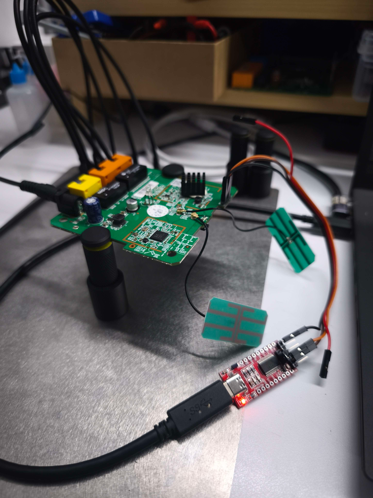
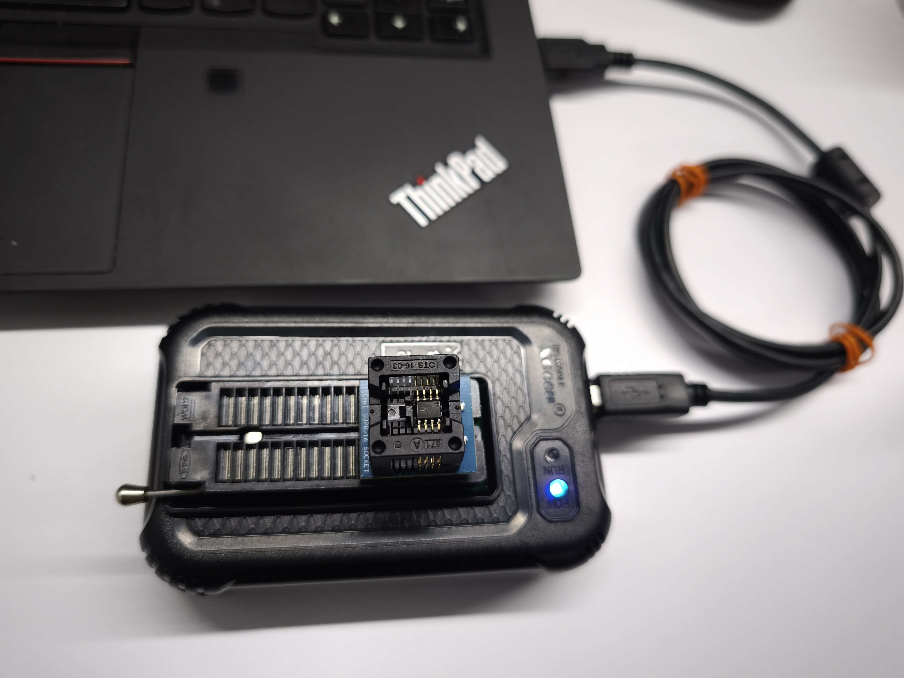
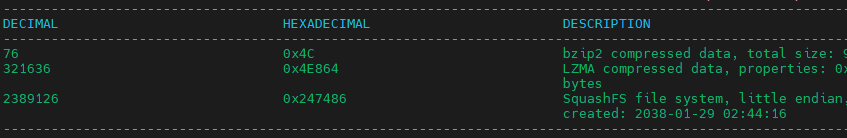
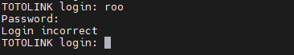
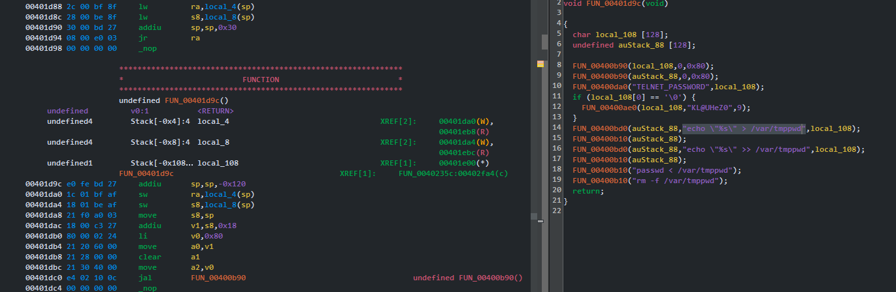
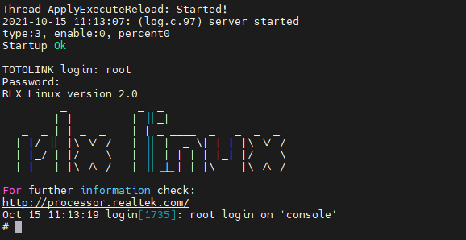

---

title: 'Getting root shell on TOTOLINK T6 V3'
published: 2025-06-25
description: 'Updating the password during boot time is not enough !!'
image: 'pics/device.png'
tags: ['Blogs', 'IoT', 'Router']
category: 'Blogs'
draft: false
---

I do Vuln research in my free time. Today, my target is TOTOLINK T6 V3.0, The firmware version is `V4.1.5cu.748_B20211015`. After open the plastic shell, I see 4 pin with `GND`, `TX`, `RX`, `VCC`. It should be UART, with the correct baud rate (`38400`). After line and line of log, they ask me for credential to login.



## Dumping the Firmware
You can download the newest firmware by this [link](https://www.totolink.net/home/menu/detail/menu_listtpl/download/id/190/ids/36.html). The device use `XM25QH64C` SOP-8, I desolder it anduse `XGecu T48` to dump the firmware, then use `binwalk` on it.<br>



## Finding login credentials
We have `SquashFS` at `0x247486`, let's extract it first. First we wanna read `etc/shadow` for login credentials. There are `shadow` and `shadow.sample` file. The `shadow` file is link to `/var/show`, we dont have this file. Lets read init script in `init.d` folder.



In the `rcS` file, we can see the device will copy the `/etc/shadow.sample` to `/var/shadow`. Therefore, the `shadow.sample` will contain login credentials.

```
cp /etc/shadow.sample /var/shadow
cp /etc/passwd.sample /var/passwd
#cp /etc/vsftpd.conf /var/config/vsftpd.conf
```

Lets look inside that file.

```
root:$1$BJXeRIOB$w1dFteNXpGDcSSWBMGsl2/:16090:0:99999:7:::
nobody:*:14495:0:99999:7:::
```

We can crack the hash and the login will be `root - cs2012`, but cant login because its wrong.



## Finding the "real" credentials
Trace the output of UART, we can see they gonna change password during boot time, we need to find where it happen.<br>
Back to the `rcS` script, we can see they call `cs password` after copy `shadow.sample` file. 

```
cp /etc/shadow.sample /var/shadow
cp /etc/passwd.sample /var/passwd
#cp /etc/vsftpd.conf /var/config/vsftpd.conf

cs password
```

So we need to reverse the `cs` binary. We can see they echo `KL@UHeZ0` to `/var/tmppwd`, use it to change the password for root and delete it.



So the correct credential is `root - KL@UHeZ0`.


