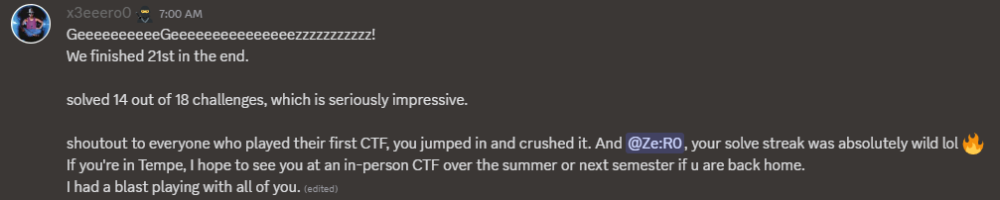
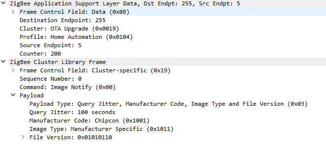
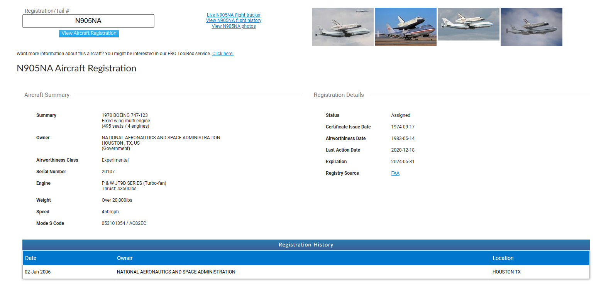
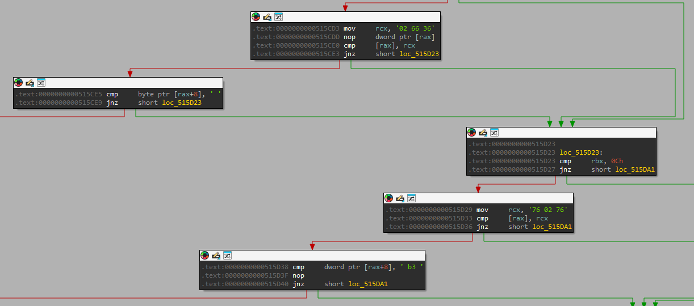
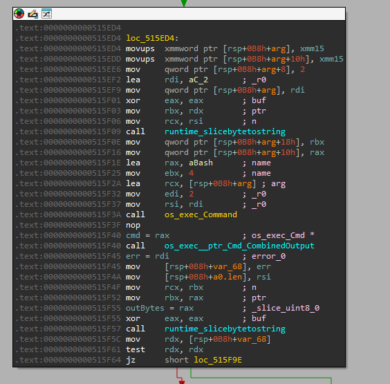

<style>
/* This targets only this page */
pre.astro-code.github-dark {
  margin: 0;
}
</style>

> This was my first CTF with "CTF Academy", mentored by Shellphish. I'm so happy to have played alongside everyone! We solved 14 out of 18 challenges and finished 21st overall. WP everybody !!



They release the official writeups for every chall. But I just want to write one for memorize. some people die of nostalgia XD.

## rev/It's data, not data

### Challenge detail

>(you may want to do Is it data or data? first)<br>
>nc itsdatanotdata.chals.damctf.xyz 39531<br>
>[attached](/writeups_file_attached/damnctf_2025/chall.bin)

### Binary analysis

The program gonna take our input to gen a weird string. Then ask us to make it become **"episode3,57min34sec"** in 100 step. The program will expect a number from user to execute command.<br>
After reverse we got the command table like this:
| Number      | Explain |
| :---        |    :----:   |
| 15       | set "G" at cursor       |
| 24       | set "q" at cursor       |
| 57       | set "W" at cursor       |
| 19       | set "c" at cursor       |
| 22       | set ";" at cursor       |
| 2       | str[cursor] += 3       |
| 3       | str[cursor] += 3       |
| 7       | set "7" at str[7]       |
| 9       | swap str[cursor] with str[cursor - 1]    |
| 8       | swap str[cursor] with str[cursor + 2]    |

Everytime you use those command, the step += 1.<br>
There are 2 commands that allow you to move the cursor:

| Command      | Explain |
| :---        |    :----:   |
| r       | move cursor to right       |
| l       | move cursor to left       |

Those 2 are not considered steps<br>
Because we only have 100 step. We need to optimize the string by find the good init number and let the program get us a good string. Script (shout out to Elvis):
```python
from pwn import *

def get_score(rnd_string):
    score = 0
    target_string = "episode3,57min34sec"
    for i, c in enumerate(rnd_string):
        if c.lower() == target_string[i]:
            score += 1
    
    return score

if __name__ == "__main__":
    max_score = 0
    good_string = ""
    best_seed = 0
    
    for seed in range(0, 0xFFFFFFFF):
        p = process("./chal")
        p.sendline(str(seed).encode())
        p.recvuntil(b"Current: ")
        rnd_string = p.recvline()[:-1]
        rnd_string = rnd_string.decode()
        score = get_score(rnd_string)
        if score > max_score:
            print("Found new string '%s' , seed %d with score %d" % (rnd_string, seed, score))
            max_score = score
            good_string = rnd_string
            best_seed = seed
        else:
            print("Best seed: %d" % best_seed)
        
        p.close()

# int: 2244
# episode3,57min34sec
# etnsOle`,5?}Iz)2Cb@
```
Good enough, now we just need to tweak the string. Those steps:

<div style="height: 300px; overflow-y: scroll;border: none;">

```console
7
8
r
r
8
r
r
r
9
l
l
l
l
l
l
l
8
7
r
r
r
9
l
l
l
8
7
3
3
3
3
r
r
3
3
r
r
24
3
3
3
3
l
l
3
r
r
r
19
2
2
r
24
3
3
3
r
3
3
r
r
24
2
3
l
2
3
r
r
2
r
19
r
r
24
3
r
19
2
2
r
r
24
3
3
r
19
2
3
3
```
</div>

## rev/Lost in the ZCL
### Challenge detail
>Little Timmy decided to simplify the flag printing, and has deployed an update to the ESPs. Once again Timmy has lost the source, can you get him the flag again?
>
>Note: this is intended as a pt2 of RISCy Business, but the challenges are not interdependent
>[attached](/writeups_file_attached/damnctf_2025/capture.pcapng.gz)

### PCAP analysis
Load the file in Wireshark and get nothing. Look at **[Zigbee Network Layer Data]**. We can see the payload is encrypted. Zigbee use AES-128 to encrypt the traffic, the default key is: 
```
Zigbee Trust Center Link Key (ZigbeeAlliance09):
5A 69 67 42 65 65 41 6C 6C 69 61 6E 63 65 30 39
```
Add this key, **Edit -> Preferences -> Protocols -> Zigbee -> Edit**. After decrypt, we can see the payload.<br>
I can see some packet with Cluster: OTA Upgrade (0x0019), lets get all the packet that has "Cluster: OTA Upgrade (0x0019)".



Add this key to Wireshark. We get some traffic with data is some ascii string. Since we are playing damCTF, so I gonna search for some *"dam{"* or *"64:61:6d:7b"* in hex. And we found the flag.


Or you can use ZigbeeOtaExtractor. In Wireshark, apply this filter `zbee_aps.cluster == 0x0019` then **File -> Export Packet Dissections -> As Json**. Then use ZigbeeOtaExtractor and find for a flag.

::github{repo="compujuckel/ZigbeeOtaExtractor"}

## misc/Mode Sleuth
### Challenge detail
>Software defined radio is so fun! I just recorded a bunch of planes near me, but I think someone messed with the data. Can you find the plane that is not supposed to be there?
>
>Flag format: dam{<N-number>_<Registered owner name>_<serial number>}
>
>Note: must be all caps, owner name should be full name including any spaces Example: dam{N249BA_BOEING AIRCRAFT HOLDING CO_24309}
>
>[attached](/writeups_file_attached/damnctf_2025/capture.txt)

### File analysis
The challenge detail talk about plane. The 1st value has 112-bits, the 3rd is 56-bits. First bytes of 112-bits is 0x8D (10001101), first 5-bits = 17, next 3-bits = 5, 17 - 5 is the DF (Downlink Format) and CA (Transponder capability). Seem like we are dealing with ADS-B and ADS-B Mode S.<br>

| Bit | Explain |
|----------|----------|
| 1-5    |    DF - Downlink Format      |
| 6-8    |    CA - Transponder capability      |
| 9-32    |   ICAO - ICAO aircraft address       |
| 33-88    |  ME - Message, extended squitter        |
| (33-37)    | TC - Type code (optional)          |
| 89-112    |  PI - Parity/Interrogator ID        |

ICAO will contain plane's info, we can search through it. Write a simple script that parse all the 112-bits value, get ICAO then search. Most of them are civil planes... but there is one plane with ICAO `AC82EC`. It's NASA plane, so this must be the one we are finding for. I use this [web](https://tr.flightaware.com) to get the info, and we have the flag.



## misc/breach
#### Challenge detail
>hack the mainframe, choom. eddies for days.
>
>ssh chal@breach.chals.damctf.xyz
>
>pw: chalworksnow
>
>[attached](/writeups_file_attached/damnctf_2025/breach)

#### Binary analysis
The program give us a matrix[10][10] and 2 command:
```
 74  63  63  2D  73  73  20  6C  63  2D
 3B  74  66  74  3B  6C  67  66  20  73
 74  67  67  74  61  20  3B  73  6C  2D
 67  52  64  6C  61  3B  73  20  66  73
 61  61  61  2D  6C  66  67  63  63  3B
 67  64  66  61  52  67  20  67  63  63
 66  64  64  52  74  2D  73  20  52  74
 6C  63  6C  20  20  67  66  6C  66  3B
 3B  64  2D  3B  6C  61  2D  61  61  20
 63  52  6C  74  64  66  3B  20  6C  52

 [63][66][20][3b][74] NEUTRALIZE MALWARE
 [67][20][67][3b][6c][74][3b][20] DATAMINE: COPY MALWARE
```
I chose some random pos to get better understand. x denotes row, y denotes column.At first x = 0, if we select the pos at y (0, y) then next time we will have to select pos on the y column, so on and so on,... e.g: if we select (0, 2) at first, then we need to selec pos in 3rd column for next value.<br>
The output is quite interesting:
```
BUFFER: [74 74 63 63 74 74 74 74 ]
BREACH FAILED. ERROR:
bash: line 1: ttccttttccc: command not found
```
Hmm why is the `ttccttttccc: command not found` here. Lets load it to our fav decompiler.<br>
The program check our buffer with `[63 66 20]` and `[67 20 67 3b]`. If correct, it makes the program hang (WTF ??).



Then I found a interesting place, the program call `os_exec_Command()`. So the program will decode your input from hex to ascii and pass it to `os_exec_Command()`. Thats why the `ttccttttccc: command not found` appeared. 



I try to create a string "ls -R". And the output is:
```
BUFFER: [6C 73 20 2D 52 ]

DEBUG: AXIS: y
BREACH FAILED. ERROR:
.:
alft
altf
atfl
falt
flat
latf

./alft:

./altf:
flag

./atfl:

./falt:

./flat:

./latf:
```

Good good, now we just need to create a string like `cd altf; cat flag`.

<style
  pre.astro-code.github-dark {
    margin: 0;
  }
</style>