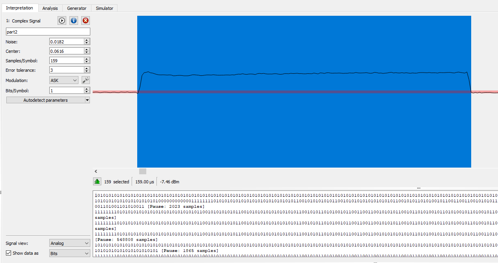
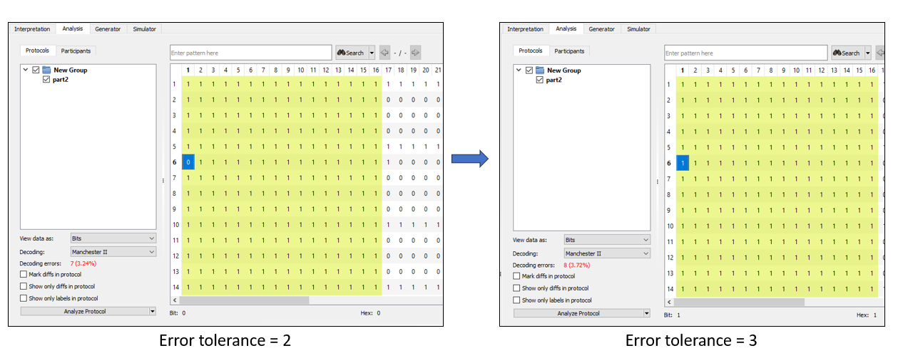
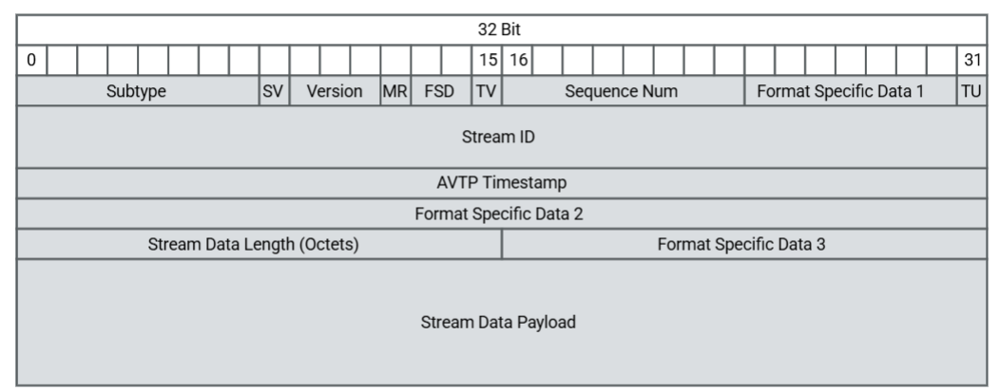
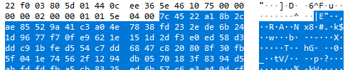
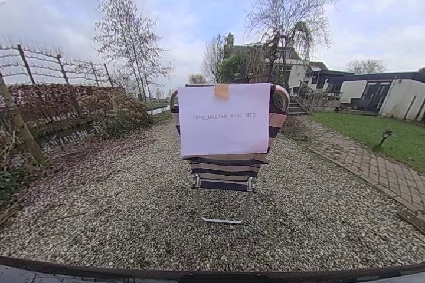

Pretty good CTF (for a noob like me)! I learned a lot from those challenges. Thanks to Willem Melching for creating this CTF.

## Easy Task
#### Volkswagen CAN Checksum
>**Challenge**
><br>&nbsp;&nbsp;&nbsp;&nbsp;The goal of this challenge is to compute the correct one byte checksum XX for the CAN message with payload XX0f0300. The flag is of the format CTF{XX}.
><br>
><br>**Background**
><br>&nbsp;&nbsp;&nbsp;&nbsp;VW uses the Autosar CRC8 8H2F checksum. Before computing the CRC, the payload is extended by a "secret" byte based on the Arbitration ID. Part of this challenge is figuring out what this "secret" byte is based on some traffic logged from the car. For some messages the "secret" value depends on the value of the counter, but that is not the case for this message.
><br>Example code to generate the CRC:
>```python
>import crcmod
>crc = crcmod.mkCrcFun(
>    poly=0x100 + polynomial,
>    initCrc=initial_value
>    rev=False,
>)
>data = payload + secret_byte
>checksum = crc(data) ^ 0xff
>```
><br>**Logged Messages**
><br>&nbsp;&nbsp;&nbsp;&nbsp;The following 15 messages were captured from the car. Note the first byte is the checksum of the message, then second byte contains a counter.
><br>&nbsp;&nbsp;&nbsp;&nbsp;*0&nbsp;&nbsp;&nbsp;74000300*
><br>&nbsp;&nbsp;&nbsp;&nbsp;*1&nbsp;&nbsp;&nbsp;c1010300*
><br>&nbsp;&nbsp;&nbsp;&nbsp;*2&nbsp;&nbsp;&nbsp;31020300*
><br>&nbsp;&nbsp;&nbsp;&nbsp;*3&nbsp;&nbsp;&nbsp;84030300*
><br>&nbsp;&nbsp;&nbsp;&nbsp;*4&nbsp;&nbsp;&nbsp;fe040300*
><br>&nbsp;&nbsp;&nbsp;&nbsp;*5&nbsp;&nbsp;&nbsp;4b050300*
><br>&nbsp;&nbsp;&nbsp;&nbsp;*6&nbsp;&nbsp;&nbsp;bb060300*
><br>&nbsp;&nbsp;&nbsp;&nbsp;*7&nbsp;&nbsp;&nbsp;0e070300*
><br>&nbsp;&nbsp;&nbsp;&nbsp;*8&nbsp;&nbsp;&nbsp;4f080300*
><br>&nbsp;&nbsp;&nbsp;&nbsp;*9&nbsp;&nbsp;&nbsp;fa090300*
><br>&nbsp;&nbsp;&nbsp;&nbsp;*10&nbsp;&nbsp;0a0a0300*
><br>&nbsp;&nbsp;&nbsp;&nbsp;*11&nbsp;&nbsp;bf0b0300*
><br>&nbsp;&nbsp;&nbsp;&nbsp;*12&nbsp;&nbsp;c50c0300*
><br>&nbsp;&nbsp;&nbsp;&nbsp;*13&nbsp;&nbsp;700d0300*
><br>&nbsp;&nbsp;&nbsp;&nbsp;*14&nbsp;&nbsp;800e0300*
><br>
><br>**References**
><br>&nbsp;&nbsp;&nbsp;&nbsp;Autosar CRC specification: https://www.autosar.org/fileadmin/standards/R22-11/CP/AUTOSAR_SWS_CRCLibrary.pdf
><br>

This chall is quite easy. From the PDF, we can tell that  CRC8 H2F use poly 0x2f, init value is 0xff. Base on 15 messages above, we can write a script to bruteforce the secret that will be used everytime.
Script:
```python
import crcmod

polynomial = 0x2f
initial_value = 0xff

crc = crcmod.mkCrcFun(
    poly=0x100 + polynomial,
    initCrc=initial_value,
    rev=False,
)

for i in range(0, 255):
    payload = b"\x00\x03\x00"
    data = payload + i.to_bytes(1, 'little')
    checksum = crc(data) ^ 0xff
    if checksum == 0x74:
        secret = i

print("Found secret: %d" % secret)

payload = b"\x0f\x03\x00" + secret.to_bytes(1, 'little')
checksum = crc(payload) ^ 0xff
print("FLAG: CTF{%2X}" % checksum)
```

```console
$python solve_checksum.py
[+] Found secret: 195
[+] FLAG: CTF{35}
```

## Medium Task
### hittag2 Keyfob ID (part 1)
>**Challenge**
><br>&nbsp;&nbsp;&nbsp;&nbsp;This challenge contains a recording from a Keyfob featuring a Hitag2 cipher for RKE. The keyfob transmits a message containing a plaintext keyfob ID, counter and button followed by a MAC. Attached to this challenge you will find a SDR recording of 6 presses of the unlock button.
><br>&nbsp;&nbsp;&nbsp;&nbsp;Use URH to decode the messages from the keyfob and figure out the keyfob ID. The flag is of the form CTF{keyfob id}, e.g CTF{536c8dab}
><br>&nbsp;&nbsp;&nbsp;&nbsp;Refer to the following papers for more information on Hitag2 and the possible message structure.
><br>
><br>**References**
><br>&nbsp;&nbsp;&nbsp;&nbsp;URH download: https://github.com/jopohl/urh/releases
><br>&nbsp;&nbsp;&nbsp;&nbsp;Introduction to hitag2: https://www.usenix.org/system/files/conference/usenixsecurity12/sec12-final95.pdf
><br>&nbsp;&nbsp;&nbsp;&nbsp;Hitag2 as used in RKE, reference for message layout: https://www.usenix.org/system/files/conference/usenixsecurity16/sec16_paper_garcia.pdf
><br>

First, we need to setup URH. I use *Autodetect parameters* with 2 option:
* Additionally detect noise
* Additionally detect modulation

But when examining the sample, I see the Samples/Symbol is 159. So we need to tweak the settings.



From the PDF, we can see:
| Parameter      | Value |
| :---        |    :----:   |
| Working freq       | 433 Mhz       |
| Modulation       | ASK\FSK       |
| Encoding       | Manchester       |

Packet detail:
| Name      | Size (bit) | Description |
| :---        |    :----:   | :----: |
| SYNC | 16 | sync bit |
| UID | 32 | UID |
| BTN | 4 | Button identifier |
| CNTRL| 10 | Low part of Counter |
| KS | 32 | Keystream|
| CHK| 8 | Checksum bytes|

Since Hitag2 uses Manchester encoding, we need to use Manchester (I or II) decoding. First, I tried Manchester I and wrote a parser for it. However, I didn't get any valid output because the checksum was incorrect. The checksum is calculated as the XOR of all bytes, excluding the checksum byte itself and 2-bytes SYNC.

```console
$python hitag2_parse.py 0000fdffb8d5fc63a4e9b9d12a
[+] Packet bytes:
| 00 | 00 | FD | FF | B8 | D5 | FC | 63 | A4 | E9 | B9 | D1 | 2A |

[?] Wrong checksum: should be 2A - but got D5
```

So I tried using Manchester II. The first few packets had incorrect checksums, but the 4th one was valid, and I was able to parse it.
<br>One more thing, the default value of Error tolerance is 2. But some packet dont have a "good" SYNC, so I try to increase it by one and decode again. This time with Error tolerance = 3, all the packet has 0xffff SYNC



```console
$python hitag2_parse.py ffff0200472a039c5b16462ed5
[+] Packet bytes:
| FF | FF | 02 | 00 | 47 | 2A | 03 | 9C | 5B | 16 | 46 | 2E | D5 |

[+] Parsed data:
  [-] SYNC: 0xffff
  [-] UID: 0x200472a
  [-] Button: 0x0
  [-] Counter: 0xe7
  [-] keystream: 0x16c5918b
  [-] Checksum bytes: 0xd5
```
The flag is CTF{keyfobid}, so flag for part 1 is `CTF{200472a}`

Script:
```python
import sys

def check_sum(bytes_arr):
    checksum = 0
    for i in bytes_arr[2:-1]:
        checksum ^= i
    
    return checksum

if __name__ == "__main__":
    if len(sys.argv) != 2:
        print("Give me packet !!")
        exit(0)
    else:
        packet_hex = bytearray.fromhex(sys.argv[1])
        print("\n[+] Packet bytes:\n")
        for i in packet_hex:
            print("| %02X " % i, end="")
        print("|\n")

        ret = check_sum(packet_hex)
        if ret == packet_hex[-1]:
            print("[+] Parsed data:")

            sync = int.from_bytes(packet_hex[:2], byteorder='big')
            print("  [-] SYNC: 0x%x" % sync)
            
            keyfob_id = keyfob_id = int.from_bytes(packet_hex[2:6], byteorder='big')
            print("  [-] UID: 0x%x" % keyfob_id)

            button = packet_hex[6] >> 4 & 0xf
            print("  [-] Button: 0x%x" % button)

            counter = packet_hex[6] & 0xf
            counter = counter << 6
            counter += packet_hex[7] >> 2
            print("  [-] Counter: 0x%x" % counter)

            secret = int.from_bytes(packet_hex[8:12], byteorder='big')
            secret = secret >> 2
            secret += (packet_hex[7] & 0x3) << 30            
            print("  [-] keystream: 0x%x" % secret)

            print("  [-] Checksum bytes: 0x%x" % packet_hex[-1])

            print("[!] Flag part 1: CTF{%x}" % keyfob_id)
            print("\n[+] Part 2")

            iv = counter << 4 
            iv += button
            print("  [-] IV: 0x%08x" %iv)

            inver_ks = secret ^ 0xffffffff
            print("  [-] secret: 0x%08x" % inver_ks)
        else:
            print("[?] Wrong checksum: should be %2X - but got %2X" % (packet_hex[-1], ret))
```

## Hard Task
### hittag2 Keyfob ID (part 2)
>**Challenge**
><br>&nbsp;&nbsp;&nbsp;&nbsp;This challenge contains a recording from a Keyfob featuring a Hitag2 cipher for RKE. The keyfob transmits a message containing a plaintext keyfob ID, counter and button followed by a MAC. Attached to this challenge you will find a SDR recording of 6 presses of the unlock button.
><br>&nbsp;&nbsp;&nbsp;&nbsp;Use URH to decode the messages from the keyfob and figure out the keyfob ID, button and keystream. Use this to crack the (equivalent) key that's inside the keyfob. The flag is of the form CTF{key}, e.g. CTF{1d81e7e1a6fe}.
><br>
><br>**References**
><br>&nbsp;&nbsp;&nbsp;&nbsp;Introduction to hitag2: https://www.usenix.org/system/files/conference/usenixsecurity12/sec12-final95.pdf
><br>&nbsp;&nbsp;&nbsp;&nbsp;Hitag2 as used in RKE, reference for message layout: https://www.usenix.org/system/files/conference/usenixsecurity16/sec16_paper_garcia.pdf
><br>&nbsp;&nbsp;&nbsp;&nbsp;Reference for cracking code, introduces "equivalent key": https://www.usenix.org/system/files/conference/woot18/woot18-paper-verstegen.pdf
><br>&nbsp;&nbsp;&nbsp;&nbsp;Hitag2 cracking code from proxmark3 . Use crack5 for CPU cracking, or crack5opencl for OpenCL based cracking: https://github.com/RfidResearchGroup/proxmark3/tree/master/tools/hitag2crack
><br>
><br>**Hints**
><br>&nbsp;&nbsp;&nbsp;&nbsp;The cracking code expects the UID and two pairs of IV and Keystream
><br>&nbsp;&nbsp;&nbsp;&nbsp;&nbsp;&nbsp;&nbsp;&nbsp;e.g. \<UID> \<nR1> \<aR1> \<nR2> \<aR2>
><br>&nbsp;&nbsp;&nbsp;&nbsp;nR is called IV in the papers, and is formed by concatenating CNTRH (assume 0, 18 bits), CNTRL (from received message, 10 bits) and BTN (from received message, 4 bits). CNTRH is on the MSB side, BTN on the LSB side.
><br>&nbsp;&nbsp;&nbsp;&nbsp;aR is the keystream. The cracking code expects the keystream to be inverted (^ 0xffffffff), see the test script for reference https://github.com/RfidResearchGroup/proxmark3/blob/master/tools/hitag2crack/hitag2_gen_nRaR.py#L134.
><br>&nbsp;&nbsp;&nbsp;&nbsp;If you have issues try using the python implementation from hitag2hell or proxmark to generate some examples to test the cracking.
><br>&nbsp;&nbsp;&nbsp;&nbsp;Hitag2 implementation in Python to verify results: https://github.com/factoritbv/hitag2hell/blob/master/pseudocode/hitag2.py
><br>

I used all the data from the first packet that was successfully parsed. There are a few things we need to note:
* The nonce is based on the Counter (CNTR). The full CNTR is 28 bits, but only the lower 10 bits are sent over the air. The upper 18 bits are unknown (I assume they are all zeros). The IV is Counter || Button ('||' denotes concatenation) <=> 0xe7 || 0x0 = 0xe70
* Cracking code expects the keystream to be inverted => keystream ^ (0xffffffff) <=> 0x16c5918b ^ 0xffffffff = 0xe93a6e74
* \<nR1> = 0xe70
* \<aR1> = 0xe93a6e74

With the hint, we can easy find the hitag2crack in proxmark3 git repo. There are crack1, 2, 3, 4 and 5. The author of first 4 is Kevin Sheldrake - he gave an excellent talk about cracking hitag2 crypto at 44CON 2017 ([should watch !!](https://www.youtube.com/watch?v=abx1hQDCKyg)). But from the hint, I went straight to crack5.
<br>We have \<UID> \<nR1> \<aR1>, now need another \<nR2> \<aR2>. I tried the next successful parsed packet, I compiled the crack5 and passed the param in.
```console
$python hitag2_parse.py ffff0200472a03a05749e7facf
[+] Packet bytes:
| FF | FF | 02 | 00 | 47 | 2A | 03 | A0 | 57 | 49 | E7 | FA | CF |

[+] Parsed data:
  [-] SYNC: 0xffff
  [-] UID: 0x200472a
  [-] Button: 0x0
  [-] Counter: 0xe8
  [-] keystream: 0x15d279fe
  [-] Checksum bytes: 0xcf

[+] Part 2
  [-] IV: 0xe80
  [-] secret: 0xea2d8601
```
* \<nR2> = 0xe80
* \<aR2> = 0xea2d8601

```python
$./ht2crack5 0200472a 00000e70 e93a6e74 00000e80 ea2d8601
Thread 0 slice 1/170
Thread 5 slice 1/170
Thread 1 slice 1/170
Thread 7 slice 1/170
Thread 6 slice 1/170
...
Thread 7 slice 23/170
Thread 11 slice 23/170
Thread 1 slice 23/170
Thread 0 slice 23/170
Thread 4 slice 23/170
Thread 5 slice 23/170
Thread 8 slice 23/170
Key: 72B7C3CCE726
```

We found key ?!! But let's verify it. I use a [script](https://github.com/factoritbv/hitag2hell/blob/master/pseudocode/hitag2.py) to verify if the key is correct we will get the same Keystream as first packet (the packet I mention at part 1).
```console
$python hitag2.py
Usage: python hitag2.py <initial state> | <key> <uid> <nonce>

$python hitag2.py 72b7c3cce726 0200472a 00000e70
[+] Keystream: 0x16c5918b
```
Noice !! Same keystream with part 1. So part 2 flag is:`CTF{72b7c3cce726}`

### AVTP Video
>**Challenge**
><br>&nbsp;&nbsp;&nbsp;&nbsp;Attached to this challenge you will find a pcap captured from a G30 BMW. This capture was taken using a TAP on the automotive ethernet connection between the BDC (e.g. the gateway/BCM) and the rear view camera.<br>
>&nbsp;&nbsp;&nbsp;&nbsp;In this pcap you will first see SOME/IP traffic. When the car is put in reverse a video stream is started alongside the SOME/IP traffic. The goal of the challenge is to decode this video stream. The rear view camera is pointed at a piece of paper containing the flag.

Since we are looking for a video, I focus on analyzing the JPEG protocol. Lets tear the 1st packet down:
```console
0000   03 01 a9 ee 10 75 44 0c ee 36 5e 46 81 00 a0 56   .....uD..6^F...V
0010   22 f0 03 80 01 01 44 0c ee 36 5e 46 10 75 00 00   ".....D..6^F.u..
0020   00 00 02 00 00 01 00 20 00 00 67 42 00 29 e3 50   ....... ..gB.).P
0030   16 87 a4 20 00 00 7d 00 00 18 6a 0d 18 00 0c e0   ... ..}...j.....
0040   00 04 86 bd e0 00 40 00 00 00 00 00 00 00 00 00   ......@.........
0050   00 00 00 00 00 00 00 00 00 00 00 00 00 00 00 00   ................
0060   00 00 00 00 00 00                                 ......
```

| Bytes      | Name | Value |
| :---        |    :----:  | :----:  |
| 0 - 14 | Ethernet Header | 03 01 a9 ee 10 75 44 0c ee 36 5e 46 81 00 |
| 12 - 16 | VLAN tag | 81 00 a0 56|
| 16 - ... | AVTP Header and payload | 22 f0 03 80 ... 00 00|

Why AVTP ? because the `22 f0` is the EtherType value of [AVTP](https://en.wikipedia.org/wiki/EtherType). After that, we need to parse the AVTP header, lets break it down:



```
Subtype: 0x3 - Compressed Video Format (CVF)
Sequence Number: 0x1 - The first packet ??
Length payload: 0x20 bytes
```

With Subtype(0x3), AVTP can carry:
* H.264 (AVC)
* JPEG 2000
* MPEG-2
* H.265 (HEVC)

Payload start with `67 42 00 29 ...`, so I found out this AVTP carry H.264 video. The first packet sent SPS and the next packet sent PPS. In H.264 video encoding, ***SPS*** and ***PPS*** are two critical metadata units that tell a video decoder how to interpret the actual video data (frames).<br>
Okay now we know what we are doing, time to learn about H.264. Lets analyze the AVTP layer of 3rd packet. Raw packet:

```
0000   03 01 a9 ee 10 75 44 0c ee 36 5e 46 81 00 a0 56
0010   22 f0 03 80 03 01 44 0c ee 36 5e 46 10 75 00 00
0020   00 00 02 00 00 01 05 59 00 00 7c 85 88 84 00 00
0030   6b 7b e9 8f f2 c1 90 00 10 12 f4 45 23 c8 a5 d8
...    ...
```

`Raw_packet[38:40] = 1369 (big endian)` - is the length of payload. The payload start at `Raw_packet[42:42 + length]`. The first bytes is **NAL Unit**, detail:

| Bit      | Name | Description |
| :---        |    :----:   | :----: |
| 1 | F | Forbidden zero bit (must always be 0) |
| 2 | NRI | NAL Reference ID |
| 5 | Type | Identifies the type of NAL unit |

In this payload, the NAL is `0x7c` or `01111100` in binary

```
0(0)       11(3)      11100(28)
F           NRI         Type
```
Type = 28 => FU-A (Fragmentation Unit - Type A) this tells us this is a fragmented unit. The next bytes will be FU-Header. The FU-Header detail:

| Bit      | Name | Description |
| :---        |    :----:   | :----: |
| 1 | S | Start bit - 1: This is the first fragment, 0: opposite |
| 1 | E | End bit - 1: This is the last fragment; 0: opposite |
| 1 | R | Reserved |
| 5 | Type | Type of the original NAL unit being fragmented |

The next bytes is `0x85` or `10000101`. Lets break it down:

```
1(1)    0(0)    0(0)    00101(5)
S       E       R       Type
```

So, this is the first fragment (bit S = 1) and this is the IDR slice (Type = 5). Base on the FU-Header detail, we can assume if we encounter the packet has NAL and FU-Header = `0x7c 0x45`, this will be the fragmented because `0x45 == 01000101` the E bit is on.



Now we need to find a way to recover the frame. I download the example h264 file, and do a little search on internet. I can see the format of h264 file header like:

```
example:
00 00 00 01 67 42 00 1e da 01 e0 ...    (SPS)
00 00 00 01 68 ce 3c 80                 (PPS)
00 00 00 01 65 88 84 00 ...             (IDR slice / keyframe)
```

Okay so, first we need to add SPS and PPS info into our recover file. But we need to add the prefix `\x00\x00\x00\x01` first, then `SPS_payload`, do the same with PPS.<br>
Then the frame come in, we need to add prefix `\x00\x00\x00\x01` too, but this time we need to add the NAL unit `0x65`. Why `0x65` ? Because the `0x65 = 01100101`, NRI = 3 and Type = 5 (IDR slice). After that is the payload but we need to remove 2 first bytes (the NAL unit and FU-Header). For the next fragment (S bit and E bit is zero), we dont need to add the prefix.<br>
But how do we know when 1 frame (frame in video) end. We can use the AVTP Timestamp, same frame gonna has same Timestamp right ? (I suppose it is). We choose the `AVTP_Timestamp = 0` and only get payload from packet has `AVTP_Timestamp = 0`.

```python
from scapy.all import rdpcap, Dot1Q, Ether
import sys

prefix = b"\x00\x00\x00\x01"
Found = 0
Timestamp = 0

if len(sys.argv) == 2:
    packet_cap = rdpcap(sys.argv[1])
    with open("result.bin", "wb") as f:
        for packet in packet_cap:
            write_data = b""
            if Ether in packet:
                if packet.haslayer(Dot1Q):
                    ether_type = packet.getlayer(Dot1Q)
                    if ether_type.type == 0x22f0:
                        payload = bytes(ether_type.payload)
                        AVTP_timestamp = int.from_bytes(payload[12:16], "big")
                        if AVTP_timestamp == Timestamp:
                            payload_len = int.from_bytes(payload[20:22], "big")
                            AVTP_payload = payload[24:24 + payload_len]
                            NAL_unit = AVTP_payload[0]
                            if NAL_unit == 0x67: # encounter the SPS
                                write_data = prefix + AVTP_payload
                            elif NAL_unit == 0x68: # encounter the PPS
                                write_data = prefix + AVTP_payload
                            elif NAL_unit == 0x7c: # FU Indicator
                                FU_header = AVTP_payload[1] # FU Header
                                if FU_header == 0x85:
                                    print("Encounter First fragment")
                                    write_data = prefix + b"\x65" + AVTP_payload[2:]
                                elif FU_header == 0x05:
                                    write_data = AVTP_payload[2:]
                                elif FU_header == 0x45:
                                    print("End of fragment")
                                    write_data = AVTP_payload[2:]
                                    Found = 1

            if write_data != b"":
                f.write(write_data)
            if Found == 1:
                break
else:
    print("Need ARGV !!")
    exit(0)
```

Then use `ffmpeg` to decompress it to png.
```
ffmpeg.exe -f h264 -i result.bin output.png
```

Finally we got a png that show flag



You can try to recover full video by looping the reconstruction process we used before. The Video is:

<video width="640" height="360" controls>
  <source src="/writeups_file_attached\PracticalCarHacking/video.mp4" type="video/mp4">
  Your browser does not support the video tag.
</video>
