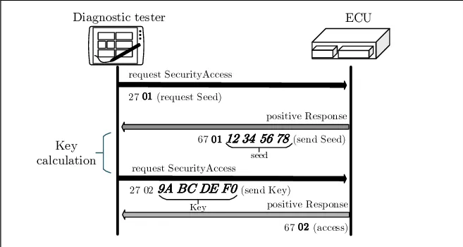

> I mainly focus on Hardware challenge, those challenge is interesting.

## CAN BUS log challenge

The CAN bus log is here: [Attached](/writeups_file_attached/damnctf_2025/canlog.txt)

### lost-in-madras

#### Finding the VIN

>I recently visited Madras... and I got carjacked T.T<br>
>Luckily, I had a wireless OBD adapter connected to my car through which I was able to obtain the CAN log for the whole journey. It's so unfortunate that I can't make sense of the log.<br>
> + To confirm that it is mine, find the VIN for my car.
> + Also, can you help me find where my car ended up?
>
>Example flag: bi0s{1FTFW1R6XBFB08616_Eiffel Tower}

The task is clear: find the VIN and locate the car. The log is large, and its structure is as follows:
```
+-----------------+----------+-------------+----------------+
|  CAN Interface  |  CAN-ID  |  MSG Length |      MSG       |
+-----------------+----------+-------------+----------------+
```

Since the VIN is a 17-character alphanumeric string, it contains information about the vehicle such as the model, country, year... I write a `string_dumper` for this task.

```python
def get_all_CANID(data):
    can_id_arr = []
    for i in data:
        temp = i.strip().split("  ")
        can_id = int(temp[1].strip(), 16)
        if can_id not in can_id_arr:
                can_id_arr.append(can_id)
    return can_id_arr

def get_message_by_can(data, can_id):
    count = 0
    for i in data:
        temp = i.strip().split("  ")
        can = int(temp[1], 16)
        if can == can_id:
            count += 1
            size = int(temp[2].replace("[","").replace("]",""))
            msg = temp[-1].split(" ")
            dump_string = ""
            for j in msg:
                char = int(j, 16)
                if char > 0x20 and char < 0x7f:
                    dump_string += chr(char)
                else:
                    dump_string += "."
            if size == 8:
                print(i + "\t" + dump_string)
            elif size == 7:
                print(i + "\t\t" + dump_string)
            elif size > 5 and size < 7:
                print(i + "\t\t\t" + dump_string)
            elif size == 4:
                print(i + "\t\t\t\t" + dump_string)     
            elif size == 3:
                print(i + "\t\t\t\t\t" + dump_string)      
            elif size < 3:
                print(i + "\t\t\t\t\t\t" + dump_string)
    print("CAN-ID 0x%x - Total: %d" % (can_id,count))
    print("")

with open("canlog.txt", "r") as file:
    data = []
    for line in file:
        data.append(line.strip())
    can_id_arr = get_all_CANID(data)
    can_id_arr.sort()
    for i in can_id_arr:
        print("0x%x" % i)
        get_message_by_can(data, i)
```

The author said that he used OBD-2 to dump this log. So I started looking for documentation about PIDs and CAN-IDs. The document stated:
+ CAN-ID 0x7DF: Broadcast ID, meaning all ECUs will listen and respond if the request is relevant to them.
+ CAN-ID 0x7E8 to 0x7EF: response ID for the Engine Control Module (ECM), other modules may respond with 0x7E9 to 0x7EF.

But in this log, we don't see any CAN-IDs similar. So maybe it used a custom CAN (Oh man !! I hate this). The CAN-IDs `7xx` look quite interesting. As far as I’ve analyzed, I’ve realized the following:
+ CAN-ID 0x733: The request.
+ CAN-ID 0x73B: The response.

Just aim the `0x73B` we found some interesting string.

```
vcan0  73B   [8]  10 14 62 F1 90 31 46 4D    ..b..1FM
vcan0  73B   [8]  21 48 4B 37 44 38 32 42    !HK7D82B
vcan0  73B   [8]  22 47 41 33 34 39 35 34    "GA34954
```

Seem like we found the VIN `1FMHK7D82BGA34954`. Look good right !! (You can look for the request contains `F1 90` then pair it the reponse). NGL: first few hours I though this challenge is about some Honda car 💀 because the `JHM` string.


#### Finding the lastest location

We got the info of the car, we need to search for some DBC (CAN database) to translates raw CAN data into meaningful signals (like RPM, temperature,...). So I googled for `Ford 2011 DBC`, it led me to this project.

::github{repo="commaai/opendbc"}

Structure of a DBC File:

| Component | Description                                                               |
| --------- | ------------------------------------------------------------------------- |
| **BO\_**  | **Message definition** (CAN ID, name, size, sender)                       |
| **SG\_**  | **Signal definition** (name, position, length, byte order, scaling, etc.) |
| **BU\_**  | Node (ECU/module) definitions                                             |
| **CM\_**  | Comments                                                                  |
| **VAL\_** | Enumerated values for signals (e.g., 0 = OFF, 1 = ON)                     |
| **BA\_**  | Attributes (metadata for messages, signals, nodes, etc.)                  |

There are some `BO_` in the `Ford 2011 DBC` about GPS data:

```
BO_ 1125 GPS_Data_Nav_1: 8 XXX
 SG_ GpsHsphLattSth_D_Actl : 25|2@0+ (1,0) [0|0] "" XXX
 SG_ GpsHsphLongEast_D_Actl : 9|2@0+ (1,0) [0|0] "" XXX
 SG_ GPS_Longitude_Minutes : 46|6@0+ (1,0) [0|0] "Minutes" XXX
 SG_ GPS_Longitude_Min_dec : 55|14@0+ (0.0001,0) [0|0] "Minutes" XXX
 SG_ GPS_Longitude_Degrees : 39|9@0+ (1,-179.0) [0|0] "Degrees" XXX
 SG_ GPS_Latitude_Minutes : 15|6@0+ (1,0) [0|0] "Minutes" XXX
 SG_ GPS_Latitude_Min_dec : 23|14@0+ (0.0001,0) [0|0] "Minutes" XXX
 SG_ GPS_Latitude_Degrees : 7|8@0+ (1,-89.0) [0|0] "Degrees" XXX

BO_ 1126 GPS_Data_Nav_2: 8 XXX
 SG_ Gps_B_Falt : 2|1@0+ (1,0) [0|0] "" XXX
 SG_ GpsUtcYr_No_Actl : 55|5@0+ (1,1.0) [0|0] "Year" XXX
 SG_ GpsUtcMnth_No_Actl : 47|4@0+ (1,1.0) [0|0] "Month" XXX
 SG_ GpsUtcDay_No_Actl : 37|5@0+ (1,1.0) [0|0] "Day" XXX
 SG_ GPS_UTC_seconds : 23|6@0+ (1,0) [0|0] "seconds" XXX
 SG_ GPS_UTC_minutes : 15|6@0+ (1,0) [0|0] "Minutes" XXX
 SG_ GPS_UTC_hours : 7|5@0+ (1,0) [0|0] "Hours" XXX
 SG_ GPS_Pdop : 31|5@0+ (0.2,0) [0|0] "" XXX
 SG_ GPS_Compass_direction : 26|4@0+ (1,0) [0|0] "" XXX
 SG_ GPS_Actual_vs_Infer_pos : 38|1@0+ (1,0) [0|0] "" XXX

BO_ 1127 GPS_Data_Nav_3: 8 XXX
 SG_ GPS_Vdop : 63|5@0+ (0.2,0) [0|0] "" XXX
 SG_ GPS_Speed : 47|8@0+ (1,0) [0|0] "MPH" XXX
 SG_ GPS_Sat_num_in_view : 7|5@0+ (1,0) [0|0] "" XXX
 SG_ GPS_MSL_altitude : 15|12@0+ (10.0,-20460.0) [0|0] "feet" XXX
 SG_ GPS_Heading : 31|16@0+ (0.01,0) [0|0] "Degrees" XXX
 SG_ GPS_Hdop : 55|5@0+ (0.2,0) [0|0] "" XXX
 SG_ GPS_dimension : 2|3@0+ (1,0) [0|0] "" XXX

BO_ 1144 GPS_Data_Nav_4: 8 XXX
 SG_ VehPos_L_Est : 39|32@0+ (0.01,0) [0|0] "meter" XXX
 SG_ VehHead_W_Actl : 23|16@0+ (0.01,-327.68) [0|0] "degrees/second" XXX
 SG_ VehHead_An_Est : 7|16@0+ (0.01,0) [0|0] "degrees" XXX
```

The number followed by `BO_` is the CAN-ID. In the log we have 0x465 (1125), it should be our GPS data. We still need to understand what signal will be sent. Lets examine few first line of 0x465 CAN-ID in DBC file.
+ BO_ 1125 GPS_Data_Nav_1: 8 XXX.
    + `BO_`: Message Syntax.
    + `1125`: CAN-ID (dec).
    + `GPS_Data_Nav_1`: Name.
    + `8`: Length (Bytes).
+ SG_ GpsHsphLattSth_D_Actl : 25|2@0+ (1,0) [0|0] "" XXX
    + `SG_`: Signal Syntax.
    + `GpsHsphLattSth_D_Actl`: Name.
    + `25|2`: Bit start | Length.
    + `@0`: byte order, `@0` for big-endian/Motorola, `@1` for little-endian/Intel.
    + `+`: unsigned, `-` for signed.
    + `(1,0)`: (scale,offset), the values are used in the physical value linear equation.
    + `[0|0]`: min | max, can be set to [0|0] - not defined.
    + `XXX`: Receiver node name.

Okay now we need to parse the CAN data for some GPS data. Lets examine the lastest 0x465 data:
```
vcan2  465   [8]  66 0D F4 48 1A 0E DD 00	f..H....

binary:
01100110 00001101 11110100 01001000 00011010 00001110 11011101 00000000
0        7        15       23       31       39       47       55
```

Write a script to extract those bit. Remember to use those scale and offset, the formula is: 

$$
\text{data} = \text{scale} \times \text{data} + \text{offset}
$$

Then we calculate the `latitude` and `longitude` with this formula:

$$
\text{Latitude} = \text{Degrees} + \frac{\text{Minutes} + \text{Minute\_Decimals}}{60}
$$

But its weird, very weird. I cant get the correct lat/long, the result i got when I use the correct bit offset is `(-81.96282, -164.24957)`. So maybe our DBC is wrong (this is the part that hold me).<br>
After the CTF end, some ppl share about the correct [DBC](https://docs.google.com/spreadsheets/d/1Oumkq83oMC7sUsSIggGv-BK4hmQbXqV5Lp1j2pPncLE/edit?gid=615387281#gid=615387281). So I try again !! This time it gives `(13.07606, -126.85976)`, point to somewhere in the middle of the ocean.<br>
Hmm thats weird. I start guessing the bit position, we have 9 data:

```
vcan2  465   [8]  66 16 1A 08 1A 2B AE 00	f....+..
vcan2  465   [8]  66 15 06 08 1A 29 20 00	f....)..
vcan2  465   [8]  66 14 4C 08 1A 21 8B 00	f.L..!..
vcan2  465   [8]  66 12 55 88 1A 11 EC 00	f.U.....
vcan2  465   [8]  66 12 35 A8 1A 0A 00 00	f.5.....
vcan2  465   [8]  66 11 8E 68 1A 0F E2 00	f..h....
vcan2  465   [8]  66 10 D2 28 1A 09 7F 00	f..(....
vcan2  465   [8]  66 10 32 C8 1A 06 82 00	f.2.....
vcan2  465   [8]  66 0D F4 48 1A 0E DD 00	f..H....
CAN-ID 0x465 - Total: 9
```

You can see the first value `0x66` dont change, because the car just moving arround Madras therefor the degrees wont be change ?? So I think, the first byte would be our `GPS_Latitude_Degrees`. To extract the `GPS_Latitude_Minutes` we simply take the `GPS_Latitude_Degrees` bit offset, add it with `8 - the size of GPS_Latitude_Degrees`, do the same for `GPS_Latitude_Min_dec`. To sum up:
+ 0 -> 8: `GPS_Latitude_Degrees`
+ 8 -> 14: `GPS_Latitude_Minutes`
+ 14 -> 28: `GPS_Latitude_Min_dec`

For Longitude, you can see the `X8 1A` wont change, so I use the same way to extract it:
+ 28 -> 37: `GPS_Longitude_Degrees`
+ 37 -> 43: `GPS_Longitude_Minutes`
+ 43 -> 57: `GPS_Longitude_Min_dec`

The result:
```
[+] GPS_LAT_DEG = 13.00000
[+] GPS_LAT_MIN = 3.00000
[+] GPS_LAT_MIN_DEC = 0.80040
[+] GPS_LON_DEG = 80.00000
[+] GPS_LON_MIN = 16.00000
[+] GPS_LON_MIN_DEC = 0.76100
[+] Result: 13.06334, 80.279350
```


Script:
```python

import binascii

GPS_lat_deg_bit_off = 0
GPS_lat_min_dec_bit_off = 14
GPS_lat_min_bit_off = 8

GPS_lon_deg_bit_off = 28
GPS_lon_min_dec_bit_off = 43
GPS_lon_min_bit_off = 37

def extract_bit(data, pos, size):
    bin_data = ""
    for i in data:
        bin_data += format(i, "08b")
    
    out = int(bin_data[pos : pos+size],2)
    return out

def decode_gps(data):
    gps_latitude_deg = extract_bit(data, GPS_lat_deg_bit_off, 8)
    lat_deg = (1 * gps_latitude_deg) + (-89)
    gps_latitude_min = extract_bit(data, GPS_lat_min_bit_off, 6)
    gps_latitude_min = (1 * gps_latitude_min) + 0
    gps_latitude_min_dec = extract_bit(data, GPS_lat_min_dec_bit_off, 14)
    gps_latitude_min_dec = (0.0001 * gps_latitude_min_dec) + 0
    
    gps_longitude_deg = extract_bit(data, GPS_lon_deg_bit_off, 9)
    lon_deg = (1 * gps_longitude_deg) + (-179)
    gps_longitude_min = extract_bit(data, GPS_lon_min_bit_off, 6)
    gps_longitude_min = (1 * gps_longitude_min) + 0
    gps_longitude_min_dec = extract_bit(data, GPS_lon_min_dec_bit_off, 14)
    gps_longitude_min_dec = (0.0001 * gps_longitude_min_dec) + 0
    
    latitude = lat_deg + (gps_latitude_min + gps_latitude_min_dec) / 60.0
    longitude = lon_deg + (gps_longitude_min + gps_longitude_min_dec) /60.0
    
    latitude = round(latitude, 5)
    longitude = round(longitude, 5)
    
    print("[+] GPS_LAT_DEG = %.5f" % lat_deg)
    print("[+] GPS_LAT_MIN = %.5f" % gps_latitude_min)
    print("[+] GPS_LAT_MIN_DEC = %.5f" % gps_latitude_min_dec)

    print("[+] GPS_LON_DEG = %.5f" % lon_deg)
    print("[+] GPS_LON_MIN = %.5f" % gps_longitude_min)
    print("[+] GPS_LON_MIN_DEC = %.5f" % gps_longitude_min_dec)

    print("")
    print("[+] Result: %.5f, %5f" % (latitude, longitude))


data = "660DF4481A0EDD00"
data = binascii.unhexlify(data)

decode_gps(data)
```

Flag: `bi0s{1FMHK7D82BGA34954_M. A. Chidambaram Stadium}`

### found-in-madras

>Thanks to you, I found my car<br>
>Just to be safe I want to check if the thief went above the speed limit or not. Get me the highest speed achieved by the car during the theft.<br>
>Seems like he was trying to gain access to Security level 15. Can you get me the SEED and KEY for the approved access?<br>
>(Based on the same CAN log as lost-in-madras)<br>
>Example flag: bi0s{12.23kph_DEADBEEF_CAFEBABE}<br>

This challenge ask for 2 part:
+ The Security level 15 SEED and Key.
+ Top speed the car achieved.

#### The SEED and KEY

A UDS (Unified Diagnostic Services) request seed is part of a security access mechanism in the UDS protocol. This is typically part of SecurityAccess service (0x27).<br>
First, the client will send a `seed request` to the ECU, then the ECU responds with a `SEED`. Client use the `SEED` to gen a `KEY` and send it back to the ECU. If ECU accept the `KEY` (`KEY` is good), ECU send accept code and grants access to protected services.



So in this case, the step should be:
+ Step 1: Client use `0x733` to send a request for `SEED`. The data should be `27 15 ...` because we use `Security level 15`.
+ Step 2: ECU return a `SEED` after the request packet. The data should be `67 15 <SEED>`.
+ Step 3: Client calculate the key and send back to the ECU. Data will be `27 16 <KEY>`, 2nd bytes is `Security level + 1`.
+ Step 4: ECU accept the key, and send back something like `67 16 00 00 00 ...`.

We need to pair the requests and responds, then we find out when the ECU accept that key.

```
1:
vcan0  733   [8]  02 27 15 00 00 00 00 00    .'......
vcan0  73B   [8]  06 67 15 76 95 40 60 00    .g.v.@`.

vcan0  733   [8]  06 27 16 A1 4B 92 4C 00    .'..K.L.

2:
vcan0  733   [8]  02 27 15 00 00 00 00 00    .'......
vcan0  73B   [8]  06 67 15 03 62 07 92 00    .g..b...

vcan0  733   [8]  06 27 16 9B 11 10 2C 00    .'....,.

3:
vcan0  733   [8]  02 27 15 00 00 00 00 00    .'......
vcan0  73B   [8]  06 67 15 32 84 95 07 00    .g.2....

vcan0  733   [8]  06 27 16 B8 92 39 35 00    .'...95.

4:
vcan0  733   [8]  02 27 15 00 00 00 00 00    .'......
vcan0  73B   [8]  06 67 15 72 72 22 00 00    .g.rr"..

vcan0  733   [8]  06 27 16 09 CA A2 11 00    .'......

5:
vcan0  733   [8]  02 27 15 00 00 00 00 00    .'......
vcan0  73B   [8]  06 67 15 35 77 94 86 00    .g.5w...

vcan0  733   [8]  06 27 16 CA 43 AB BE 00    .'..C...
vcan0  73B   [8]  02 67 16 00 00 00 00 00    .g......


6:
vcan0  733   [8]  02 27 15 00 00 00 00 00    .'......
vcan0  73B   [8]  06 67 15 44 78 58 31 00    .g.DxX1.

vcan0  733   [8]  06 27 16 40 8C F0 99 00    .'.@....

7:
vcan0  733   [8]  02 27 15 00 00 00 00 00    .'......
vcan0  73B   [8]  06 67 15 15 13 01 36 00    .g....6.

vcan0  733   [8]  06 27 16 B8 9A 35 06 00    .'...5..

8:
vcan0  733   [8]  02 27 15 00 00 00 00 00    .'......
vcan0  73B   [8]  06 67 15 11 59 98 53 00    .g..Y.S.

vcan0  733   [8]  06 27 16 A8 81 2B 47 00    .'...+G.

9:
vcan0  733   [8]  02 27 15 00 00 00 00 00    .'......
vcan0  73B   [8]  06 67 15 71 68 43 89 00    .g.qhC..

vcan0  733   [8]  06 27 16 23 BC AD 69 00    .'.#..i.
```

Only the 5th has accept packet, so `SEED` is `35779486` and `KEY` is `CA43ABBE`.

#### The Speed

Based on the `ford_cgea1_2_bodycan_2011.dbc` we know the CAN-ID for Engine_Data is `1059 (0x423)`. The detail like:

```
BO_ 1059 Engine_Data_MS: 8 XXX
 ...
 SG_ VEH_SPD : 7|16@0+ (0.01,-100.0) [0|0] "KPH" XXX
 SG_ ENG_SPD : 23|16@0+ (0.25,0) [0|0] "RPM" XXX
 SG_ Fuel_Level_State_UB : 37|1@0+ (1,0) [0|0] "" XXX
```

Lets extract bit from `7->23` for the vehicle speed. But we have too much data; we need an efficient way to parse it. Lets me introduce you, the `cantools`.

::github{repo="cantools/cantools"}

Example script to decode the message:

```
import cantools

dbc_string = """
VERSION ""

NS_ :
    NS_DESC_

BS_:

BU_: XXX

BO_ 1059 Engine_Data_MS: 8 XXX
 SG_ Res_UreaLvlLo_B_Dsply_UB : 35|1@0+ (1,0) [0|0] "" XXX
 SG_ Res_UreaLvlLo_B_Dsply : 36|1@0+ (1,0) [0|0] "" XXX
 SG_ Fuel_Level_State : 47|2@0+ (1,0) [0|0] "" XXX
 SG_ AwdOffRoadMode_D_Stats_UB : 55|1@0+ (1,0) [0|0] "" XXX
 SG_ AwdRnge_D_Actl_UB : 42|1@0+ (1,0) [0|0] "" XXX
 SG_ RearDiffLckLamp_D_Rq_UB : 32|1@0+ (1,0) [0|0] "" XXX
 SG_ AwdOffRoadMode_D_Stats : 41|2@0+ (1,0) [0|0] "" XXX
 SG_ AwdRnge_D_Actl : 45|3@0+ (1,0) [0|0] "" XXX
 SG_ RearDiffLckLamp_D_Rq : 34|2@0+ (1,0) [0|0] "" XXX
 SG_ VEH_SPD : 7|16@0+ (0.01,-100.0) [0|0] "KPH" XXX
 SG_ ENG_SPD : 23|16@0+ (0.25,0) [0|0] "RPM" XXX
 SG_ Fuel_Level_State_UB : 37|1@0+ (1,0) [0|0] "" XXX
"""

db = cantools.database.load_string(dbc_string)

for message in db.messages:
    print("Loaded message: %s (ID: %d)" % (message.name, message.frame_id))

data = bytes([0xF7, 0x3E, 0x00, 0x00, 0x00, 0x00, 0x00, 0x00]) # just raw data
decoded = db.decode_message(1059, data)

print("Decoded Message:", decoded)
```

I tried few data, but the speed is very insane (above 300+ km/h). So maybe the we need to modify the DBC. I use the same approach (guessing bit pos) I mentioned above. Here is few data of `0x423`:

```
vcan1  423   [5]  22 3E 00 00 00			">...
vcan1  423   [5]  2D 3E 00 00 00			->...
vcan1  423   [5]  38 3E 00 00 00			8>...
vcan1  423   [5]  43 3E 00 00 00			C>...
vcan1  423   [5]  4F 3E 00 00 00			O>...
vcan1  423   [5]  5A 3E 00 00 00			Z>...
```

You can see the `3E` is consistent, the formula to get the speed is (remember to apply the (scale,offset)):

$$
\text{real\_speed} = \text{speed}_1 \times 256 + \text{speed}_2
$$

Seem like the 2nd bytes is the speed_1, and the 1st bytes is the speed_2. So I modified the DBC, here is the final DBC I used.

```
BO_ 1059 Engine_Data_MS: 5 XXX
 SG_ VEH_SPD : 0|16@1+ (0.01,-100.0) [0|0] "KPH" XXX
```

The `VEH_SPD` is modifed, start at `0`, size is `16` and using `@1+` for little-endian instead of `@0+`.

```
import cantools

dbc_string = """
VERSION ""

NS_ :
    NS_DESC_

BS_:

BU_: XXX

BO_ 1059 Engine_Data_MS: 5 XXX
 SG_ VEH_SPD : 0|16@1+ (0.01,-100.0) [0|0] "KPH" XXX
"""

db = cantools.database.load_string(dbc_string)

for message in db.messages:
    print("Loaded message: %s (ID: %d)" % (message.name, message.frame_id))

data_arr = []

with open("423_filter.txt", "r") as file:
    for line in file:
        data = line.strip().split("  ")[-1].split(" ")
        temp_arr = []
        for i in data:
            temp_arr.append(int(i, 16))
        data_arr.append(bytes(temp_arr))

max = 0

for i in data_arr:
    decoded = db.decode_message(1059, i)

    print("[+] Speed: %f" % decoded["VEH_SPD"])

    if max < decoded["VEH_SPD"]:
        max = decoded["VEH_SPD"]

print("[+] Got max speed: %f" % max)
```

Flag: `bi0s{65.13_35779486_CA43ABBE}`

*To be continued...*